

 

<h3>Universidad Peruana de Ciencias Aplicadas</h3>

<strong>Facultad de Ingeniería</strong> 
<strong>Carrera: Ingeniería de Software</strong> 

<strong>Periodo:</strong> 202601 
<strong>Codigo del curso:</strong> 1ACC0238 
<strong>Nombre del curso:</strong> Aplicaciones para Dispositivos Móviles 
<strong>NRC:</strong> 3690 

<strong>Nombre del profesor:</strong> Jorge Luis Mayta Guillermo 

 <strong>*Informe de Trabajo Final*</strong>  

<strong>Nombre del startup: </strong>MobilFlow 
<strong>Nombre del producto: </strong>Automatch 

### Relación de Integrantes

| Apellidos y Nombres                  |   Código    |
|:------------------------------------:|:-----------:|
|                                      |             |
| Villugas Jeronimo, Liam Anderson     | U202211634  |
| Taquiri Calderon, Jhunior Giussepe     | U20221C576 |
| Sanchez Gonzales, Gabriel            | U202310609  |
| Tuesta Marin, Romina Alejandra       | U202211706  |
| Torrejon Navarro, Braulio Rodrigo    | U201711828  |

<strong> Julio, 2026</strong> 

# Project Report Collaboration Insights

# Registro de Versiones del Informe

| Versión | Fecha      | Autor        | Descripción de modificación                   |
|---------|------------|--------------|-----------------------------------------------|
| 1.0     | 6/09/2025 | Romina Tuesta | Creación de la estructura inicial del reporte, cargó archivos y actualizó una rama|
| 1.0     | 23/04/2026 | Gabriel Sánchez Gonzales | Cargó archivos, Descripción de la Startup, diseño de entrevistas, entrevistas, user personas, empathy mapping, Ubiquitous language, product backlog, event storming y actualizó una rama|
| 1.0     | 23/04/2026 | Braulio Rodrigo Torrejon Navarro | Cargo archivos, entrevistas, user stories, candidate context discovery, domain message flow modeling, bounded context canvases, software architecture y impact mapping |
| 1.0     | 23/04/2026 | Giussepe Taquiri             | Análisis competitivo, estrategias y tácticas frente a competidores, User Task Matrix y User Journey Mapping |

| 1.0     | 23/04/2026 | Liam Villugas          | Antecedentes y problematica, Lean UX Canvas, Lean UX Hypothesis Statements, Lean UX Assumptions, Lean UX Problem Statements y Context mapping |

---

## Contenido
- [Student Outcome](#student-outcome)
- [Capítulo I: Introducción](#capítulo-i-introducción)
    - [1.1. Startup Profile](#11-startup-profile)
        - [1.1.1. Descripción de la Startup](#111-descripción-de-la-startup)
        - [1.1.2. Perfiles de integrantes del equipo](#112-perfiles-de-integrantes-del-equipo)
    - [1.2. Solution Profile](#12-solution-profile)
        - [1.2.1. Antecedentes y problemática](#121-antecedentes-y-problemática)
        - [1.2.2. Lean UX Process](#122-lean-ux-process)
  - [1.2.2.1. Lean UX Problem Statements](#1221-lean-ux-problem-statements)
  - [1.2.2.2. Lean UX Assumptions](#1222-lean-ux-assumptions)
  - [1.2.2.3. Lean UX Hypothesis Statements](#1223-lean-ux-hypothesis-statements)
  - [1.2.2.4. Lean UX Canvas](#1224-lean-ux-canvas)
    - [1.3. Segmentos objetivo](#13-segmentos-objetivo)
- [Capítulo II: Requirements Elicitation & Analysis](#capítulo-ii-requirements-elicitation--analysis)
    - [2.1. Competidores](#21-competidores)
        - [2.1.1. Análisis competitivo](#211-análisis-competitivo)
        - [2.1.2. Estrategias y tácticas frente a competidores](#212-estrategias-y-tácticas-frente-a-competidores)
    - [2.2. Entrevistas](#22-entrevistas)
        - [2.2.1. Diseño de entrevistas](#221-diseño-de-entrevistas)
        - [2.2.2. Registro de entrevistas](#222-registro-de-entrevistas)
        - [2.2.3. Análisis de entrevistas](#223-análisis-de-entrevistas)
    - [2.3. Needfinding](#23-needfinding)
        - [2.3.1. User Personas](#231-user-personas)
        - [2.3.2. User Task Matrix](#232-user-task-matrix)
        - [2.3.3. User Journey Mapping](#233-user-journey-mapping)
        - [2.3.4. Empathy Mapping](#234-empathy-mapping)
        - [2.3.5. As-is Scenario Mapping](#235-as-is-scenario-mapping)
    - [2.4. Ubiquitous Language](#24-ubiquitous-language)
- [Capítulo III: Requirements Specification](#capítulo-iii-requirements-specification)
    - [3.1. To-Be Scenario Mapping](#31-to-be-scenario-mapping)
    - [3.2. User Stories](#32-user-stories)
    - [3.3. Impact Mapping](#33-impact-mapping)
    - [3.4. Product Backlog](#34-product-backlog)
- [Capítulo IV: Product Design](#capítulo-iv-product-design)
    - [4.1. Style Guidelines](#41-style-guidelines)
        - [4.1.1. General Style Guidelines](#411-general-style-guidelines)
        - [4.1.2. Web Style Guidelines](#412-web-style-guidelines)
    - [4.2. Information Architecture](#42-information-architecture)
        - [4.2.1. Organization Systems](#421-organization-systems)
        - [4.2.2. Labeling Systems](#422-labeling-systems)
        - [4.2.3. SEO Tags and Meta Tags](#423-seo-tags-and-meta-tags)
        - [4.2.4. Searching Systems](#424-searching-systems)
        - [4.2.5. Navigation Systems](#425-navigation-systems)
    - [4.3. Landing Page UI Design](#43-landing-page-ui-design)
        - [4.3.1. Landing Page Wireframe](#431-landing-page-wireframe)
        - [4.3.2. Landing Page Mock-up](#432-landing-page-mock-up)
    - [4.4. Web Applications UX/UI Design](#44-web-applications-uxui-design)
        - [4.4.1. Web Applications Wireframes](#441-web-applications-wireframes)
        - [4.4.2. Web Applications Wireflow Diagrams](#442-web-applications-wireflow-diagrams)
        - [4.4.2. Web Applications Mock-ups](#442-web-applications-mock-ups)
        - [4.4.3. Web Applications User Flow Diagrams](#443-web-applications-user-flow-diagrams)
    - [4.5. Web Applications Prototyping](#45-web-applications-prototyping)
    - [4.6. Domain-Driven Software Architecture](#46-domain-driven-software-architecture)
        - [4.6.1. Software Architecture Context Diagram](#461-software-architecture-context-diagram)
        - [4.6.2. Software Architecture Container Diagrams](#462-software-architecture-container-diagrams)
        - [4.6.3. Software Architecture Components Diagrams](#463-software-architecture-components-diagrams)
    - [4.7. Software Object-Oriented Design](#47-software-object-oriented-design)
        - [4.7.1. Class Diagrams](#471-class-diagrams)
        - [4.7.2. Class Dictionary](#472-class-dictionary)
    - [4.8. Database Design](#48-database-design)
        - [4.8.1. Database Diagram](#481-database-diagram)
- [Capítulo V: Product Implementation, Validation & Deployment](#capítulo-v-product-implementation-validation--deployment)
    - [5.1. Software Configuration Management](#51-software-configuration-management)
        - [5.1.1. Software Development Environment Configuration](#511-software-development-environment-configuration)
        - [5.1.2. Source Code Management](#512-source-code-management)
        - [5.1.3. Source Code Style Guide & Conventions](#513-source-code-style-guide--conventions)
        - [5.1.4. Software Deployment Configuration](#514-software-deployment-configuration)
    - [5.2. Landing Page, Services & Applications Implementation](#52-landing-page-services--applications-implementation)
    - [5.2.1. Sprint 1](#521-sprint-1)
        - [5.2.1.1. Sprint Planning 1](#5211-sprint-planning-1)
        - [5.2.1.2. Aspect Leaders and Collaborators](#5212-aspect-leaders-and-collaborators)
        - [5.2.1.3. Sprint Backlog 1](#5213-sprint-backlog-1)
        - [5.2.1.4. Development Evidence for Sprint Review](#5214-development-evidence-for-sprint-review)
        - [5.2.1.5. Execution Evidence for Sprint Review](#5215-execution-evidence-for-sprint-review)
        - [5.2.1.6. Services Documentation Evidence for Sprint Review](#5216-services-documentation-evidence-for-sprint-review)
        - [5.2.1.7. Software Deployment Evidence for Sprint Review](#5217-software-deployment-evidence-for-sprint-review)
        - [5.2.1.8. Team Collaboration Insights during Sprint](#5218-team-collaboration-insights-during-sprint)
    - [5.2.2. Sprint 2](#522-sprint-2)
        - [5.2.2.1. Sprint Planning 2](#5221-sprint-planning-2)          
        - [5.2.2.2. Aspect Leaders and Collaborators](#5222-aspect-leaders-and-collaborators)
        - [5.2.2.3. Sprint Backlog 2](#5223-sprint-backlog-2)            
        - [5.2.2.4. Development Evidence for Sprint Review](#5224-development-evidence-for-sprint-review)
        - [5.2.2.5. Execution Evidence for Sprint Review](#5225-execution-evidence-for-sprint-review)
        - [5.2.2.6. Services Documentation Evidence for Sprint Review](#5226-services-documentation-evidence-for-sprint-review)
        - [5.2.2.7. Software Deployment Evidence for Sprint Review](#5227-software-deployment-evidence-for-sprint-review)
        - [5.2.2.8. Team Collaboration Insights during Sprint](#5228-team-collaboration-insights-during-sprint)
    - [5.2.3. Sprint 3](#523-sprint-3)
        - [5.2.3.1. Sprint Planning 3](#5231-sprint-planning-3)
        - [5.2.3.2. Aspect Leaders and Collaborators](#5232-aspect-leaders-and-collaborators)
        - [5.2.3.3. Sprint Backlog 3](#5233-sprint-backlog-3)
        - [5.2.3.4. Development Evidence for Sprint Review](#5234-development-evidence-for-sprint-review)
        - [5.2.3.5. Execution Evidence for Sprint Review](#5235-execution-evidence-for-sprint-review)
        - [5.2.3.6. Services Documentation Evidence for Sprint Review](#5236-services-documentation-evidence-for-sprint-review)
        - [5.2.3.7. Software Deployment Evidence for Sprint Review](#5237-software-deployment-evidence-for-sprint-review)
        - [5.2.3.8. Team Collaboration Insights during Sprint](#5238-team-collaboration-insights-during-sprint)
      - [5.2.4. Sprint 4](#524-sprint-4)
          - [5.2.4.1. Sprint Planning 3](#5241-sprint-planning-4)
          - [5.2.4.2. Aspect Leaders and Collaborators](#5242-aspect-leaders-and-collaborators)
          - [5.2.4.3. Sprint Backlog 3](#5243-sprint-backlog-4)
          - [5.2.4.4. Development Evidence for Sprint Review](#5244-development-evidence-for-sprint-review)
          - [5.2.4.5. Execution Evidence for Sprint Review](#5245-execution-evidence-for-sprint-review)
          - [5.2.4.6. Services Documentation Evidence for Sprint Review](#5246-services-documentation-evidence-for-sprint-review)
          - [5.2.4.7. Software Deployment Evidence for Sprint Review](#5247-software-deployment-evidence-for-sprint-review)
          - [5.2.4.8. Team Collaboration Insights during Sprint](#5248-team-collaboration-insights-during-sprint)

    - [5.3. Validation Interviews](#53-validation-interviews)
        - [5.3.1. Diseño de Entrevistas](#531-diseño-de-entrevistas)
        - [5.3.2. Registro de Entrevistas](#532-registro-de-entrevistas)
        - [5.3.3. Evaluaciones según heurísticas](#533-evaluaciones-según-heurísticas)

    - [5.4. Video About-the-Product](#54-video-about-the-product)
- [Conclusiones](#conclusiones)

---

## Student Outcome

El curso contribuye al cumplimiento del Student Outcome ABET:

**ABET – EAC - Student Outcome**  

**Criterio 1:** Actualiza conceptos y
conocimientos necesarios para su
desarrollo profesional y en especial para
su proyecto en soluciones de ingeniería
de software

**Criterio 2:** Reconoce la necesidad del
aprendizaje permanente para el
desempeño profesional y el desarrollo
de proyectos en soluciones de
tecnologías de ingeniería de software

| Criterio específico | Acciones realizadas | Conclusiones |
| :---- | :---- | :---- |
| **Criterio 1:** Actualiza conceptos y conocimientos necesarios para su desarrollo profesional y en especial para su proyecto en soluciones de ingeniería de software | **Gabriel Sanchez**    **AV1:** Descripción del startup; entrevistas a usuarios; diseño de user personas; elaboración de empathy mapping; definición de ubiquitous language; creación del product backlog; desarrollo de event storming    **Braulio Torrejon**    **AV1:** Cargo archivos; entrevistas a usuarios; elaboración de user stories; candidate context discovery; domain message flow modeling; bounded context canvases; definición de software architecture; desarrollo de impact mapping    **Romina Tuesta**    **AV1:** Realicé todo el punto 2.6 diagrama de clase, base de datos y contenedores C4 y la estructuración de layers.    **Giussepe Taquiri**    **AV1:** Análisis competitivo; definición de estrategias y tácticas frente a competidores; elaboración de User Task Matrix; desarrollo de User Journey Mapping    **Liam Villugas**    **AV1:**  entrevistas a mecanicos; Elaboracion de Antecedentes y problematica; Lean UX Problem Statements; Lean UX Assumptions; Lean UX Hypothesis Statements; Lean UX Canvas; desarrollo de Context mapping| **Gabriel Sanchez**    **AV1:** Durante este avance desarrollé la descripción completa del startup, realicé entrevistas a usuarios, diseñé user personas y empathy maps, construí el ubiquitous language, elaboré el product backlog y llevé a cabo el event storming.    **Braulio Torrejon**    **AV1:** En este avance consolidé la arquitectura del proyecto mediante entrevistas, user stories y modelado de contextos. Implementé diagramas de flujo de mensajes y bounded contexts, definiendo la arquitectura de software y el impact mapping, lo que permitió dar claridad técnica y trazabilidad al proyecto.    **Romina Tuesta**    **AV1:** En este avance pude conocer más acerca de la estructura de los bounded context, realizando los layers como domain, interface, etc., además de adentrarme más a los contenedores de cada bounded.    **Giussepe Taquiri**    **AV1:** Durante este avance desarrollé el análisis competitivo y definí estrategias y tácticas frente a los competidores. Asimismo, elaboré el User Task Matrix y los User Journey Maps, aplicando herramientas de análisis UX para comprender mejor las necesidades del usuario y contribuir a la solución del proyecto.   **Liam Villugas**     **AV1:** En este avance consolidé la visión estratégica y técnica de AutoMatch mediante el uso de Lean UX y Domain-Driven Design (DDD). Al integrar las entrevistas a mecánicos con el modelado de Bounded Contexts, logré alinear los objetivos de negocio de MobilFlow con una arquitectura de software escalable. Este proceso me permitió aplicar conocimientos avanzados en ingeniería de software para garantizar la trazabilidad y la correcta delimitación de dominios en la solución. |
| **Criterio 2:** Reconoce la necesidad del aprendizaje permanente para el desempeño profesional y el desarrollo de proyectos en soluciones de tecnologías de ingeniería de software | **Gabriel Sanchez**    **AV1:** Descripción del startup; entrevistas a usuarios; diseño de user personas; elaboración de empathy mapping; definición de ubiquitous language; creación del product backlog; desarrollo de event storming    **Braulio Torrejon**    **AV1:** Cargo archivos; entrevistas a usuarios; elaboración de user stories; candidate context discovery; domain message flow modeling; bounded context canvases; definición de software architecture; desarrollo de impact mapping    **Romina Tuesta**    **AV1:** En este avance pude conocer más acerca de la estructura de los bounded context, realizando los layers como domain, interface, etc., además de adentrarme más a los contenedores de cada bounded.    **Giussepe Taquiri**    **AV1:** Análisis competitivo; estrategias y tácticas frente a competidores; User Task Matrix; User Journey Mapping; uso de herramientas de análisis y gestión    **Liam Villugas**    **AV1:**  entrevistas a mecanicos; Elaboracion de Antecedentes y problematica; Lean UX Problem Statements; Lean UX Assumptions; Lean UX Hypothesis Statements; Lean UX Canvas; desarrollo de Context mapping  | **Gabriel Sanchez**    **AV1:** Este proceso evidenció que el desarrollo de soluciones de software exige aprendizaje constante. Comprendí que debo seguir actualizándome y explorando nuevas metodologías y tecnologías para mejorar la calidad y efectividad de mis proyectos.    **Braulio Torrejon**    **AV1:** Este proceso me permitió reconocer que la construcción de arquitecturas sólidas requiere aprendizaje continuo. La integración de técnicas como EventStorming, DMFM y bounded contexts evidenció la necesidad de seguir perfeccionando metodologías y herramientas para lograr soluciones escalables y auditables.    **Romina Tuesta**    **AV1:** Lo realizado en esta entrega refuerza la necesidad de obtener más conocimiento para llegar a la vida profesional preparados y listos para aplicar lo aprendido.    **Giussepe Taquiri**    **AV1:** Este avance me permitió reconocer la importancia del aprendizaje continuo en el desarrollo de soluciones tecnológicas. A través del análisis competitivo y herramientas UX, comprendí la necesidad de actualizar constantemente mis conocimientos para adaptarme a nuevas tecnologías y metodologías en ingeniería de software.    **Liam Villugas**    **AV1:** El desarrollo de AutoMatch evidencia que la ingeniería de software exige un aprendizaje permanente para dominar marcos como Lean UX y DDD. La complejidad del ecosistema de MobilFlow reafirma que la actualización constante en metodologías y arquitecturas es indispensable para resolver problemas reales y mantener la competitividad profesional en el diseño de soluciones tecnológicas. |

# Capítulo I: Presentación

## 1.1. Startup Profile

### 1.1.1. Descripción de la Startup

Nuestra startup “MobilFlow” ofrece una aplicación innovadora que conecta a proveedores de servicios mecánicos con usuarios que usan regularmente un auto particular como transporte principal. Ofrecemos una solución accesible e independiente para que el usuario pueda encontrar la mejor opción para realizar servicios de mecánica y reparación de autos, con un modelo de negocio que ayuda a quienes usan autos particulares a encontrar el mejor mecánico disponible según sus necesidades. Para ello, investigaremos cómo cumplir con esta meta, identificando y recolectando fuentes sobre modelos de negocio similares, y planificaremos el diseño y la codificación de nuestra solución.

**Misión:** Brindar a los usuarios de autos particulares una forma rápida, confiable y accesible de encontrar servicios mecánicos de calidad, conectándolos con proveedores verificados mediante una plataforma eficiente e intuitiva.

**Visión:** Convertirnos en la plataforma líder en soluciones mecánicas automotrices, transformando la manera en que las personas encuentran y acceden a servicios de reparación, destacando por nuestra innovación, confianza y alcance a nivel nacional.

### 1.1.2. Perfiles de integrantes del equipo

#### 1.1.2.1 Gabriel Sánchez

Soy estudiante en la Universidad Peruana de Ciencias Aplicadas (UPC) cursando el 7mo ciclo de la carrera de Ingeniería de Software. Soy una persona comprometida con mi desarrollo académico y profesional. Con esa responsabilidad, aspiro a proveer soluciones tecnológicas a aquellos que las requieran para facilitar su área de trabajo. Junto con mi equipo de trabajo tendré la oportunidad de poner mis conocimientos y habilidades en uso con el proyecto “AutoMatch” con el fin de disminuir la problemática identificada. 

  

#### 1.1.2.4 Braulio Torrejon
Soy un estudiante de 7mo ciclo de la carrera de Ingenieria de Software. Tengo interes en lo que es aprender nuevas herramientas para proyectos personales. Estoy trabajando como QA y comprometido a la responsabilidad del equipo. Poseo conocimiento en los lenguajes de: C++, Python, C#, Genexus y estuve 1 año en practicas pre profesionales siendo QA, soy una persona que estoy listo a trabajar bajo presión y con mucho compañerismo.

  

#### 1.1.2.5  Giussepe Taquiri

Soy estudiante de la Universidad Peruana de Ciencias Aplicadas (UPC), cursando el séptimo ciclo de la carrera de Ingeniería de Software. Me caracterizo por ser responsable, proactivo y orientado al aprendizaje continuo. Busco aplicar mis conocimientos en análisis, diseño y desarrollo de software, trabajando de manera colaborativa con mi equipo para proponer soluciones eficientes e innovadoras. Asimismo, contribuyo activamente en la toma de decisiones y en la construcción de soluciones tecnológicas que mejoren la experiencia de los usuarios, como en el desarrollo de **AutoMatch**, una plataforma digital que conecta conductores con servicios mecánicos confiables mediante geolocalización, verificación de proveedores y comparación de precios. 

  

## 1.2. Solution Profile

### 1.2.1. Antecedentes y problemática

En la actualidad, el parque automotor de vehículos particulares ha crecido de manera exponencial, convirtiéndose en el principal medio de transporte para millones de personas. Sin embargo, el sector de servicios de mantenimiento y reparación no ha evolucionado al mismo ritmo tecnológico. El mercado se encuentra dividido entre concesionarios oficiales, con costos excesivamente elevados, y talleres independientes, que operan mayoritariamente en la informalidad o sin visibilidad digital.  

Esta situación genera un escenario de incertidumbre para el conductor, quien al enfrentar una avería o requerir un mantenimiento preventivo, se ve obligado a navegar en un sistema basado en el "ensayo y error". La falta de información centralizada sobre la calidad de los repuestos, la experiencia real de los técnicos y la competitividad de los precios crea una barrera de desconfianza que afecta tanto al usuario como a los buenos proveedores que no tienen cómo destacar su trabajo. Automatch nace para resolver esta fragmentación, profesionalizando el encuentro entre la oferta y la demanda mediante la tecnología.

---

#### What?
La desconexión digital entre conductores de autos particulares y servicios mecánicos confiables, lo que deriva en una falta de transparencia en precios, calidad y tiempos de entrega.

#### When?
Se manifiesta ante emergencias mecánicas o necesidades de mantenimiento preventivo, momentos en los que el usuario requiere una solución rápida y validada.

#### Where?
El proyecto se enfoca en centros urbanos con alta congestión vehicular donde la demanda de reparaciones es constante y la oferta es dispersa.

#### Who?
**Usuarios:** Propietarios de autos que valoran su tiempo y seguridad.  
**Proveedores:** Mecánicos y talleres que buscan formalizar su captación de clientes y optimizar sus ingresos.

#### Why?
Debido a la informalidad del sector y la ausencia de una plataforma que centralice reputación, especialidades y presupuestos, dejando al usuario vulnerable a servicios deficientes o cobros injustos.

#### How?
A través de un ecosistema móvil intuitivo que permita geolocalizar talleres, comparar presupuestos en tiempo real y visualizar reseñas de otros usuarios.

#### How much?
La problemática genera pérdidas económicas por reparaciones mal ejecutadas. La solución requiere una inversión en desarrollo de software, recolección de datos y estrategias de validación de proveedores.

### 1.2.2. Lean UX Process

#### 1.2.2.1. Lean UX Problem Statements

El estado actual de la industria de servicios mecánicos para usuarios de autos particulares está fragmentado y carece de transparencia. A pesar de la alta demanda de mantenimientos y reparaciones, no existe un estándar digital que permita a los conductores validar la confianza, calidad y precio de los proveedores de forma rápida.
Observamos que la falta de una plataforma centralizada genera una asimetría de información: los usuarios pierden tiempo y dinero en servicios deficientes, mientras que los mecánicos calificados pierden oportunidades de negocio por falta de visibilidad. Esto ha creado una brecha de desconfianza en el ecosistema automotriz que afecta la seguridad vial y la economía de los conductores.

1.2.2.2. Lean UX Assumptions

#### 1.2.2.2. Lean UX Assumptions

##### 1. Business Assumptions

- **Creemos que nuestros clientes tienen la necesidad de:**  
  Encontrar mecánicos de confianza sin tener que depender exclusivamente de recomendaciones informales o visitas físicas inciertas.

- **El valor principal que el cliente obtiene de AutoMatch es:**  
  La transparencia en precios, la seguridad de contratar a alguien verificado y el ahorro de tiempo en la búsqueda.

- **Nuestros clientes actuales (o futuros) son:**  
  Propietarios de vehículos particulares, de entre 20 y 55 años, con poco conocimiento técnico automotriz y alta dependencia de su auto para el día a día.

- **Nuestra principal competencia son:**  
  Los concesionarios oficiales (por estatus/garantía) y los talleres informales de barrio (por cercanía/costo).

- **Nuestra mayor ventaja competitiva será:**  
  El sistema de reputación (reviews) y la facilidad de geolocalización de servicios especializados.

- **Ganaremos dinero mediante:**  
  Comisiones por cada servicio concretado, suscripciones premium para talleres o espacios publicitarios de proveedores de repuestos.

---

###### 2. User Assumptions

- **¿Quién es el usuario?**  
  Personas que usan su auto para trabajar o movilizar a su familia y que ven el mantenimiento como un gasto estresante y opaco.

- **¿Dónde encaja nuestro producto en su vida?**  
  Como la herramienta de consulta inmediata ante un testigo prendido en el tablero o el vencimiento de un mantenimiento preventivo.

- **¿Qué problemas resuelve nuestro producto?**  
  El miedo a ser estafado, la incertidumbre del costo y la dificultad de encontrar un taller con disponibilidad inmediata.

- **¿Cuándo y cómo se utiliza el producto?**  
  Principalmente en situaciones de emergencia (averías en ruta) o en la planificación semanal de mantenimientos.

- **¿Qué miedo tienen los usuarios sobre nuestra app?**  
  Que los mecánicos listados no sean realmente evaluados o que la aplicación sea difícil de usar en un momento de estrés.
  
1.2.2.3. Lean UX Hypothesis Statements

1.2.2.4. Lean UX Canvas

## 1.3. Segmentos objetivo

**Segmento objetivo 1: Mecánicos**
- Profesionales o técnicos que brindan servicios de diagnóstico, mantenimiento y reparación automotriz, y buscan captar clientes, generar confianza y mejorar la visibilidad de sus servicios.

**Segmento objetivo 2: Conductores**
- Propietarios de vehículos que requieren servicios mecánicos confiables para mantener la operatividad de su auto y reducir la incertidumbre al buscar atención técnica.

# Capítulo II: Requirements Development and Software Solution Design

## 2.1. Competidores
### ¿Por qué llevar a cabo este análisis?

El análisis de competidores se realiza con el propósito de identificar y evaluar a los principales actores del mercado de servicios automotrices. Esto permite comprender sus fortalezas, debilidades, estrategias y propuestas de valor, así como las oportunidades existentes dentro del entorno competitivo.

A través de este análisis, AutoMatch puede definir una estrategia diferenciada, orientada a satisfacer de manera más eficiente las necesidades de los usuarios. Asimismo, permite reconocer vacíos en el mercado, como la falta de plataformas especializadas, la limitada transparencia en precios y la escasa validación de la calidad del servicio.

En el contexto peruano, donde el sector automotriz presenta altos niveles de informalidad y desconfianza, este análisis resulta clave para diseñar una solución que genere valor, confianza y accesibilidad para los usuarios, posicionando a AutoMatch como una alternativa innovadora frente a los competidores existentes.
### 2.1.1. Análisis competitivo

#### Competitive Analysis Landscape

**¿Por qué llevar a cabo este análisis?**  
Identificar y comparar a los principales competidores del mercado automotriz para entender sus fortalezas, debilidades y estrategias, con el fin de definir la propuesta de valor y ventaja competitiva de AutoMatch en el contexto peruano.

---

### Comparativa general

| Categoría | AutoMatch | Google Maps / Reseñas | Autingo (LatAm) | Maquinarias.pe | Cadenas formales (Bosch / Derco) |
|----------|-----------|------------------------|-----------------|----------------|----------------------------------|
| **Overview** | App que conecta conductores con mecánicos | Plataforma de búsqueda con reseñas | Plataforma digital de servicios mecánicos | Plataforma peruana de servicios postventa | Talleres formales con respaldo de marca |
| **Ventaja competitiva** | Geolocalización + verificación + comparación de precios | Gran volumen de información | Servicio estructurado digital | Respaldo empresarial | Garantía y respaldo técnico |
| **Mercado objetivo** | Conductores urbanos en Perú | Usuarios globales | Mercado latinoamericano | Usuarios en Perú | Segmento medio-alto |
| **Estrategias de marketing** | Redes sociales, referidos | SEO | Marketing digital | Publicidad digital | Publicidad corporativa |
| **Servicios** | Búsqueda, cotización, chat, historial | Reseñas y ubicación | Diagnóstico, reservas | Mantenimiento y postventa | Servicios especializados |
| **Precios** | Gratis | Gratis | Pago por servicio | Precios definidos | Alto costo |
| **Canales** | App y web | Web y app | Web y app | Web | Presencial + digital |

---

### Análisis FODA comparativo

| Plataforma | Fortalezas | Debilidades | Oportunidades | Amenazas |
|------------|-----------|-------------|---------------|----------|
| **AutoMatch** | Especialización, geolocalización, verificación, comparación de precios | Marca nueva | Liderar mercado peruano, integrar pagos digitales | Nuevos competidores, desconfianza inicial |
| **Google Maps** | Gran base de usuarios, visibilidad | No especializado, información no validada | Crecimiento continuo | Plataformas especializadas |
| **Autingo** | Plataforma estructurada | No adaptado a Perú | Expansión LATAM | Competidores locales |
| **Maquinarias.pe** | Respaldo empresarial | No es marketplace | Crecimiento digital en Perú | Apps más completas |
| **Cadenas formales** | Alta confianza y calidad | Costos elevados | Expansión | Alternativas más económicas |

### 2.1.2. Estrategias y tácticas frente a competidores

Para competir eficazmente en el mercado peruano de servicios automotrices, AutoMatch implementa un conjunto de estrategias orientadas a diferenciarse de plataformas generalistas, servicios formales tradicionales y soluciones digitales existentes.

---

#### Diferenciación por especialización

A diferencia de Google Maps, que solo ofrece información general, AutoMatch se enfoca exclusivamente en servicios mecánicos, permitiendo una experiencia más precisa y útil para el usuario.

Esta especialización permite ofrecer funcionalidades específicas como filtrado por tipo de servicio, diagnóstico y comparación de opciones.

---

#### Estrategia de confianza y verificación

Frente a la desconfianza presente en el mercado, AutoMatch implementa:

- Verificación de identidad y experiencia de mecánicos  
- Sistema de calificaciones y reseñas reales  

En comparación con competidores como Google Maps o plataformas informales, donde la información puede no estar validada, AutoMatch garantiza mayor confiabilidad en la elección del servicio.

---

#### Transparencia y comparación de precios

A diferencia de Maquinarias.pe o cadenas formales, donde los precios suelen ser fijos o poco visibles, AutoMatch ofrece:

- Cotizaciones previas al servicio  
- Comparación entre múltiples mecánicos  

Esto reduce la incertidumbre del usuario y mejora la toma de decisiones.

---

#### Geolocalización en tiempo real

AutoMatch incorpora funcionalidades de ubicación avanzada, permitiendo localizar mecánicos cercanos en tiempo real.

Esta estrategia permite competir directamente con la facilidad de uso de Google Maps.

---

#### Adaptación al contexto peruano

A diferencia de plataformas internacionales como Autingo, AutoMatch está diseñada específicamente para el mercado peruano:

- Considera distritos, tráfico y comportamiento urbano  
- Se adapta a las necesidades locales del usuario  

Esto genera una mayor cercanía con el usuario y mejora la adopción.

---

#### Estrategia de crecimiento y adquisición

Para posicionarse en el mercado, AutoMatch aplicará:

- Marketing digital en redes sociales  
- Programas de referidos  
- Alianzas con talleres y comunidades automotrices  

Esto permite competir con el posicionamiento orgánico de Google Maps y la estructura corporativa de cadenas formales.

---

#### Integración de pasarela de pago

AutoMatch incorporará una pasarela de pago segura dentro de la plataforma, permitiendo a los usuarios realizar pagos digitales de manera rápida y confiable.

Esto permitirá:

- Reducir el uso de efectivo  
- Aumentar la seguridad en las transacciones  
- Generar confianza entre usuarios y mecánicos  
- Facilitar la trazabilidad de los pagos  

Además, esta funcionalidad mejora la experiencia del usuario al centralizar todo el proceso (búsqueda, contratación y pago) en una sola plataforma.

## 2.2. Entrevistas

### 2.2.1. Diseño de entrevistas

#### 2.2.1.1 Preguntas Generales

1. Nombre  
2. Edad  
3. Género  
4. Distrito de residencia  
5. Estado civil  
6. Ocupación  
7. Canales digitales que usa para informarse, contratar o promover servicios  
8. Dispositivos que utiliza con mayor frecuencia

#### 2.2.1.2 Segmento Objetivo: Mecanicos

1. ¿Cómo es el proceso desde que un cliente te contacta hasta que terminas el servicio?  
2. ¿Cuántos clientes atiendes en una semana promedio?  
3. ¿Sientes que este flujo de clientes deriva en una inconsistencia de ganancias?  
4. ¿Qué porcentaje de tus clientes son nuevos vs recurrentes?  
5. ¿Qué es lo más difícil de conseguir clientes nuevos?  
6. ¿Qué te frustra del mercado actual?  
7. Si existiera una app que te envía clientes cercanos, ¿la usarías?  
8. ¿Qué tendría que tener para que realmente la uses?  
9. ¿Qué te haría desconfiar de esa app?

#### 2.2.1.3 Segmento Objetivo: Conductores**

1. ¿Que tipo de vehículo que poses, mecanico o automatico?  
2. ¿Qué tan necesario es tu auto en tu día a día?  
3. ¿Qué pasa cuando tu auto falla?  
4. ¿Cómo buscas un mecánico hoy?  
5. ¿Cuánto tiempo te tomó encontrarlo?  
6. ¿Cuál es tu mayor problema al buscar un mecánico?  
7. ¿Alguna vez te han engañado o cobrado de más?  
8. ¿Comparas opciones antes de elegir?  
9. ¿Usarías una app para encontrar mecánicos cercanos? ¿Qué tendría que tener para que confíes en ella?

### 2.2.2. Registro de entrevistas

[Url a Registros de Entrevistas](https://upcedupe-my.sharepoint.com/:v:/g/personal/u202310609_upc_edu_pe/IQB6eMiOs_9NRJwg7FY-8HVuAd6emf_2sFNGlHnXcElmBYM?e=LIyASH&nav=eyJyZWZlcnJhbEluZm8iOnsicmVmZXJyYWxBcHAiOiJTdHJlYW1XZWJBcHAiLCJyZWZlcnJhbFZpZXciOiJTaGFyZURpYWxvZy1MaW5rIiwicmVmZXJyYWxBcHBQbGF0Zm9ybSI6IldlYiIsInJlZmVycmFsTW9kZSI6InZpZXcifX0%3D)

#### 2.2.2.1 Segmento Objetivo: Conductores

**Entrevista N°1**

**Datos del entrevistado**  
- Nombre: Anedyib   
- Apellidos: Villar  
- Edad: 23  
- Genero: Mujer  
- Lugar de Residencia: Lima, Perú  
- Estado civil: Soltera  
- Ocupación: Analista de Marketing  
- Tipo de vehículo: Automatico

**Resumen de la entrevista:**

Las respuestas de Ane reflejan que su principal frustración como propietaria de un auto está en la confianza y el temor a ser engañada al buscar servicios mecánicos. Aunque prefiere acudir al concesionario oficial de Nissan porque desconfía de los mecánicos de la calle, incluso dentro de ese canal ha tenido malas experiencias, como cobros por servicios incompletos o trabajos que no se realizaron correctamente. Para ella, el problema no es solo reparar el auto, sino tener la seguridad de que el servicio será honesto, cumplirá con lo solicitado y tendrá una relación justa entre calidad y precio.

Otro punto importante es que su auto es una necesidad para su rutina diaria, tanto para ir a trabajar como para movilizarse por temas laborales, por lo que una falla representa una interrupción importante. Cuando necesita buscar soluciones, recurre principalmente a canales que le generan confianza, como directorios oficiales y referencias, aunque reconoce que encontrar opciones puede tomar tiempo. También menciona que suele evaluar alternativas dependiendo del tipo de problema, priorizando siempre confianza y reputación.

Respecto a soluciones digitales, Ane muestra apertura hacia una aplicación para encontrar mecánicos cercanos, siempre que esté respaldada por una comunidad y referencias reales de usuarios. Para ella, la propuesta de valor más fuerte sería:

* Referencias y reseñas verificadas de otros conductores.  
* Transparencia en precios y cumplimiento del servicio ofrecido.  
* Un espacio confiable, enfocado en la comunidad automotriz, que ayude a reducir el riesgo de malas experiencias.

Con esto, percibe que podría tomar mejores decisiones, reducir la incertidumbre y encontrar mecánicos confiables más fácilmente.

**Información de la entrevista**

Duración: 4:30
Minuto de inicio en el video consolidado: 0:00

**Entrevista N°2**

**Datos del entrevistado**  

- Nombre: Jose  
- Apellidos: Torrejon  
- Edad: 27  
- Genero: Hombre  
- Lugar de Residencia: Lima, Perú  
- Estado civil: Soltero  
- Ocupación: Profesor de Marketing  
- Tipo de vehículo: Automatico  
**Información de la entrevista**  

- Fecha de la entrevista: 14/04  
- Duración: 4:08  
- Minuto de inicio en el video consolidado: 0:00  

**Resumen de la entrevista:**

Las respuestas de José reflejan que su principal frustración como propietario de un auto está en la confianza y transparencia al buscar mecánicos. Explica que el problema no es solo “arreglar el auto”, sino todo lo que se vuelve complicado alrededor: dificultad para encontrar especialistas confiables, precios poco claros, y limitaciones logísticas cuando el vehículo no puede desplazarse. En su experiencia, ha tenido que pasar por cuatro mecánicos distintos hasta encontrar uno que le brinde cierta seguridad, aunque aún siente la necesidad de contar con segundas opiniones.

Otro dolor fuerte es el costo económico y la incomodidad que generan las fallas del auto. José depende de su vehículo para ir a trabajar, ya que el transporte público no está cerca. Cuando el auto falla, primero investiga en internet y luego consulta con su mecánico de confianza, pero reconoce que los precios varían mucho y que incluso su mecánico actual le cobra más por servicios a domicilio. Esa falta de estandarización le genera dudas sobre si está pagando lo justo.

En cuanto a la búsqueda de mecánicos, José señala que lo más complicado es la falta de referencias confiables. Prefiere que el mecánico vaya a su casa para supervisar el trabajo, pero reconoce que en reparaciones más complejas debe dejar el auto en el taller, lo que le genera inseguridad. No suele comparar opciones porque mover el auto es difícil cuando está dañado, lo que lo obliga a depender de un único contacto.

Respecto a soluciones digitales, José estaría dispuesto a usar una aplicación para encontrar mecánicos cercanos, siempre que ofrezca reseñas y recomendaciones de otros usuarios. Para él, la propuesta de valor más fuerte sería:

* Referencias verificadas que generen confianza.  
* Transparencia en precios y servicios.  
* Disponibilidad de mecánicos que puedan atender a domicilio.

Con esto, percibe que reduciría la incertidumbre, evitaría sobrecostos y tendría mayor seguridad en el mantenimiento de su vehículo.

#### 2.2.2.1 Segmento Objetivo: Mecanicos

**Entrevista N°1**

**Datos del entrevistado**  

- Nombre: Christian  
- Apellidos: Vilcahuamán  
- Edad: 35  
- Genero: Hombre  
- Lugar de Residencia: Santa Anita  
- Estado civil: Soltero  
- Ocupación: administrador de taller automotriz.  

**Información de la entrevista**  

- Fecha de la entrevista: 14/04  
- Duración:   
- Minuto de inicio en el video consolidado: 0:00  

**Resumen de la entrevista:**  
Las respuestas de Cristian reflejan que su principal preocupación como administrador de taller no está en la falta de clientes, sino en la capacidad operativa para atenderlos correctamente. Explica que su flujo de trabajo está bastante estructurado, con procesos definidos desde la recepción hasta el control de calidad, y que la mayor dificultad para captar nuevos clientes radica en gestionar la disponibilidad de técnicos, el espacio del taller y evitar incumplimientos por retrasos en trabajos en curso. Además, menciona que la mayoría de sus clientes son recurrentes, por lo que la captación de nuevos clientes no ha sido una prioridad, aunque reconoce que sí representa una oportunidad de crecimiento.

Otro punto importante es que Cristian muestra apertura hacia soluciones digitales, siempre que estas no solo generen clientes, sino que ayuden a optimizar la operación del taller. Estaría dispuesto a usar una aplicación que le envíe clientes cercanos si esta permite gestionar disponibilidad, coordinar horarios y evitar sobrecargar la capacidad del negocio. Sin embargo, también señala que desconfiaría de una solución que falle en mostrar información real sobre espacios o tiempos disponibles, ya que eso afectaría directamente el servicio y la reputación del taller. Para él, el valor principal de una herramienta digital está en combinar captación con confiabilidad y gestión operativa.

**Entrevista N°2**

**Datos del entrevistado**  
- Nombre: Luisa  
- Apellidos: Rios  
- Genero: Mujer  
- Lugar de Residencia: Bruno Terrero, Salamanca  
- Tipo de vehículo: Automatico  
  
**Información de la entrevista**  
- Fecha de la entrevista: 14/04  
- Duración: 4:08  
- Minuto de inicio en el video consolidado: 0:00  
  
**Resumen de la entrevista:**

Las respuestas de Luisa reflejan que su principal preocupación como técnica de máquinas domésticas no está en la falta de clientes, sino en la capacidad operativa para atenderlos correctamente. Explica que su flujo de trabajo está bastante estructurado, con procesos definidos desde la recepción hasta la entrega en perfectas condiciones de funcionamiento, y que la mayor dificultad para captar nuevos clientes radica en demostrar su confiabilidad y la calidad de su mano de obra. Además, menciona que la mayoría de sus clientes son recurrentes o referencias de clientes existentes, por lo que la captación de nuevos clientes no ha sido una prioridad, aunque reconoce que sí representa una oportunidad de crecimiento.

Luisa muestra apertura hacia soluciones digitales, siempre que estas no solo generen clientes, sino que ayuden a optimizar su operación. Estaría dispuesta a usar una aplicación que le envíe clientes cercanos si esta permite demostrar su expertise a través de reseñas y comunicación clara. Sin embargo, también señala que desconfiaría de una solución que falle en mostrar información completa sobre los trabajos realizados, las condiciones en que recibe las máquinas y en qué estado debe entregarlas, ya que eso afectaría directamente el servicio y su reputación. Para ella, el valor principal de una herramienta digital está en combinar captación con eficiencia, comunicación clara y gestión de detalles operativos.

**Entrevista N°3**

**Datos del entrevistado**
- Nombre: Carlo
- Apellidos: García
- Edad: 23 años
- Genero: Hombre
- Lugar de Residencia: San Borja
  
**Información de la entrevista**

- Fecha de la entrevista: 19/04
- Duración: 8:33
- Minuto de inicio en el video consolidado: 0:00

**Resumen de la entrevista:**

Las respuestas de Carlo reflejan que su principal frustración como mecánico automotriz está en la dispersión y volatilidad del mercado. Explica que el problema no es solo "reparar autos", sino todo lo que se vuelve complicado alrededor: la necesidad de estar presente en múltiples canales de comunicación (WhatsApp, Facebook, TikTok, Instagram), la falta de un lugar centralizado para comunicarse con clientes, y la dificultad para gestionar de manera eficiente tanto a proveedores como a clientes simultáneamente. Esta dispersión genera que tenga que cambiar constantemente entre aplicaciones y flujos diferentes, lo que es bastante trabajoso.
Volatilidad de ingresos y flujo de clientes
Otro dolor fuerte para Carlo es la inconsistencia en sus ganancias derivada del flujo irregular de clientes. Atiende entre 12 a 20 clientes por semana, pero este volumen es muy variable. Reconoce que depende mucho de las comisiones y que, aunque tiene clientes recurrentes (aproximadamente 30% nuevos y 70% recurrentes), hay días sin ningún cliente. Esta volatilidad le genera inseguridad financiera y dificulta la planificación.
Dificultad para conseguir clientes de manera eficiente
Señala que lo más complicado es lograr que los clientes lo encuentren de forma eficiente. Actualmente obtiene clientes a través de redes sociales y páginas de la mecánica, pero el proceso es disperso y poco organizado. No existe un canal centralizado donde los clientes puedan encontrarlo directamente según sus necesidades específicas.
Soluciones digitales potenciales
Respecto a una posible solución digital, Carlo estaría totalmente dispuesto a usar una aplicación que le enviara clientes a partir de sus necesidades. Para él, esta aplicación tendría que tener:
Un canal de comunicación bien establecido y centralizado.
Capacidad para interactuar, realizar ofertas y propuestas de forma directa.
Evaluación de trabajos sin tener que cambiar entre múltiples plataformas.
Con esto, Carlo percibe que reduciría la dispersión, mejoraría la eficiencia operativa y tendría un flujo más predecible de clientes.

**Entrevista N°4**

**Datos del entrevistado**  
- Nombre: Luis   
- Apellidos: Péres    
- Edad: 23 años  
- Genero: Hombre  
- Lugar de Residencia: Chorrillos, Lima, Perú  

**Información de la entrevista**  

- Fecha de la entrevista: 20/04  
- Duración: 3:49  
- Minuto de inicio en el video consolidado: 0:00  

**Resumen de la entrevista:**

Las respuestas de Luis reflejan que uno de los principales desafíos desde el lado del taller es la inestabilidad en el flujo de clientes, lo que impacta directamente en la consistencia de los ingresos. Aunque el taller atiende entre 15 a 25 clientes por semana, esta demanda varía considerablemente, generando semanas con alta carga de trabajo y otras con baja actividad.

Otro punto importante es la dificultad para captar nuevos clientes, ya que la confianza juega un rol clave en la decisión del usuario. Luis menciona que existe una fuerte competencia en el mercado, donde algunos talleres reducen precios para atraer clientes, lo que también genera una percepción enfocada en lo económico más que en la calidad del servicio.

En cuanto a los canales digitales, el taller utiliza principalmente WhatsApp para la comunicación directa con los clientes y Facebook como medio para visualizar servicios y referencias. Esto evidencia una adopción digital básica, pero aún limitada en términos de herramientas especializadas.

Respecto a soluciones digitales, Luis muestra una actitud positiva hacia una aplicación que pueda conectar talleres con clientes cercanos, ya que percibe que podría ayudar a incrementar la demanda. Sin embargo, establece condiciones claras para su adopción:

* Facilidad de uso en la plataforma.  
* Visualización clara de la ubicación de los clientes.  
* Generación de clientes reales y potenciales.  
* Sistema de referencias o reputación confiable.

Por otro lado, los factores que generarían desconfianza incluyen que la aplicación no funcione correctamente, que los clientes no sean reales o que implique costos elevados sin resultados tangibles.

En general, Luis percibe que una solución digital bien implementada podría mejorar la captación de clientes, estabilizar los ingresos del taller y fortalecer la confianza en el servicio, siempre que cumpla con estándares de funcionalidad, transparencia y efectividad.

### 2.2.3. Análisis de entrevistas

**2.2.3.1 Segmento Objetivo Conductores**

Los resultados evidencian que el segmento de conductores entrevistados presenta la necesidad de encontrar mecánicos confiables, transparentes y cercanos. La falla de un vehículo no representa solo un problema técnico, sino también una interrupción importante en su rutina laboral y personal. Por ello, cualquier solución dirigida a este segmento debe enfocarse no solo en la reparación del auto, sino también en reducir la incertidumbre durante la búsqueda del servicio.

Otro hallazgo relevante es que ambos entrevistados ya usan canales digitales para informarse, principalmente computadora y celular. Esto demuestra una apertura hacia herramientas tecnológicas que faciliten la búsqueda de mecánicos, especialmente si incluyen reseñas verificadas y referencias reales. En ese sentido, una aplicación orientada a este segmento tendría mayor aceptación si resuelve el problema de confianza y permite comparar opciones sin    generar riesgos adicionales

En conclusión, el análisis permitio identifico que el conductor es dependiente de su vehículo para trabajar y altamente sensible a problemas de confianza en servicios mecánicos. Sus principales necesidades se centran en encontrar mecánicos confiables, evitar cobros injustos y acceder a información verificable antes de tomar una decisión. Estas características serán clave para definir los arquetipos y orientar la propuesta de valor de la solución.

**2.2.3.1 Segmento Objetivo Mecanicos**

Los resultados evidencian que el segmento de mecánicos entrevistado presenta una necesidad clara de captar clientes sin perder control operativo. Tanto Cristian como Luisa priorizan la capacidad de atender correctamente antes que incrementar volumen indiscriminadamente, mientras Carlo enfatiza el problema de dispersión y falta de centralización en la relación con clientes.

Otro hallazgo relevante es que el valor esperado de una solución digital no se limita solo a generar clientes. Los tres entrevistados asocian valor con funcionalidades como visibilidad frente a nuevos usuarios, gestión de disponibilidad, reputación basada en reseñas y un mejor emparejamiento entre la necesidad del conductor y la especialidad del mecánico. Esto sugiere que una propuesta enfocada únicamente en listar mecánicos sería insuficiente si no incorpora mecanismos que generen confianza, mejoren el descubrimiento del servicio y faciliten conexiones más relevantes entre ambas partes.

En conclusión, el mecánico típico de este segmento es un profesional que valora no solo captar nuevos clientes, sino hacerlo mediante canales que fortalezcan su visibilidad, reputación y acceso a oportunidades acordes con su especialidad. Sus principales necesidades se centran en recibir clientes de forma confiable, generar confianza a través de referencias y reseñas, mejorar su exposición frente a potenciales usuarios y acceder a una solución que facilite conexiones relevantes con conductores que realmente necesiten sus servicios. Estas características serán clave para construir los arquetipos del segmento y definir una propuesta de valor alineada a sus principales necesidades. 

## 2.3. Needfinding
En esta sección se identifican y analizan las necesidades de los usuarios a partir de la información recolectada en entrevistas y herramientas de investigación UX. El objetivo es comprender los problemas, motivaciones y comportamientos de los usuarios para definir soluciones alineadas a sus expectativas.

### 2.3.1. User Personas

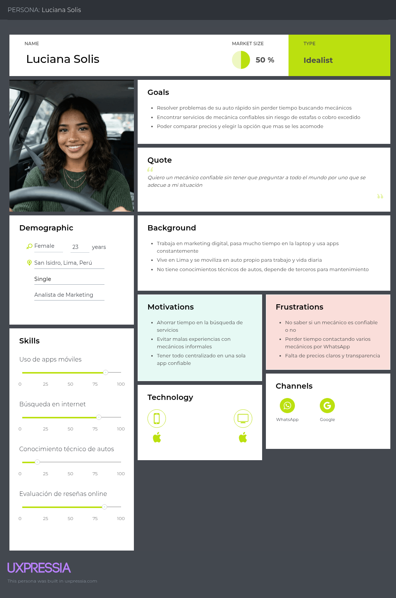
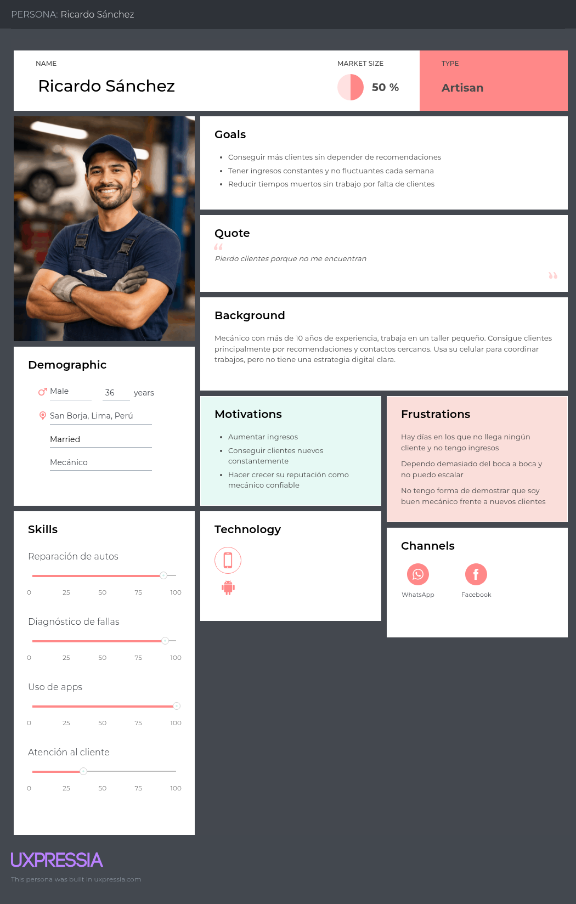

2.3.2. User Task Matrix

| Task | Luciana (Conductora) |  | Ricardo (Mecánico) |  |
|------|----------------------|--|--------------------|--|
|      | Frecuencia | Importancia | Frecuencia | Importancia |
| Buscar mecánico | Always | High | Rarely | Medium |
| Comparar opciones y precios | Often | High | Rarely | Medium |
| Evaluar confianza (reseñas/recomendaciones) | Always | High | Sometimes | High |
| Contactar mecánico / cliente | Often | High | Always | High |
| Coordinar servicio (tiempo y lugar) | Often | High | Always | High |
| Solicitar servicio | Sometimes | High | Rarely | Medium |
| Ejecutar servicio mecánico | Rarely | Medium | Always | High |
| Gestionar pagos | Often | High | Often | High |
| Conseguir nuevos clientes | Rarely | Low | Always | High |
| Mantener reputación | Rarely | Medium | Often | High |
2.3.3. User Journey Mapping

#### User Journey Map – Conductora (Luciana)

%20(1).jpg)

---

#### User Journey Map – Mecánico (Ricardo)

%20(1).jpg)

### 2.3.4. Empathy Mapping

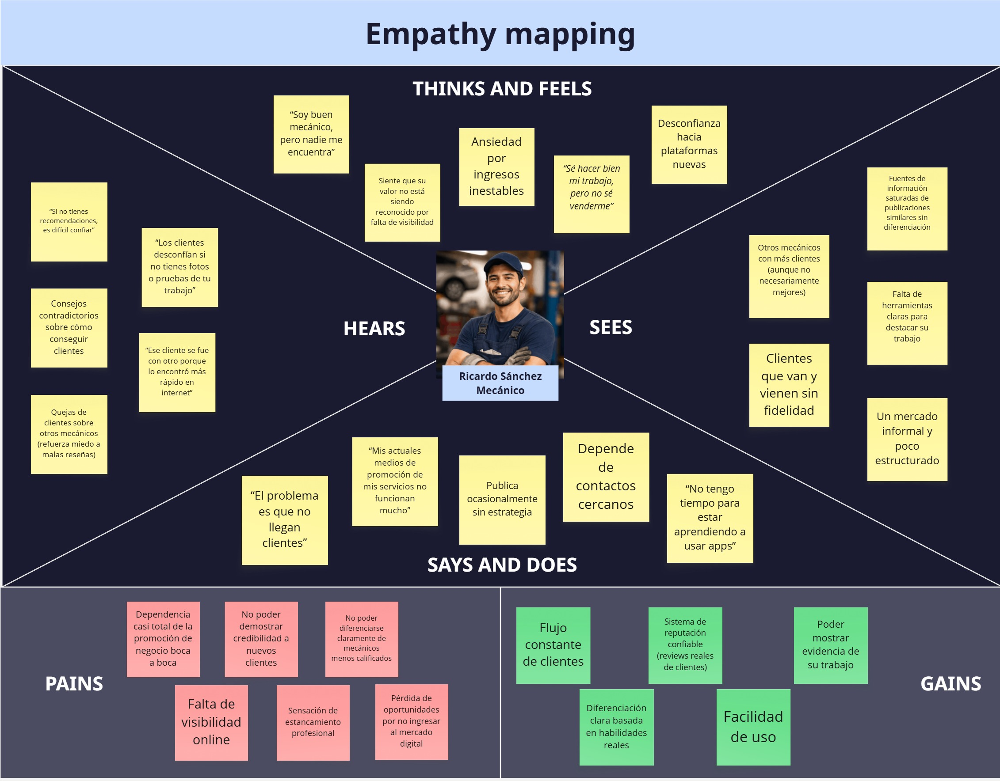
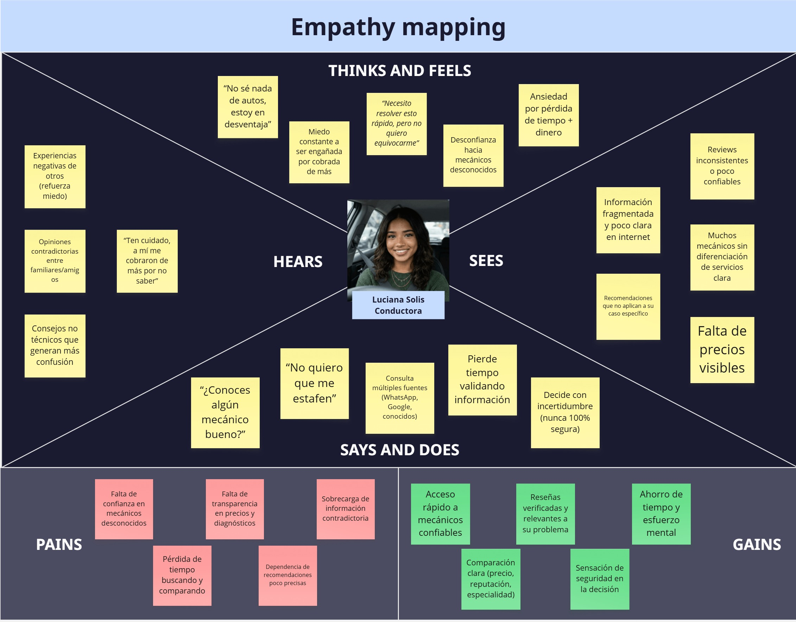

### 2.3.5. Ubiquitous Language

| Término | Definición |
| :---- | :---- |
| **Usuario** | Persona que posee un vehículo y busca servicios mecánicos dentro de la plataforma. |
| **Mecánico** | Proveedor de servicios de mantenimiento o reparación automotriz registrado en la plataforma. |
| **Solicitud de servicio** | Pedido generado por un usuario para recibir atención mecánica. |
| **Match** | Proceso mediante el cual la plataforma conecta a un usuario con uno o más mecánicos disponibles según criterios como ubicación y disponibilidad. |
| **Servicio mecánico** | Trabajo solicitado por el usuario, como mantenimiento, reparación o diagnóstico del vehículo. |
| **Disponibilidad** | Estado del mecánico que indica si puede atender solicitudes en un momento determinado. |
| **Calificación** | Puntuación numérica otorgada por el usuario al mecánico tras finalizar un servicio. |
| **Reseña** | Comentario cualitativo del usuario sobre la experiencia del servicio recibido. |
| **Historial de servicios** | Registro de todos los servicios realizados por un usuario o mecánico dentro de la plataforma. |
| **Precio estimado** | Costo aproximado del servicio mostrado antes de su ejecución. |

#### 2.4. Requirements specification

| Epics |  |
| :---- | ----- |
| Epic 01: Manejo de Usuarios |  |
| Epic 02: Manejo de Servicios |  |
| Epic 03: Matching |  |
| Epic 04: Calificación y reseñas  |  |

### 2.4.1. User Stories

### **2.4.1.1 User Stories**  

| Story ID  | User | Priority | Epic |
| ----- | :---: | :---: | :---: |
| US-01 | Conductor	 | Media | **Epic 04: Calificación y reseñas** |
| **Title** | Calificaciones y reseñas |  |  |
| **Description** |  |  |  |
| Como conductor, quiero leer reseñas y ver calificaciones de mecánicos para tomar una decisión informada. |  |  |  |
| **Acceptance Criteria** |  |  |  |
| **Escenario 1:** Consulta de reseñas **Dado** que el conductor abre el perfil de un mecánico **Cuando** revisa las reseñas **Entonces** se muestran comentarios y promedio de calificaciones.	 |  |  |  |

### 

| Story ID  | User | Priority | Epic |
| ----- | :---: | :---: | :---: |
| US-02 | Conductor	 | Alta | **Epic 02: Manejo de Servicios** |
| **Title** | Cotización transparente |  |  |
| **Description** |  |  |  |
| Como conductor, quiero recibir una cotización previa antes de aceptar el servicio para evitar cobros excesivos. |  |  |  |
| **Acceptance Criteria** |  |  |  |
| **Escenario 1:** Cotización previa **Given** que el conductor solicita un servicio **When** se procesan la información los síntomas del vehículo **Then** la app muestra el precio estimado antes de confirmar.	 |  |  |  |

### 

### 

| Story ID  | User | Priority | Epic |
| ----- | :---: | :---: | :---: |
| US-03 | Conductor	 | Media | **Epic 02: Manejo de Servicios** |
| **Title** | Historial de servicios |  |  |
| **Description** |  |  |  |
| Como conductor, quiero ver mi historial de servicios para recordar qué trabajos se hicieron y con quién. |  |  |  |
| **Acceptance Criteria** |  |  |  |
| **Escenario 1:** Consulta de historial **Given** que el conductor accede a su historial **When** revisa servicios previos **Then** se muestran fecha, mecánico y costo de cada servicio.	 |  |  |  |

### 

| Story ID | User | Priority | Epic |
| ----- | :---: | :---: | :---: |
| US-04 | Conductores | Alta | **Epic 01: Manejo de Usuarios** |
| **Title** | Registro de usuario |  |  |
| **Description** |  |  |  |
| Como usuario quiero registrarme en la plataforma para acceder como conductor o mecánico. |  |  |  |
| **Acceptance Criteria** |  |  |  |
| **Escenario 1: Registrar usuario con email nuevo Dado que** no tengo una cuenta **Cuando** completo mis datos de registro **Entonces** se crea mi usuario con estado activo.  **Escenario 2: Registrar usuario con email usado Dado que** intento registrarme con un correo ya existente **Cuando** envío el formulario **Entonces** el sistema rechaza el registro y me informa el conflicto.  |  |  |  |

### 

| Story ID | User | Priority | Epic |
| ----- | :---: | :---: | :---: |
| US-05 | Conductores | Alta | **Epic 01: Manejo de Usuarios** |
| **Title** | Completar perfil de conductor |  |  |
| **Description** |  |  |  |
| **Como** conductor **Quiero** completar mi perfil personal y de vehículo **Para** recibir mejores recomendaciones y solicitudes más precisas.  |  |  |  |
| **Acceptance Criteria** |  |  |  |
| **Escenario 1: Agregar datos de vehiculo**   Dado que mi cuenta está creada   Cuando agrego los datos de mi vehículo   Entonces mi perfil de conductor queda disponible para búsquedas y matching. **Escenario 2: Actualizar datos de vehiculo**   Dado que ya tengo un vehículo registrado   Cuando actualizo su información   Entonces el perfil guarda la versión más reciente.  |  |  |  |

### 

| Story ID | User | Priority | Epic |
| ----- | :---: | :---: | :---: |
| US-06 | Mecanico | Alta | **Epic 01: Manejo de Usuarios** |
| **Title** | Completar perfil de mecánico |  |  |
| **Description** |  |  |  |
| **Como** mecánico **Quiero** completar mi perfil profesional **Para** mostrar mis capacidades y ser encontrado por conductores.  |  |  |  |
| **Acceptance Criteria** |  |  |  |
| **Escenario 1: Completar datos de mecánico   Dado que** ya estoy registrado   **Cuando** completo mis datos profesionales   **Entonces** mi perfil público queda habilitado. **Escenario 2: Actualizar datos de mecánico   Dado que** actualizo mis datos de contacto o presentación   **Cuando** guardo los cambios   **Entonces** el perfil público refleja la nueva información. |  |  |  |

### 

| Story ID | User | Priority | Epic |
| ----- | :---: | :---: | :---: |
| US-07 | Mecanico | Alta | **Epic 01: Manejo de Usuarios** |
| **Title** | Definir especialidades del mecánico  |  |  |
| **Description** |  |  |  |
| **Como** mecánico **Quiero** definir mis especialidades **Para** aparecer en búsquedas relacionadas con mis conocimientos.  |  |  |  |
| **Acceptance Criteria** |  |  |  |
| **Escenario 1: Ingresar Especialidades**   Dado que estoy editando mi perfil   Cuando selecciono especialidades como frenos, motor o electricidad   Entonces el sistema las asocia a mi perfil. **Escenario 2: Eliminar Especialidades**   Dado que una especialidad ya no aplica a mi servicio   Cuando la elimino del perfil   Entonces deja de usarse en el matching. |  |  |  |

### 

| Story ID | User | Priority | Epic |
| ----- | :---: | :---: | :---: |
| US-12 | Mecanico | Media | **Epic 01: Manejo de Usuarios** |
| **Title** | Definir especialidades del mecánico  |  |  |
| **Description** |  |  |  |
| **Como** mecánico **Quiero** definir mis especialidades **Para** aparecer en búsquedas relacionadas con mis conocimientos.  |  |  |  |
| **Acceptance Criteria** |  |  |  |
| **Escenario 1: Ingresar Especialidades**   Dado que estoy editando mi perfil   Cuando selecciono especialidades como frenos, motor o electricidad   Entonces el sistema las asocia a mi perfil. **Escenario 2: Eliminar Especialidades**   Dado que una especialidad ya no aplica a mi servicio   Cuando la elimino del perfil   Entonces deja de usarse en el matching. **Escenario 3: Seleccionar Especialidad de Tipo de vehículo**   Dado que atiendo un tipo de vehiculo especifico (Carros, SUV, motos, etc)   Cuando selecciono esos tipos de vehículo   Entonces solo seré sugerido para esos segmentos. **Escenario 4: Eliminar Especialidad de Tipo de vehículo**   Dado que ya no atiendo un tipo de vehículo   Cuando lo retiro de mi perfil   Entonces el sistema lo excluye de futuras recomendaciones. |  |  |  |

### 

| Story ID | User | Priority | Epic |
| ----- | :---: | :---: | :---: |
| US-08 | Mecanico | Alta | **Epic 02: Manejo de Servicios** |
| **Title** | Publicar servicio  |  |  |
| **Description** |  |  |  |
| Como mecánico Quiero publicar mis servicios Para ofrecerlo en el catálogo y recibir solicitudes. |  |  |  |
| **Acceptance Criteria** |  |  |  |
| **Escenario 1: Publicar Servicio Completo   Dado que** completé la información del servicio   **Cuando** lo publico   **Entonces** el servicio aparece en el catálogo. **Escenario 2: Publicar Servicio Incompleto     Dado que** faltan datos obligatorios del servicio   **Cuando** intento publicarlo   **Entonces** el sistema bloquea la publicación y muestra los campos faltantes.  |  |  |  |

### 

| Story ID | User | Priority | Epic |
| ----- | :---: | :---: | :---: |
| US-09 | Mecanico | Media | **Epic 02: Manejo de Servicios** |
| **Title** | Editar, activar o desactivar una publicación |  |  |
| **Description** |  |  |  |
| **Como** mecánico **Quiero** editar o pausar mis servicios publicados **Para** mantener actualizado mi catálogo.  |  |  |  |
| **Acceptance Criteria** |  |  |  |
| **Escenario 1: Actualizar Servicio   Dado que** un servicio sigue vigente   **Cuando** actualizo su descripción o condiciones   **Entonces** la publicación se actualiza sin perder su identidad. **Escenario 2: Eliminar Servicio   Dado que** no estoy disponible temporalmente   **Cuando** desactivo un servicio   **Entonces** deja de aparecer en las búsquedas. |  |  |  |

### 

| Story ID | User | Priority | Epic |
| ----- | :---: | :---: | :---: |
| US-10 | Conductor | Alta | **Epic 02: Manejo de Servicios** |
| **Title** | Buscar mecánicos con filtros |  |  |
| **Description** |  |  |  |
| **Como conductor Quiero buscar mecánicos usando filtros Para encontrar opciones compatibles con mi problema y mi vehículo.**  |  |  |  |
| **Acceptance Criteria** |  |  |  |
| **Escenario 1: Busqueda de mecanicos con filtros   Dado que** tengo síntomas y tipo de vehículo definidos   **Cuando** aplico filtros de búsqueda   **Entonces** el sistema me muestra mecánicos compatibles. **Escenario 2: Búsqueda con filtro sin exito   Dado** que no existen resultados exactos   **Cuando** ejecuto la búsqueda   **Entonces** el sistema devuelve opciones cercanas o relacionadas. |  |  |  |

### 

| Story ID | User | Priority | Epic |
| ----- | :---: | :---: | :---: |
| US-11 | Conductor | Alta | **Epic 02: Manejo de Servicios** |
| **Title** | Ver lista de mecánicos disponibles |  |  |
| **Description** |  |  |  |
| **Como conductor Quiero ver una lista de mecánicos disponibles Para comparar opciones antes de crear una solicitud.**   |  |  |  |
| **Acceptance Criteria** |  |  |  |
| **Escenario 1: Visualización de mecánicos disponibles**   Dado que hay mecánicos con disponibilidad vigente   Cuando consulto la lista   Entonces veo únicamente los que pueden atender. **Escenario 2: Sin disponibilidad en la búsqueda**   Dado que no hay disponibilidad en mi zona o horario   Cuando consulto la lista   Entonces el sistema me indica que no hay opciones disponibles. |  |  |  |

### 

| Story ID | User | Priority | Epic |
| ----- | :---: | :---: | :---: |
| US-12 | Conductor | Media | **Epic 02: Manejo de Servicios** |
| **Title** | Consultar perfil público del mecánico |  |  |
| **Description** |  |  |  |
| **Como conductor Quiero ver el perfil público del mecánico Para evaluar si es adecuado para mi caso.**  |  |  |  |
| **Acceptance Criteria** |  |  |  |
| **Escenario 1: Acceso a perfil público disponible**   Dado que selecciono un mecánico en la búsqueda   Cuando abro su perfil público   Entonces veo sus especialidades, ubicación y reputación. **Escenario 2: Perfil no disponible públicamente**   Dado que el mecánico desactivó su publicación   Cuando intento ver su perfil   Entonces el sistema muestra que no está disponible públicamente. |  |  |  |

### 

| Story ID | User | Priority | Epic |
| ----- | :---: | :---: | :---: |
| US-13 | Mecanico | Media | **Epic 02: Manejo de Servicios** |
| **Title** | Gestionar disponibilidad y horarios |  |  |
| **Description** |  |  |  |
| **Como mecánico Quiero administrar mis horarios de atención Para recibir solicitudes solo cuando realmente pueda atender.**  |  |  |  |
| **Acceptance Criteria** |  |  |  |
| **Escenario 1: Definición de horarios disponibles**   Dado que tengo una jornada definida   Cuando agrego mis franjas horarias   Entonces el sistema las usa para mostrar mi disponibilidad. **Escenario 2: Bloqueo de horario no disponible**   Dado que tengo un bloqueo de agenda   Cuando marco un horario como no disponible   Entonces ese horario deja de poder seleccionarse. |  |  |  |

### 

| Story ID | User | Priority | Epic |
| ----- | :---: | :---: | :---: |
| US-14 | Conductor | Alta | **Epic 02: Manejo de Servicios** |
| **Title** | Registrar síntomas y contexto |  |  |
| **Description** |  |  |  |
| **Como conductor Quiero registrar síntomas, problema e información contextual del vehículo Para recibir una recomendación más precisa.**  |  |  |  |
| **Acceptance Criteria** |  |  |  |
| **Escenario 1: Registro de síntomas básicos**   Dado que mi vehículo presenta un ruido extraño   Cuando describo el síntoma y el contexto   Entonces el sistema guarda la información para el diagnóstico. **Escenario 2: Registro de contexto adicional**   Dado que el problema ocurre solo en ciertas condiciones   Cuando agrego ese contexto   Entonces el diagnóstico preliminar considera esa información. |  |  |  |

### 

| Story ID | User | Priority | Epic |
| ----- | :---: | :---: | :---: |
| US-15 | Sistema | Alta | **Epic 02: Manejo de Servicios** |
| **Title** | Generar diagnóstico preliminar |  |  |
| **Description** |  |  |  |
| **Como sistema Quiero generar un diagnóstico preliminar a partir de los síntomas Para orientar el matching y la cotización referencial.**  |  |  |  |
| **Acceptance Criteria** |  |  |  |
| **Escenario 1: Diagnóstico generado con información suficiente**   Dado que los síntomas registrados son suficientes   Cuando se procesa la información   Entonces se genera un diagnóstico preliminar. **Escenario 2: Diagnóstico no generado por falta de información**   Dado que los síntomas son ambiguos o incompletos   Cuando el sistema evalúa el caso   Entonces no genera un diagnóstico confiable y mantiene el caso como pendiente de enriquecimiento. |  |  |  |

### 

| Story ID | User | Priority | Epic |
| ----- | :---: | :---: | :---: |
| US-16 | Sistema | Alta | **Epic 03: Matching** |
| **Title** | Sugerir Match |  |  |
| **Description** |  |  |  |
| **Como sistema Quiero encontrar un match entre conductor y mecánico Para maximizar la compatibilidad entre problema, vehículo y servicio.**  |  |  |  |
| **Acceptance Criteria** |  |  |  |
| **Escenario 1: Generación de match exacto**   Dado que existe un mecánico compatible con diagnóstico, vehículo y ubicación   Cuando se ejecuta el matching   Entonces se genera un match exacto. **Escenario 2: Ausencia de match exacto**   Dado que no hay un mecánico exacto disponible Cuando el sistema busca alternativas Entonces me sugiere un mecánico similar. |  |  |  |

### 

| Story ID | User | Priority | Epic |
| ----- | :---: | :---: | :---: |
| US-17 | Sistema | Alta | **Epic 02: Manejo de Servicios** |
| **Title** | Generar cotización referencial |  |  |
| **Description** |  |  |  |
| **Como sistema Quiero generar una cotización referencial Para reducir el riesgo de sobreprecio antes de crear la solicitud.**  |  |  |  |
| **Acceptance Criteria** |  |  |  |
| **Escenario 1: Generación de cotización estimada**   Dado que existe suficiente información del problema   Cuando el sistema calcula la referencia   Entonces se genera un rango de cotización estimado. |  |  |  |

### 

| Story ID | User | Priority | Epic |
| ----- | :---: | :---: | :---: |
| US-18 | Conductor | Alta | **Epic 02: Manejo de Servicios** |
| **Title** | Crear solicitud de servicio |  |  |
| **Description** |  |  |  |
| **Como conductor Quiero crear una solicitud de servicio Para formalizar mi necesidad y activar el proceso operativo.**  |  |  |  |
| **Acceptance Criteria** |  |  |  |
| **Escenario 1: Creación exitosa de solicitud**   Dado que ya elegí un mecánico o una recomendación   Cuando confirmo la solicitud   Entonces se crea una solicitud de servicio. **Escenario 2: Bloqueo por información incompleta**   Dado que no he completado los datos mínimos   Cuando intento crear la solicitud   Entonces el sistema no la registra y me pide completar la información faltante. |  |  |  |

### 

| Story ID | User | Priority | Epic |
| ----- | :---: | :---: | :---: |
| US-19 | Conductor/Mecanico | Media | **Epic 02: Manejo de Servicios** |
| **Title** | Cancelar solicitud de servicio |  |  |
| **Description** |  |  |  |
| **Como conductor o mecánico Quiero cancelar una solicitud de servicio Para detener el proceso cuando lo desee** |  |  |  |
| **Acceptance Criteria** |  |  |  |
| **Escenario 1: Cancelación de Servicio**  Dado que el servicio todavía no se ha ejecutado   Cuando una de las partes cancela la solicitud   Entonces el servicio pasa a estado cancelado. |  |  |  |

### 

| Story ID | User | Priority | Epic |
| ----- | :---: | :---: | :---: |
| US-20 | Conductor/Mecanico | Alta | **Epic 02: Manejo de Servicios** |
| **Title** | Marcar servicio |  |  |
| **Description** |  |  |  |
| **Como mecánico y conductor Quiero marcar el servicio como completado Para finalizar mi servicio** |  |  |  |
| **Acceptance Criteria** |  |  |  |
| **Escenario 1: Marcado exitoso de servicio completado**   Dado que el conductor culmina la atención   Cuando el conductor marca la finalización del servicio  Entonces el estado cambia a “pendiente de confirmación del conductor”. **Escenario 2: Bloqueo por servicio no finalizado**  Dado que el mecánico ya marcó el servicio como completado Cuando confirma el mecanico marca la finalización del servicio Entonces se registra mi confirmación.  |  |  |  |

### 

| Story ID | User | Priority | Epic |
| ----- | :---: | :---: | :---: |
| US-21 | Conductor/Mecanico | Media | **Epic 02: Manejo de Servicios** |
| **Title** | Consultar estado de servicio y servicios activos |  |  |
| **Description** |  |  |  |
| **Como conductor o mecánico Quiero consultar el estado de un servicio y mis servicios activos Para entender en qué etapa se encuentra cada atención.**  |  |  |  |
| **Acceptance Criteria** |  |  |  |
| **Escenario 1: Consulta de servicio en curso**   Dado que tengo una solicitud en curso   Cuando reviso el panel de servicios   Entonces veo su estado actual. **Escenario 2: Exclusión de servicios finalizados en activos**   Dado que un servicio ya fue finalizado   Cuando consulto mis servicios activos   Entonces ese servicio ya no aparece en la lista activa. |  |  |  |

### 

| Story ID | User | Priority | Epic |
| ----- | :---: | :---: | :---: |
| US-22 | Conductor | Media | **Epic 02: Manejo de Servicios** |
| **Title** | Calificar servicio finalizado |  |  |
| **Description** |  |  |  |
| **Como conductor Quiero calificar un servicio finalizado Para expresar mi nivel de satisfacción con la atención recibida.**  |  |  |  |
| **Acceptance Criteria** |  |  |  |
| **Escenario 1: Envío de calificación válido**   Dado que el servicio fue finalizado   Cuando envío una calificación   Entonces la plataforma la registra. |  |  |  |

### 

| Story ID | User | Priority | Epic |
| ----- | :---: | :---: | :---: |
| US-23 | Conductor | Media | **Epic 04: Calificación y reseñas** |
| **Title** | Publicar reseña |  |  |
| **Description** |  |  |  |
| **Como conductor Quiero publicar una reseña sobre el servicio finalizado Para aportar contexto cualitativo y afectar la reputación del mecánico.**  |  |  |  |
| **Acceptance Criteria** |  |  |  |
| **Escenario 1: Publicación de reseña válida**   Dado que ya completé la calificación de un servicio finalizado   Cuando envío mi reseña   Entonces la reseña se publica y actualiza la reputación del mecánico. **Escenario 2: Bloqueo por reseña duplicada**   Dado que ya existe una reseña para ese mismo servicio   Cuando intento publicar otra   Entonces el sistema la rechaza para evitar duplicidad. |  |  |  |

### 

| Story ID | User | Priority | Epic |
| ----- | :---: | :---: | :---: |
| US-24 | Conductor | Baja | **No aplica** |
| **Title** | Landing Page |  |  |
| **Description** |  |  |  |
| **Como conductor o mecánico Quiero ver las funcionalidades de la aplicación Para saber si me conviene usarla** |  |  |  |
| **Acceptance Criteria** |  |  |  |
| **Escenario 1: Ver funcionalidades**   Dado que estoy en la landing page  Cuando navego por la landing page Entonces puedo visualizar las funcionalidades de la misma |  |  |  |

### 

### **2.4.1.2 Technical Stories \- Todos**

| Story ID  | User | Priority | Epic |
| ----- | :---: | :---: | :---: |
| TS-01 | Developers	 | Media | No aplica |
| **Title** | Sistema de notificaciones |  |  |
| **Description** |  |  |  |
| Como desarrollador, quiero implementar un sistema de notificaciones externo para alertar de eventos importantes a los usuarios . |  |  |  |
| **Acceptance Criteria** |  |  |  |
| **Escenario 1:** Notificación de solicitud **Given** qué ocurre una nueva solicitud **When** el evento es generado **Then** el sistema envía una notificación al mecánico	 |  |  |  |

### 

| Story ID  | User | Priority | Epic |
| ----- | :---: | :---: | :---: |
| TS-02 | Developers	 | Alta | No aplica |
| **Title** | Conectar con API Externa de geolocalización |  |  |
| **Description** |  |  |  |
| Como desarrollador, quiero implementar servicios de geolocalización para calcular distancias entre usuarios y mecánicos. |  |  |  |
| **Acceptance Criteria** |  |  |  |
| **Escenario 1:** Consulta de ubicación **Given**  que se reciben coordenadas **When** el sistema procesa la solicitud **Then** devuelve resultados ordenados por cercanía |  |  |  |

### 

| Story ID | User | Priority | Epic |
| ----- | :---: | :---: | :---: |
| TS-03 | Developers | Alta | No Aplica |
| **Title** | Registro de usuario |  |  |
| **Description** |  |  |  |
| Como desarrollador, quiero registrar usuarios (conductores y mecánicos) a través de diferentes formularios para permitir el acceso a la plataforma.  |  |  |  |
| **Acceptance Criteria** |  |  |  |
| **Escenario 1: Consulta de ubicación Dado que** el usuario es un mecánico **Y** envía sus datos **Cuando** el sistema valida la información **Entonces** se crea el usuario con rol “Mecánico” en la base de datos  **Escenario 1: Consulta de ubicación Dado que** el usuario es un conductor **Y** envía sus datos **Cuando** el sistema valida la información **Entonces** se crea el usuario con rol “Conductor” en la base de datos  |  |  |  |

### 

| Story ID | User | Priority | Epic |
| ----- | :---: | :---: | :---: |
| TS-04 | Developers | Alta | No Aplica |
| **Title** | Login de usuario |  |  |
| **Description** |  |  |  |
| Como desarrollador, quiero autenticar a los usuarios para permitir acceso seguro.  |  |  |  |
| **Acceptance Criteria** |  |  |  |
| **Escenario 1: Inicio de sesión con credenciales correctas Dado que** el usuario ingresa credenciales correctas **Cuando** el usuario presiona el botón para iniciar sesión **Entonces** el sistema devuelve un token JWT con el que podrá hacer querys **Escenario 2: Inicio de sesión con credenciales incorrectas Dado que** el usuario ingresa credenciales incorrectas **Cuando** el usuario presiona el botón para iniciar sesión **Entonces** el sistema devuelve un error y no brinda el token **Escenario 3:Diferenciación de roles en Base de Datos. Dado** que existen distintos tipos de usuarios (mecanicos y conductores) **Cuando** el usuario intente acceder a queries **Entonces** el sistema verificará si su rol tiene acceso a estas |  |  |  |

### 

| Story ID | User | Priority | Epic |
| ----- | :---: | :---: | :---: |
| TS-05 | Developers | Alta | No Aplica |
| **Title** | Diseñar API CRUD de usuarios |  |  |
| **Description** |  |  |  |
| Como desarrollador, quiero crear endpoints para manejar a los usuarios de mi aplicación |  |  |  |
| **Acceptance Criteria** |  |  |  |
| **Escenario 1: Actualización de Usuario Dado que** existe un usuario registrado **Cuando** se actualizan los datos del usuario **Entonces** se modifican los datos del usuario en la Base de Datos  **Escenario 2: Eliminación de Usuario Dado que** existe un usuario registrado **Cuando** se solicita la eliminación del usuario **Entonces** el usuario es marcado como inactivo en la Base de Datos |  |  |  |

### 

| Story ID | User | Priority | Epic |
| ----- | :---: | :---: | :---: |
| TS-06 | Developers | Alta | No Aplica |
| **Title** | Diseñar queries de usuarios |  |  |
| **Description** |  |  |  |
| Como desarrollador, quiero filtrar usuarios por diferentes campos para mejorar la búsqueda.  |  |  |  |
| **Acceptance Criteria** |  |  |  |
| **Escenario 1: Filtro aplicado Dado que** se han ingresado parámetros de filtro **Cuando** se ejecuta la consulta **Entonces** retorna usuarios que cumplan condiciones   **Escenario 2: Filtro no Aplicado Dado que** no se han ingresado parámetros de filtro **Cuando** se ejecuta la consulta **Entonces** retorna a todos los usuarios |  |  |  |

### 

| Story ID | User | Priority | Epic |
| ----- | :---: | :---: | :---: |
| TS-07 | Developers | Alta | No Aplica |
| **Title** | Diseñar CRUD API de servicios |  |  |
| **Description** |  |  |  |
| Como desarrollador, quiero diseñar una API de servicios para poder registrar o modificar los servicios dados por los mecanicos  |  |  |  |
| **Acceptance Criteria** |  |  |  |
| **Escenario 1: Registro de Servicio  Dado que** se han ingresado los parámetros del servicio **Cuand**o se registra el servicio **Entonces** se guarda el servicio en la Base de Datos **Escenario 2: Actualización de Servicio Dado que** existe un servicio registrado **Cuando** se actualizan los datos del servicio **Entonces** se modifican los datos del servicio en la Base de Datos  **Escenario 3: Eliminación de Servicio Dado que** existe un servicio registrado **Cuando** se solicita la eliminación del servicio **Entonces** el servicio es marcado como desestimado en la Base de Datos  |  |  |  |

### 

| Story ID | User | Priority | Epic |
| ----- | :---: | :---: | :---: |
| TS-08 | Developers | Alta | No Aplica |
| **Title** | Diseñar queries de servicios |  |  |
| **Description** |  |  |  |
| Como desarrollador, quiero filtrar servicios por diferentes campos para mejorar la búsqueda.  |  |  |  |
| **Acceptance Criteria** |  |  |  |
| **Escenario 1: Filtro aplicado Dado que** se han ingresado parámetros de filtro **Cuando** se ejecuta la consulta **Entonces** retorna servicios que cumplan condiciones   **Escenario 2: Filtro no Aplicado Dado que** no se han ingresado parámetros de filtro **Cuando** se ejecuta la consulta **Entonces** retorna a todos los servicios   |  |  |  |

### 

| Story ID | User | Priority | Epic |
| ----- | :---: | :---: | :---: |
| TS-09 | Developers | Alta | No Aplica |
| **Title** | Diseñar queries de servicios |  |  |
| **Description** |  |  |  |
| Como desarrollador, quiero filtrar servicios por diferentes campos para mejorar la búsqueda.   |  |  |  |
| **Acceptance Criteria** |  |  |  |
| **Escenario 1: Filtro aplicado Dado que** se han ingresado parámetros de filtro **Cuando** se ejecuta la consulta **Entonces** retorna servicios que cumplan condiciones   **Escenario 2: Filtro no Aplicado Dado que** no se han ingresado parámetros de filtro **Cuando** se ejecuta la consulta **Entonces** retorna a todos los servicios   |  |  |  |

### 

| Story ID | User | Priority | Epic |
| ----- | :---: | :---: | :---: |
| TS-10 | Developers | Alta | No Aplica |
| **Title** | Integración con IA de recomendación inteligente de mecánicos  |  |  |
| **Description** |  |  |  |
| Como desarrollador, quiero utilizar un modelo de IA para recomendar el mejor mecánico al usuario en base a parámetros como ubicación, tipo de problema, rating y disponibilidad, para mejorar la experiencia y precisión en la elección.  |  |  |  |
| **Acceptance Criteria** |  |  |  |
| **Escenario 1: Recomendación exitosa Dado que** el usuario ingresa los parámetros del servicio (ubicación, tipo de problema, etc.) **Cuando el** sistema procesa la información con el modelo de IA **Entonces** se retorna una lista de mecánicos recomendados ordenados por relevancia  **Escenario 2: Sin coincidencias exactas Dado que** no existen mecánicos que cumplan todos los parámetros o cumplan parcialmente **Cuando** el sistema ejecuta la búsqueda **Entonces** se retornan mecánicos cercanos o similares como recomendación alternativa |  |  |  |

### 

### **2.4.1.3 Spike Stories \- Gabriel**

| Story ID  | User | Priority | Epic |
| ----- | :---: | :---: | :---: |
| SS-01 | Developer | Alta | EP-03 Plataformas |
| **Title** | Investigación de geolocalización |  |  |
| **Description** |  |  |  |
| Investigar tecnologías para implementar geolocalización en tiempo real en la plataforma. |  |  |  |
| **Acceptance Criteria** |  |  |  |
| **Escenario 1:** Evaluación de tecnologías **Given**  que se requiere implementar geolocalización **When** se analizan diferentes herramientas **Then** se documenta la mejor alternativa técnica |  |  |  |

### 

| Story ID | User | Priority | Epic |
| ----- | :---: | :---: | :---: |
| SS-02 | Developers | Media | No Aplica |
| **Title** | Investigar la Integración de OpenAI para Recomendación Inteligente de Mecánicos |  |  |
| **Description** |  |  |  |
| Como desarrollador,  quiero evaluar la integración de OpenAI como motor de recomendación para mejorar la precisión en la asignación de mecánicos y optimizar la experiencia del usuario. |  |  |  |
| **Acceptance Criteria** |  |  |  |
| **Escenario 1: Revisión de la API de OpenAI Dado que** el equipo necesita entender las capacidades de OpenAI  **Cuando** el desarrollador revisa la documentación de la API  **Entonces** identifica los endpoints y modelos adecuados para recomendaciones **Escenario 2: Evaluación de Integración Backend Dado que** el sistema usa backend para lógica de negocio  **Cuando** el desarrollador evalúa el consumo de la API de OpenAI  **Entonces** se definen los endpoints necesarios para enviar parámetros y recibir recomendaciones  **Escenario 3: Evalúa la Compatibilidad Móvil Dado** la arquitectura Kotlin Multiplatform Mobile (KMM) para Android e iOS, **Cuando** el desarrollador evalúa la compatibilidad con los Apps SDKs de OpenAI **Entonces** el desarrollador documenta los requisitos de integración móvil **Escenario 4: Evaluación de Seguridad Dado que** se manejarán datos de usuarios  **Cuando** el desarrollador analiza la integración  **Entonces** se identifican riesgos y medidas de protección (API keys, validación, etc.) **Escenario 5: Evaluación de Costos Dado** que OpenAI tiene costos por uso  **Cuando** el desarrollador analiza el consumo esperado  **Entonces** se estiman costos según el volumen de requests proyectado **Escenario 6: Evaluación de Rendimiento Dado que** las recomendaciones deben ser rápidas (menos de 5 segundos)  **Cuando** el desarrollador mide el tiempo de respuesta  **Entonces** se identifican posibles latencias **Escenario 7: Identificación de Dependencias Dado que** se requiere integración externa  **Cuando** el desarrollador revisa la implementación  **Entonces** se listan librerías, configuraciones y servicios necesarios **Escenario 8: Prototipa la Integración de Stripe Dado que** se necesita validar la viabilidad de OpenAI  **Cuando** el desarrollador construye un proof-of-concept mínimo   **Entonces** se obtiene una recomendación de mecánicos funcional **Escenario 9: Estimación de Esfuerzo Dado que** el equipo necesita una estimación de esfuerzo para la implementación de OpenAi **Cuando** el desarrollador desglosa la integración en tareas de móvil (KMM), y backend basadas en los hallazgos del Spike **Entonces** el desarrollador proporciona una estimación aproximada de puntos de historia para la funcionalidad completa en el informe.  **Escenario 10: Documentación Final Dado que** el Spike está completo, **Cuando** el desarrollador compila todos los hallazgos en un informe compartido, **Entonces** el informe incluye pros/contras, enfoque recomendado y es revisado en una reunión de equipo o sesión de refinamiento |  |  |  |

### 

| Story ID | User | Priority | Epic |
| ----- | :---: | :---: | :---: |
| SS-02 | Developers | Media | No Aplica |
| **Title** | Investigar la Integración de FAISS para Recomendación Inteligente de Mecánicos |  |  |
| **Description** |  |  |  |
| Como desarrollador,  quiero evaluar la integración de FAISS como motor de recomendación para mejorar la precisión en la asignación de mecánicos y optimizar la experiencia del usuario. |  |  |  |
| **Acceptance Criteria** |  |  |  |
| **Escenario 1: Revisión de FAISS  Dado** que el equipo necesita entender las capacidades de FAISS  **Cuando** el desarrollador revisa la documentación de FAISS  **Entonces** identifica cómo funciona la búsqueda por similitud mediante vectores **Escenario 2: Evaluación de Integración Backend  Dado que** el sistema usa backend para lógica de negocio  **Cuando** el desarrollador evalúa la integración de FAISS  **Entonces** se definen los endpoints necesarios para indexar y consultar mecánicos  **Escenario 3: Modelado de Datos Vectoriales  Dado que** FAISS trabaja con vectores  **Cuando** el desarrollador define la estructura de datos  **Entonces** se representan los mecánicos como vectores (ej: ubicación, rating, especialidad) **Escenario 4: Evaluación de Seguridad  Dado que** se manejarán datos de usuarios  **Cuando** el desarrollador analiza la integración  **Entonces** se identifican riesgos y medidas de protección **Escenario 5: Evaluación de Costos  Dado que** FAISS es open source  **Cuando** el desarrollador analiza su implementación  **Entonces** se identifican costos asociados a infraestructura (servidor, memoria) **Escenario 6: Evaluación de Rendimiento  Dado que** las recomendaciones deben ser rápidas (menos de 3 segundos)  **Cuando** el desarrollador prueba consultas de similitud  **Entonces** se valida que FAISS responde eficientemente incluso con grandes volúmenes de datos **Escenario 7: Identificación de Dependencias  Dado que** se requiere integración técnica  **Cuando** el desarrollador revisa la implementación  **Entonces** se listan librerías necesarias  **Escenario 8: Prototipa la Integración de FAISS  Dado que** se necesita validar la viabilidad  **Cuando** el desarrollador construye un proof-of-concept mínimo  **Entonces** se obtiene una lista de mecánicos recomendados por similitud **Escenario 9: Estimación de Esfuerzo   Dado que** el equipo necesita una estimación de esfuerzo   **Cuando** el desarrollador desglosa tareas (vectorización, indexación, queries backend)   **Entonces** se proporciona una estimación aproximada de implementación  **Escenario 10: Documentación Final  Dado que** el Spike está completo  **Cuando** el desarrollador compila los hallazgos  **Entonces** el informe incluye ventajas, limitaciones y posibles usos dentro del sistema |  |  |  |

### 

| Story ID | User | Priority | Epic |
| ----- | :---: | :---: | :---: |
| SS-03 | Developers | Media | No Aplica |
| **Title** | Investigar la Integración de Google Maps API para localizar mecánicos en el mapa |  |  |
| **Description** |  |  |  |
| Como desarrollador, quiero evaluar la integración de Google Maps API como motor de mapas para mejorar la experiencia del usuario al encontrar mecánicos cercanos. |  |  |  |
| **Acceptance Criteria** |  |  |  |
| **Escenario 1: Revisión de documentación de Google Maps API   Dado** que el equipo necesita entender las capacidades de Google Maps   **Cuando** el desarrollador revisa la documentación oficial de la API   **Entonces** identifica los endpoints relevantes para geolocalización y visualización de mecánicos en el mapa.  **Escenario 2: Evaluación de Integración Backend  Dado que** la plataforma usa un backend para lógica de negocio   **Cuando** el desarrollador analiza cómo consumir la API desde el backend   **Entonces** se definen los endpoints necesarios para enviar coordenadas y recibir resultados.   **Escenario 3: Prototipo mínimo de integración   Dado que** se requiere validar la viabilidad técnica   **Cuando** el desarrollador construye un proof-of-concept con un mapa y marcadores de mecánicos   **Entonces** se visualizan correctamente las ubicaciones en el mapa.   **Escenario 4: Evaluación de costos y licenciamiento   Dado que** se manejarán datos de usuarios  **Cuando** el desarrollador analiza la integración  **Entonces** se identifican riesgos y medidas de protección **Escenario 5: Evaluación de Costos  Dado que** Google Maps API tiene costos por uso   **Cuando** el desarrollador estima el volumen de requests   **Entonces** se documentan los costos proyectados y las restricciones de licenciamiento   **Escenario 6: Evaluación de Rendimiento  Dado que** la integración debe ser rápida y usable   **Cuando** se mide el tiempo de respuesta y carga del mapa   **Entonces** se valida que la experiencia sea fluida (menos de X segundos).   |  |  |  |

2.4.2. Impact Mapping

  

### 2.4.3. Product Backlog

| # Orden | User Story Id | Título | Story Points (1 / 2 / 3 / 5 / 8) |
|--------|--------------|--------|----------------------------------|
| 1 | US-01 | Calificaciones y reseñas | 3 |
| 2 | US-02 | Cotización transparente | 5 |
| 3 | US-03 | Historial de servicios | 3 |
| 4 | US-04 | Registro de usuario | 5 |
| 5 | US-05 | Completar perfil de conductor | 3 |
| 6 | US-06 | Completar perfil de mecánico | 3 |
| 7 | US-07 | Definir especialidades del mecánico | 3 |
| 8 | US-12 | Definir especialidades del mecánico | 5 |
| 9 | US-08 | Publicar servicio | 5 |
| 10 | US-09 | Editar, activar o desactivar una publicación | 3 |
| 11 | US-10 | Buscar mecánicos con filtros | 5 |
| 12 | US-11 | Ver lista de mecánicos disponibles | 3 |
| 13 | US-12 | Consultar perfil público del mecánico | 2 |
| 14 | US-13 | Gestionar disponibilidad y horarios | 5 |
| 15 | US-14 | Registrar síntomas y contexto | 3 |
| 16 | US-15 | Generar diagnóstico preliminar | 5 |
| 17 | US-16 | Sugerir Match | 8 |
| 18 | US-17 | Generar cotización referencial | 5 |
| 19 | US-18 | Crear solicitud de servicio | 5 |
| 20 | US-19 | Cancelar solicitud de servicio | 2 |
| 21 | US-20 | Marcar servicio | 3 |
| 22 | US-21 | Consultar estado de servicio y servicios activos | 3 |
| 23 | US-22 | Calificar servicio finalizado | 2 |
| 24 | US-23 | Publicar reseña | 3 |
| 25 | US-24 | Landing Page | 3 |
| 26 | TS-01 | Sistema de notificaciones | 5 |
| 27 | TS-02 | Conectar con API Externa de geolocalización | 8 |
| 28 | TS-03 | Registro de usuario | 5 |
| 29 | TS-04 | Login de usuario | 5 |
| 30 | TS-05 | Diseñar API CRUD de usuarios | 5 |
| 31 | TS-06 | Diseñar queries de usuarios | 3 |
| 32 | TS-07 | Diseñar CRUD API de servicios | 5 |
| 33 | TS-08 | Diseñar queries de servicios | 3 |
| 34 | TS-09 | Diseñar queries de servicios | 3 |
| 35 | TS-10 | Integración con IA de recomendación inteligente de mecánicos | 8 |
| 36 | SS-01 | Investigación de geolocalización | 5 |
| 37 | SS-02 | Integración de OpenAI para recomendación | 8 |
| 38 | SS-02 | Integración de FAISS para recomendación | 8 |
| 39 | SS-03 | Integración de Google Maps API | 8 |

## 2.5. Strategic-Level Domain-Driven Design

### 2.5.1. EventStorming

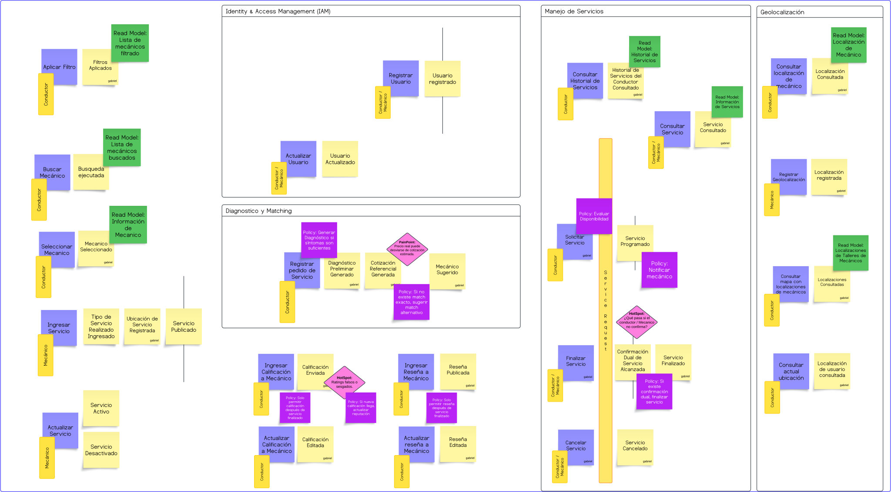

2.5.1.1. Candidate Context Discovery

Durante el EventStorming se aplicó la técnica look-for-pivotal-events para identificar los eventos que marcan cambios de estado en el negocio. Estos eventos actuaron como splitters de la narrativa principal, permitiendo separar responsabilidades y definir los contextos candidatos. A partir de este análisis se establecieron los siguientes bounded contexts:

| Bounded Context          | Descripción                                                                 | Eventos clave                                                                 |
|--------------------------|------------------------------------------------------------------------------|-------------------------------------------------------------------------------|
| ServiceCatalogContext    | Gestiona la publicación, actualización y filtrado de servicios mecánicos.   | Servicio Publicado, Servicio Actualizado, Servicio Desactivado                |
| UserIdentityContext (IAM)| Maneja el registro, autenticación y perfiles de usuarios y mecánicos.        | Usuario Registrado, Usuario Actualizado, Perfil Completado                    |
| DiagnosisContext         | Administra pedidos de servicio, síntomas y generación de diagnósticos/cotizaciones. | Pedido de Servicio Registrado, Diagnóstico Generado, Match Encontrado         |
| ReputationContext        | Gestiona calificaciones y reseñas verificadas de los servicios completados. | Calificación Enviada, Reseña Publicada, Calificación Editada, Reseña Editada  |
| ServiceManagementContext | Controla el ciclo de vida del servicio, desde la solicitud hasta la finalización y registro en el historial. | Servicio Solicitado, Confirmación Dual Alcanzada, Servicio Finalizado, Servicio Cancelado |

2.5.1.2. Domain Message Flows Modeling

2.5.1.3. Bounded Context Canvases

2.5.2. Context Mapping

2.5.3. Software Architecture

2.5.3.1. Software Architecture Context Level Diagrams

2.5.3.2. Software Architecture Container Level Diagrams

2.5.3.3. Software Architecture Deployment Diagrams

#### 2.6. Tactical-Level Domain-Driven Design

2.6.1. Bounded Context: ServiceCatalogContext 

En esta sección se describe el contexto encargado de la gestión del catálogo de servicios mecánicos, incluyendo su publicación, actualización y desactivación. Se detallan las clases identificadas como parte del modelo de dominio, documentando su propósito, atributos, métodos y relaciones, con el fin de estructurar un diccionario claro del dominio.

Miró en donde se desarrolló:

https://miro.com/app/board/uXjVHd8mZPo=/?share_link_id=996378247083

2.6.1.1. Domain Layer

Aquí se modela el núcleo del catálogo de servicios. Se incluyen entidades como Servicio, junto con Value Objects relacionados (por ejemplo, categoría o ubicación). Se definen agregados que aseguran la consistencia del estado del servicio, así como interfaces de repositorios para su persistencia.

2.6.1.2. Interface Layer

Se presentan los controladores encargados de exponer funcionalidades como publicación, edición y filtrado de servicios. Estos componentes permiten la interacción con clientes externos, como aplicaciones web o móviles.

2.6.1.3. Application Layer

Se gestionan los flujos de negocio mediante Command Handlers (por ejemplo, PublicarServicio o ActualizarServicio) y Event Handlers asociados a eventos como ServicioPublicado o ServicioActualizado.

2.6.1.4 Infrastructure Layer
Se implementan repositorios concretos para persistencia en base de datos, además de integraciones con servicios externos si aplica (por ejemplo, indexación para búsqueda).

En este punto se muestran los layers juntos:

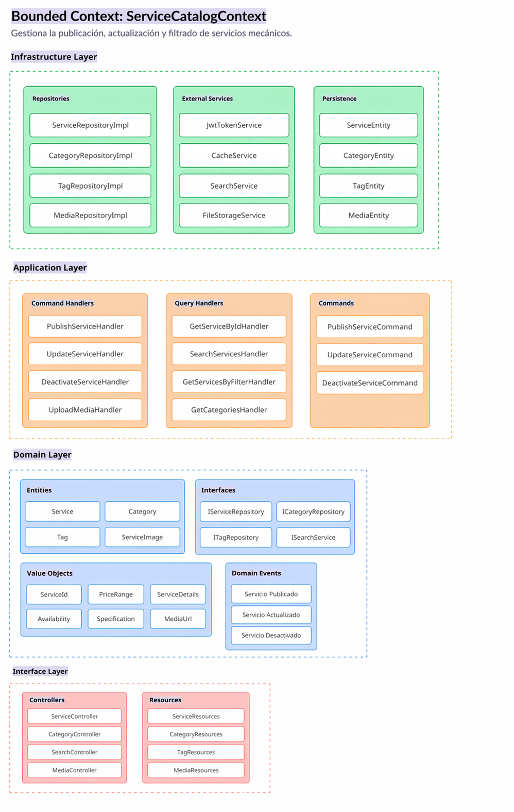

2.6.1.5. Bounded Context Software Architecture Component Level Diagrams

Se presentan diagramas C4 que muestran cómo el contenedor del catálogo se descompone en componentes como API, servicios de aplicación y repositorios.

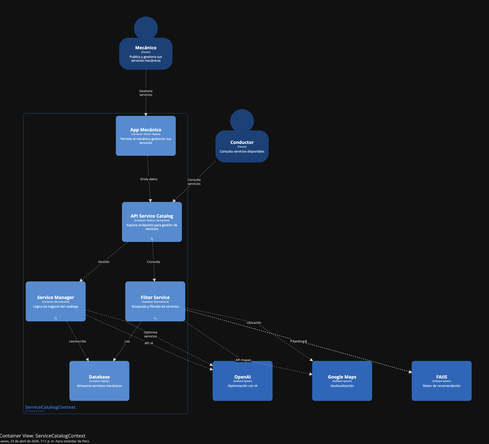

2.6.1.6. Bounded Context Software Architecture Code Level Diagrams

Se incluyen diagramas detallados que reflejan la implementación interna, incluyendo clases de dominio y estructura de persistencia.

  2.6.1.6.1. Bounded Context Domain Layer Class Diagrams
  
   Se modelan las clases principales del dominio, sus atributos, métodos y relaciones, incluyendo multiplicidades y tipos de asociación.
   
   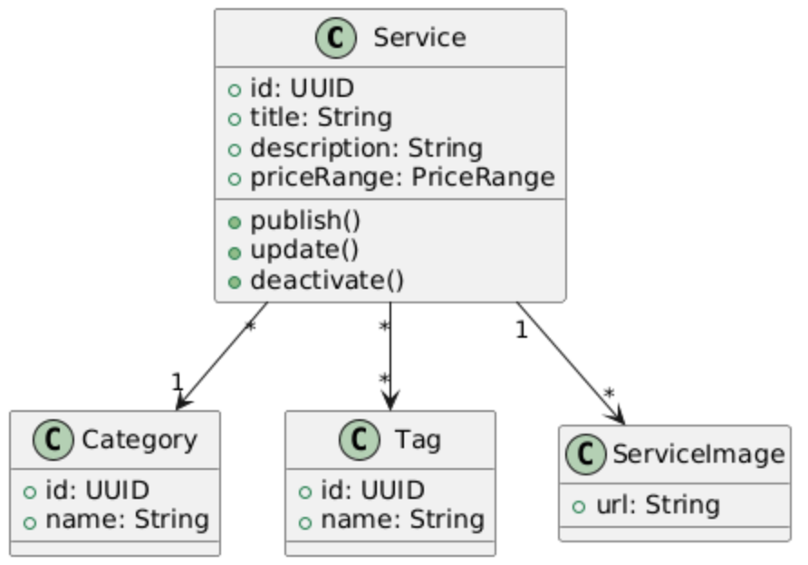
   
  2.6.1.6.2. Bounded Context Database Design Diagram
   Se define la estructura de tablas como Servicios, incluyendo claves primarias, foráneas y   restricciones necesarias para garantizar integridad.
   
   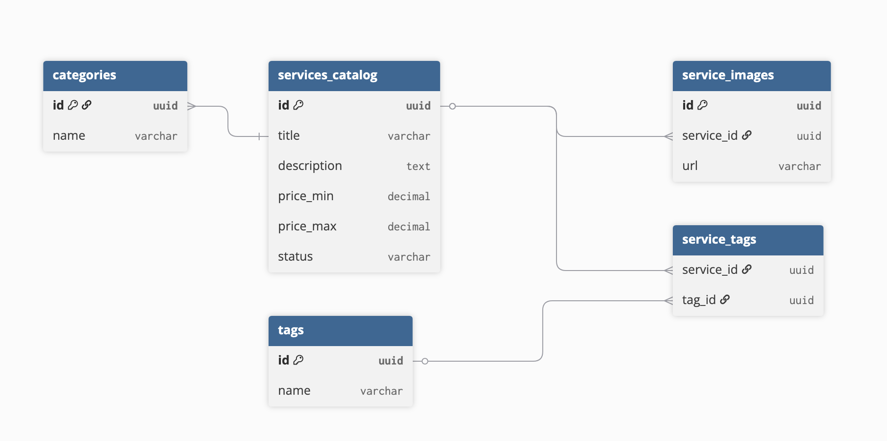

  
  

2.6.2. Bounded Context: UserIdentityContext (IAM)

Este contexto gestiona la identidad de los usuarios, abarcando registro, autenticación y administración de perfiles. Se documentan las clases clave del dominio junto con sus responsabilidades y relaciones.

2.6.2.1. Domain Layer

Incluye entidades como Usuario y Perfil, además de Value Objects como credenciales. Se modelan reglas de negocio relacionadas con autenticación y gestión de identidad.

2.6.2.2. Interface Layer

Se presentan controladores para registro, login y actualización de perfiles, actuando como punto de entrada para clientes.

2.6.2.3. Application Layer

Se definen casos de uso como RegistrarUsuario o AutenticarUsuario mediante handlers que coordinan la lógica de negocio.

2.6.2.4 Infrastructure Layer

Incluye implementación de repositorios, servicios de autenticación (como JWT) y conexión a bases de datos.

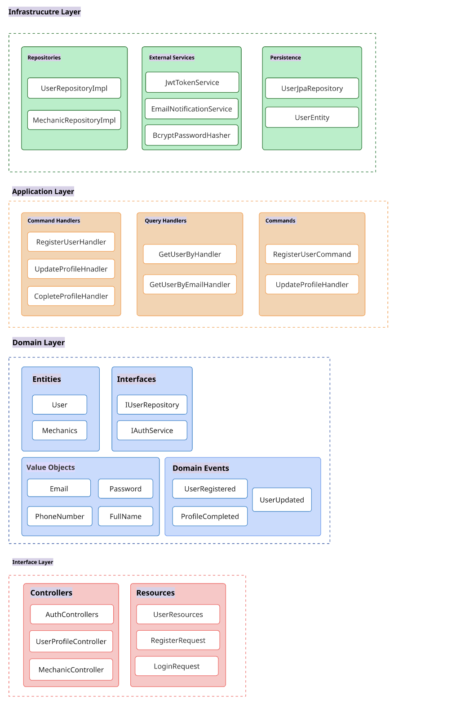

2.6.2.5. Bounded Context Software Architecture Component Level Diagrams 

Se muestra la separación entre componentes como API de autenticación, servicio de usuarios y almacenamiento.

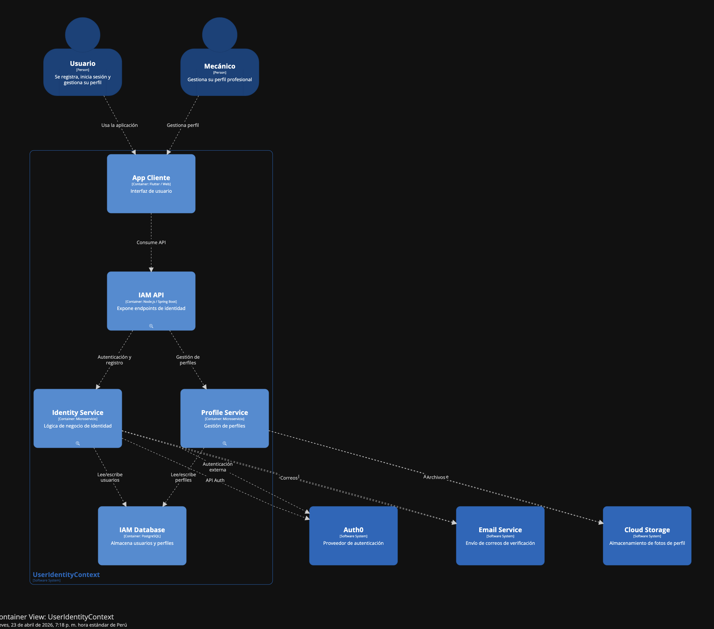

2.6.2.6. Bounded Context Software Architecture Code Level Diagrams

Se detallan clases e implementación del dominio y persistencia.

2.6.2.6.1. Bounded Context Domain Layer Class Diagrams

Se representan clases como Usuario, sus atributos y relaciones con otros objetos.

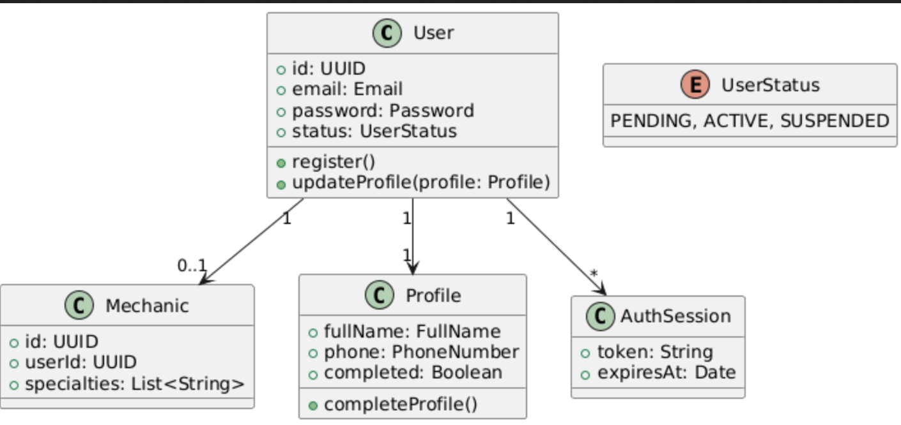

2.6.2.6.2. Bounded Context Database Design Diagram

Incluye tablas como Usuarios y Perfiles con sus respectivas relaciones.

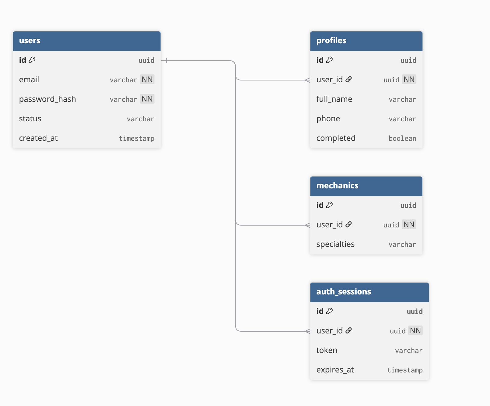

  
  

2.6.3. Bounded Context: DiagnosisContext

Este contexto se encarga de gestionar solicitudes de servicio, análisis de síntomas y generación de diagnósticos o cotizaciones.

2.6.3.1. Domain Layer

Se modelan entidades como PedidoServicio y Diagnóstico, incluyendo lógica para interpretar síntomas y generar resultados.

2.6.3.2. Interface Layer

Incluye controladores que permiten registrar solicitudes y consultar diagnósticos.

2.6.3.3. Application Layer

Se implementan flujos como RegistrarPedido o GenerarDiagnostico, así como eventos como DiagnosticoGenerado.

2.6.3.4 Infrastructure Layer

Se integran servicios externos, como motores de análisis o APIs de inteligencia artificial si corresponde.

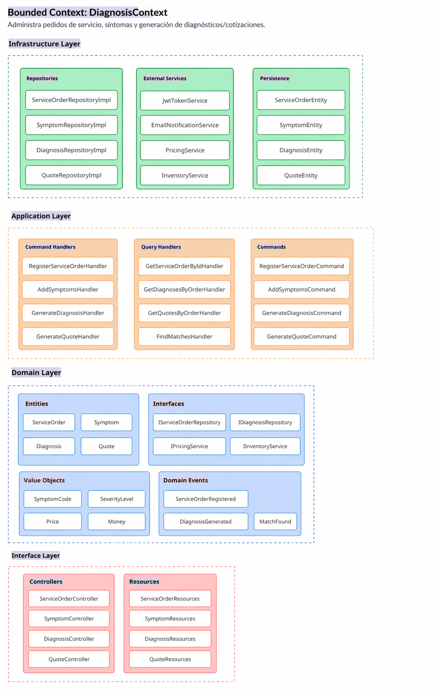

2.6.3.5. Bounded Context Software Architecture Component Level Diagrams

Se visualiza la interacción entre componentes como API, motor de diagnóstico y repositorios.

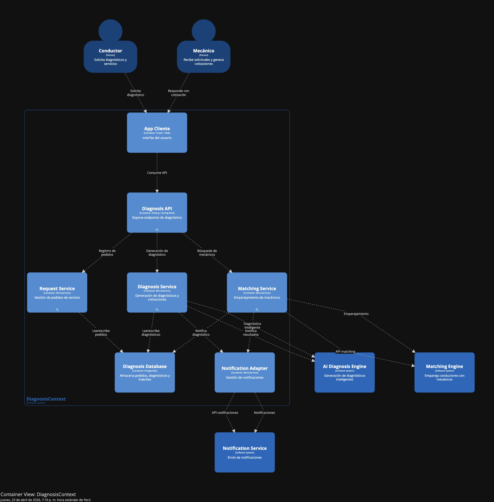

2.6.3.6. Bounded Context Software Architecture Code Level Diagrams

Se detalla la implementación interna del procesamiento de diagnósticos.

2.6.3.6.1. Bounded Context Domain Layer Class Diagrams

Incluyen clases y relaciones para modelar síntomas, pedidos y resultados.

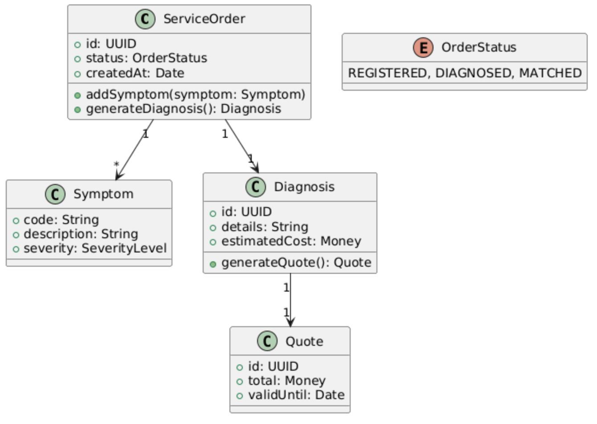

2.6.3.6.2. Bounded Context Database Design Diagram

Define tablas como Pedidos y Diagnosticos con sus relaciones.

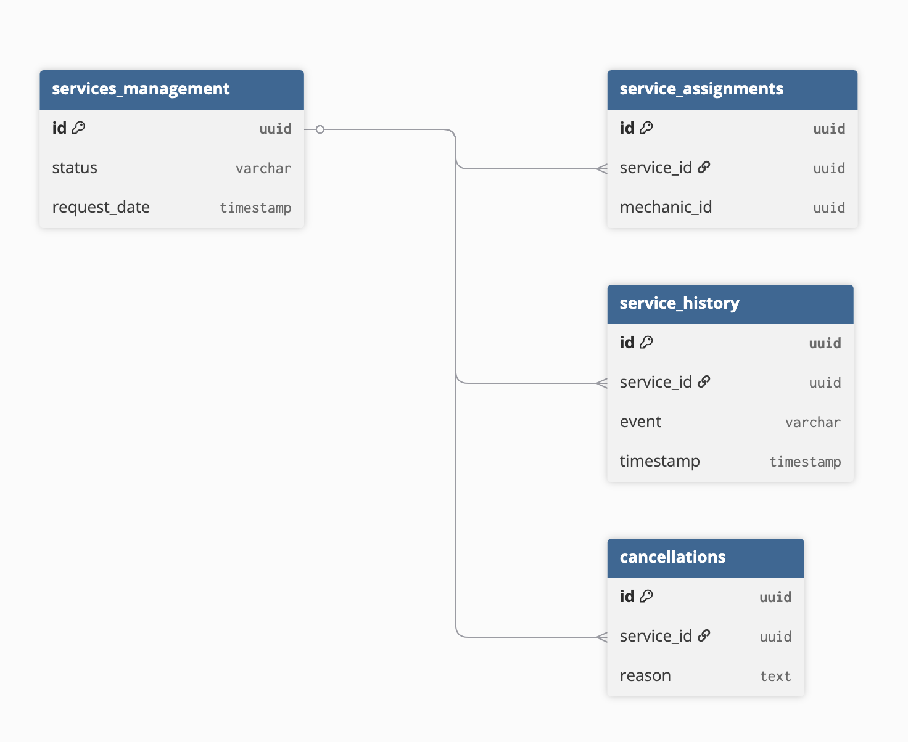

  
  

2.6.4. Bounded Context: ReputationContext

Este contexto gestiona la reputación mediante calificaciones y reseñas verificadas de servicios completados.

2.6.4.1. Domain Layer

Incluye entidades como Calificación y Reseña, con reglas que aseguran que solo servicios completados puedan ser evaluados.

2.6.4.2. Interface Layer

Se presentan endpoints para enviar, editar y visualizar reseñas.

2.6.4.3. Application Layer

Se gestionan procesos como EnviarCalificacion y PublicarReseña mediante handlers.

2.6.4.4 Infrastructure Layer

Incluye persistencia de reseñas y posibles integraciones con sistemas de moderación.

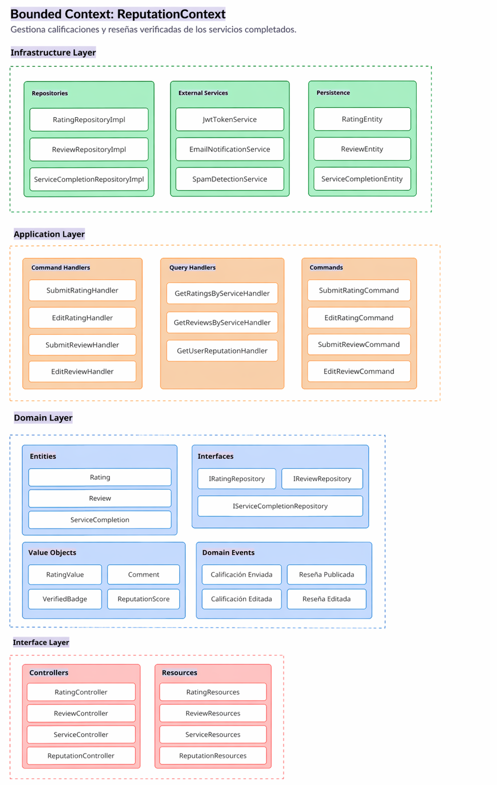

2.6.4.5. Bounded Context Software Architecture Component Level Diagrams

Muestra componentes como API de reputación y repositorios.

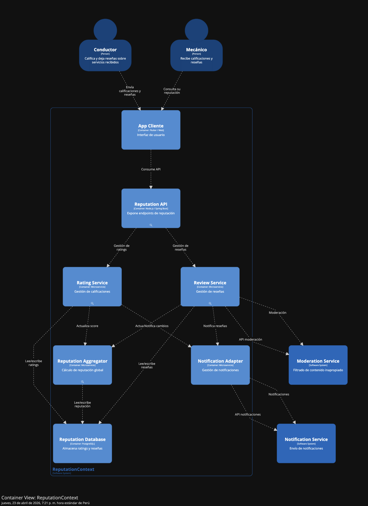

2.6.4.6. Bounded Context Software Architecture Code Level Diagrams

Expone la implementación detallada de la lógica de reputación.

2.6.4.6.1. Bounded Context Domain Layer Class Diagrams

Modela las clases de evaluación y sus relaciones con servicios.

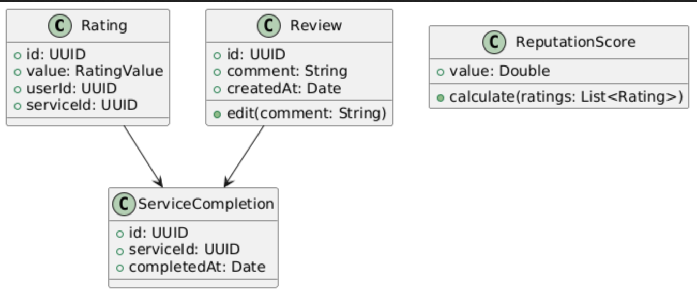

2.6.4.6.2. Bounded Context Database Design Diagram

Define tablas como Calificaciones y Reseñas.

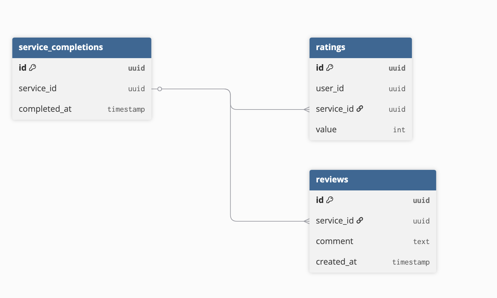

  
  

2.6.5. Bounded Context: ServiceManagementContext

Este contexto controla el ciclo de vida completo del servicio, desde la solicitud hasta su finalización o cancelación.

2.6.5.1. Domain Layer

Incluye entidades como ServicioEnProceso, con estados y reglas de transición (solicitado, confirmado, finalizado, cancelado).

2.6.5.2. Interface Layer

Se presentan controladores para gestionar el estado del servicio y registrar acciones de los usuarios.

2.6.5.3. Application Layer

Incluye persistencia del historial de servicios y posible integración con sistemas de notificación.

2.6.5.4 Infrastructure Layer

Incluye persistencia del historial de servicios y posible integración con sistemas de notificación.

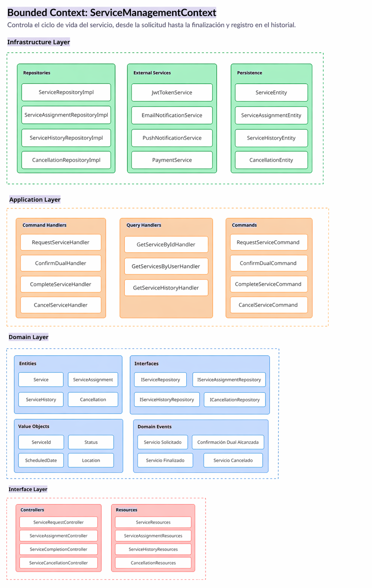

2.6.5.5. Bounded Context Software Architecture Component Level Diagrams

Se representa la interacción entre componentes como gestor de servicios, API y base de datos.

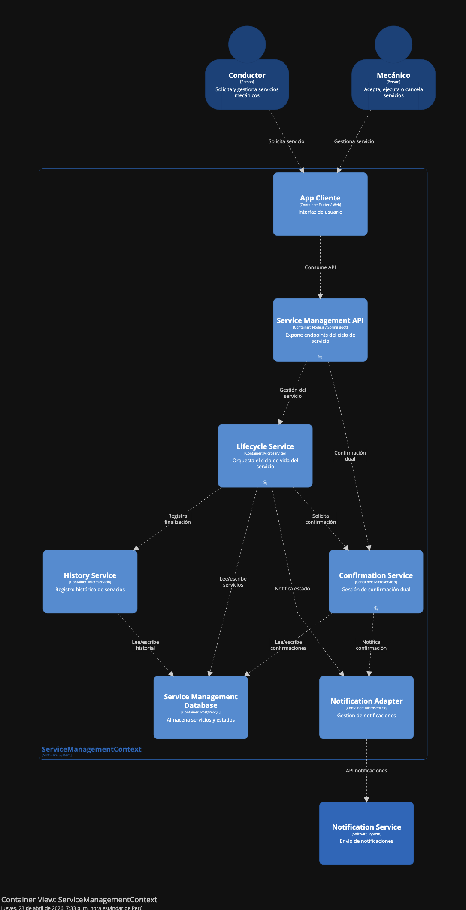

2.6.5.6. Bounded Context Software Architecture Code Level Diagrams

Se detalla la implementación de la lógica de estados y transiciones.

2.6.5.6.1. Bounded Context Domain Layer Class Diagrams

Incluye clases que modelan el ciclo de vida del servicio.

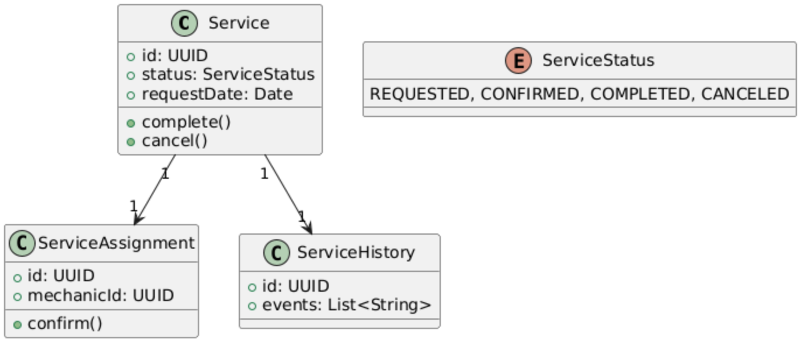

2.6.5.6.2. Bounded Context Database Design Diagram

Define tablas como Servicios y HistorialServicios con relaciones y constraints.

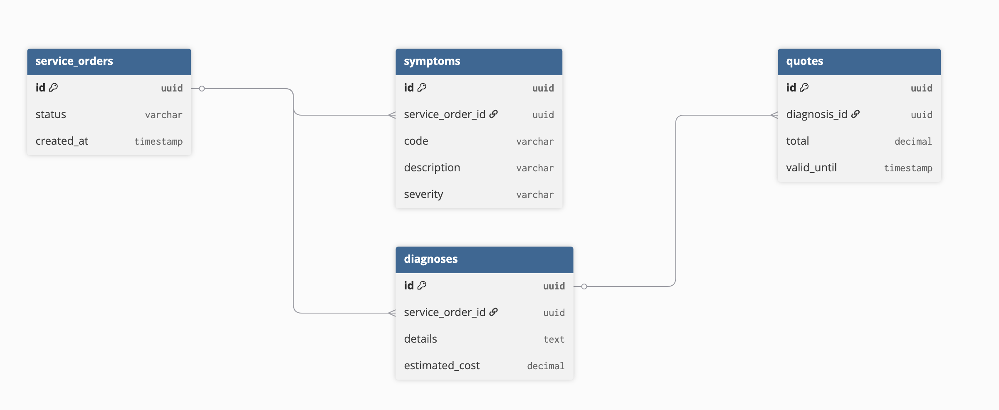

## Capítulo III: Solution UI/UX Design

### 3.1. Product design

3.1.1. Style Guidelines

3.1.1.1. General Style Guidelines

3.1.2. Information Architecture

3.1.2.1. Organization Systems

3.1.2.2. Labelling Systems

3.1.2.3. SEO Tags and Meta Tags

3.1.2.4. Searching Systems

3.1.2.5. Navigation Systems

3.1.3. Landing Page UI Design

3.1.3.1. Landing Page Wireframe

3.1.3.2. Landing Page Mock-up

3.1.4. Mobile Applications UX/UI Design

3.1.4.1. Mobile Applications Wireframes

3.1.4.2. Mobile Applications Wireflow Diagrams

3.1.4.3. Mobile Applications Mock-ups

3.1.4.4. Mobile Applications User Flow Diagrams

3.1.4.5. Mobile Applications Prototyping

## Capítulo IV: Product Implementation & Validation

### 4. Product Implementation & Validation

4.1. Software Configuration Management

4.1.1. Software Development Environment Configuration

4.1.2. Source Code Management

4.1.3. Source Code Style Guide & Conventions

4.1.4. Software Deployment Configuration

4.2. Landing Page & Mobile Application Implementation

4.2.1. Sprint n

4.2.1.1. Sprint Planning n

4.2.1.2. Sprint Backlog n

4.2.1.3. Development Evidence for Sprint Review

4.2.1.4. Testing Suite Evidence for Sprint Review

4.2.1.5. Execution Evidence for Sprint Review

4.2.1.6. Services Documentation Evidence for Sprint Review

4.2.1.7. Software Deployment Evidence for Sprint Review

4.2.1.8. Team Collaboration Insights during Sprint

#### 4.3. Validation Interviews

4.3.1. Diseño de Entrevistas

4.3.2. Registro de Entrevistas

4.3.3. Evaluaciones según heurísticas

# Conclusiones

* Desarrollar esta propuesta de aplicación permitió abordar la problemática del mercado automotriz caracterizada por la falta de transparencia, confianza y centralización en los servicios mecánicos, la cual fue validada mediante entrevistas a usuarios y trabajadores mecánicos. Asimismo, la integración de metodologías como Lean UX, levantamiento de requerimientos y modelado de dominio facilitó estructurar una solución alineada con necesidades reales, estableciendo una base sólida para su desarrollo como producto digital.  
* Podemos concluir que la construcción de soluciones en ingeniería de software requiere un aprendizaje continuo y adaptativo el cual nos permite incorporar herramientas como event storming, diseño centrado en el usuario y gestión ágil que contribuyen a mejorar la calidad del producto y fortalecen la capacidad para afrontar entornos complejos y dinámicos propios del desarrollo tecnológico actual.

# Anexos

# Anexo A: Links

Event Storming: [https://lucid.app/lucidspark/273a3243-b31d-4c41-8b85-4a83e4895612/edit?view\_items=5IFPfxgRGcXX\&page=0\_0\&invitationId=inv\_9b6303f2-c7be-4e63-a883-b7ab6a8081e3](https://lucid.app/lucidspark/273a3243-b31d-4c41-8b85-4a83e4895612/edit?view_items=5IFPfxgRGcXX&page=0_0&invitationId=inv_9b6303f2-c7be-4e63-a883-b7ab6a8081e3)

Entrevista:  
[Entrevista App Moviles.mp4](https://upcedupe-my.sharepoint.com/:v:/g/personal/u202310609_upc_edu_pe/IQB6eMiOs_9NRJwg7FY-8HVuAd6emf_2sFNGlHnXcElmBYM?e=edmal0&nav=eyJyZWZlcnJhbEluZm8iOnsicmVmZXJyYWxBcHAiOiJTdHJlYW1XZWJBcHAiLCJyZWZlcnJhbFZpZXciOiJTaGFyZURpYWxvZy1MaW5rIiwicmVmZXJyYWxBcHBQbGF0Zm9ybSI6IldlYiIsInJlZmVycmFsTW9kZSI6InZpZXcifX0%3D) 

Github Reporte:
[Link a repositorio de reporte en github](https://github.com/MobilFlow)
