<div align="center">

<br>

<h3>Universidad Peruana de Ciencias Aplicadas</h3>

<strong>Facultad de Ingeniería</strong><br>
<strong>Carrera: Ingeniería de Software</strong><br>

<strong>Periodo:</strong> 202601<br>
<strong>Codigo del curso:</strong> 1ACC0238<br>
<strong>Nombre del curso:</strong> Aplicaciones para Dispositivos Móviles<br>
<strong>NRC:</strong> 3690<br>

<strong>Nombre del profesor:</strong> Jorge Luis Mayta Guillermo<br>

<br><strong>*Informe de Trabajo Final*</strong><br><br>

<strong>Nombre del startup: </strong>MobilFlow<br>
<strong>Nombre del producto: </strong>Automatch<br>


### Relación de Integrantes

| Apellidos y Nombres                  |   Código    |
|:------------------------------------:|:-----------:|
| Villugas Jeronimo, Liam Anderson     | U202211634  |
| Taquiri Calderon, Jhunior Giussepe     | U20221C576 |
| Sanchez Gonzales, Gabriel            | U202310609  |
| Tuesta Marin, Romina Alejandra       | U202211706  |
| Torrejon Navarro, Braulio Rodrigo    | U201711828  |

<strong> Mayo, 2026</strong><br>
</div>

<div style="page-break-after: always;"></div>

# Project Report Collaboration Insights

**AV1:**


# Registro de Versiones del Informe

| Versión | Fecha      | Autor        | Descripción de modificación                   |
|---------|------------|--------------|-----------------------------------------------|
| 1.0     | 23/04/2026 | Gabriel Sánchez Gonzales | Cargó archivos, Descripción de la Startup, diseño de entrevistas, entrevistas, user personas, empathy mapping, Ubiquitous language, product backlog, event storming y actualizó una rama|
| 1.0     | 23/04/2026 | Braulio Rodrigo Torrejon Navarro | Cargo archivos, entrevistas, user stories, candidate context discovery, domain message flow modeling, bounded context canvases, software architecture y impact mapping |
| 1.0     | 23/04/2026 | Giussepe Taquiri             | Análisis competitivo, estrategias y tácticas frente a competidores, User Task Matrix y User Journey Mapping |
| 1.0     | 23/04/2026 | Liam Villugas          | Antecedentes y problematica, Lean UX Canvas, Lean UX Hypothesis Statements, Lean UX Assumptions, Lean UX Problem Statements y Context mapping |
| 2.0     | 14/04/2026 | Gabriel Sanchez          | Correcciones del AV1, desarrollo de la API de geolocalización CRUD, desarrollo de la API de IAM CRUD, desarrollo del sprint planning 1, desarrollo del sprint backlog 1, desarrollo del development evidence for sprint review, desarrollo del testing suite evidence for sprint review, desarrollo de execution evidence for sprint review, desarrollo de servicios, services documentation evidence for sprint review, preguntas para validation interviews, registro de 3 validation interviews, desarrollo de evaluación según heuristicas |

<div style="page-break-after: always;"></div>

## Contenido
- [Project Report Collaboration Insights](#project-report-collaboration-insights)
- [Registro de Versiones del Informe](#registro-de-versiones-del-informe)
  - [Contenido](#contenido)
  - [Student Outcome](#student-outcome)
- [Objetivos SMART](#objetivos-smart)
  - [S - Specific (Específico)](#s---specific-específico)
    - [Gabriel Sanchez](#gabriel-sanchez)
    - [Giussepe Taquiri](#giussepe-taquiri)
  - [M - Measurable (Medible)](#m---measurable-medible)
    - [Gabriel Sanchez](#gabriel-sanchez-1)
    - [Giussepe Taquiri](#giussepe-taquiri-1)
  - [A - Achievable (Alcanzable)](#a---achievable-alcanzable)
    - [Gabriel Sanchez](#gabriel-sanchez-2)
    - [Giussepe Taquiri](#giussepe-taquiri-2)
  - [R - Relevant (Relevante)](#r---relevant-relevante)
    - [Gabriel Sanchez](#gabriel-sanchez-3)
    - [Giussepe Taquiri](#giussepe-taquiri-3)
  - [T - Time-bound (Con límite de tiempo)](#t---time-bound-con-límite-de-tiempo)
    - [Gabriel Sanchez](#gabriel-sanchez-4)
    - [Giussepe Taquiri](#giussepe-taquiri-4)
- [Capítulo I: Presentación](#capítulo-i-presentación)
  - [1.1. Startup Profile](#11-startup-profile)
    - [1.1.1. Descripción de la Startup](#111-descripción-de-la-startup)
    - [1.1.2. Perfiles de integrantes del equipo](#112-perfiles-de-integrantes-del-equipo)
      - [1.1.2.1 Gabriel Sánchez](#1121-gabriel-sánchez)
      - [1.1.2.4 Braulio Torrejon](#1124-braulio-torrejon)
      - [1.1.2.5  Giussepe Taquiri](#1125--giussepe-taquiri)
      - [1.1.2.6  Liam Villugas](#1126--liam-villugas)
  - [1.2. Solution Profile](#12-solution-profile)
    - [1.2.1. Antecedentes y problemática](#121-antecedentes-y-problemática)
      - [What?](#what)
      - [When?](#when)
      - [Where?](#where)
      - [Who?](#who)
      - [Why?](#why)
      - [How?](#how)
      - [How much?](#how-much)
    - [1.2.2. Lean UX Process](#122-lean-ux-process)
      - [1.2.2.1. Lean UX Problem Statements](#1221-lean-ux-problem-statements)
      - [1.2.2.2. Lean UX Assumptions](#1222-lean-ux-assumptions)
        - [1. Business Assumptions](#1-business-assumptions)
          - [2. User Assumptions](#2-user-assumptions)
      - [1.2.2.3. Lean UX Hypothesis Statements](#1223-lean-ux-hypothesis-statements)
        - [1. Hipótesis de Confianza y Validación](#1-hipótesis-de-confianza-y-validación)
        - [2. Hipótesis de Comparación de Precios](#2-hipótesis-de-comparación-de-precios)
        - [3. Hipótesis de Adopción para el Mecánico](#3-hipótesis-de-adopción-para-el-mecánico)
        - [4. Hipótesis de Retención](#4-hipótesis-de-retención)
        - [5. Hipótesis de Geolocalización](#5-hipótesis-de-geolocalización)
      - [1.2.2.4. Lean UX Canvas](#1224-lean-ux-canvas)
  - [1.3. Segmentos objetivo](#13-segmentos-objetivo)
- [Capítulo II: Requirements Development and Software Solution Design](#capítulo-ii-requirements-development-and-software-solution-design)
  - [2.1. Competidores](#21-competidores)
    - [¿Por qué llevar a cabo este análisis?](#por-qué-llevar-a-cabo-este-análisis)
    - [2.1.1. Análisis competitivo](#211-análisis-competitivo)
      - [Competitive Analysis Landscape](#competitive-analysis-landscape)
    - [Comparativa general](#comparativa-general)
    - [Análisis FODA comparativo](#análisis-foda-comparativo)
    - [2.1.2. Estrategias y tácticas frente a competidores](#212-estrategias-y-tácticas-frente-a-competidores)
      - [Diferenciación por especialización](#diferenciación-por-especialización)
      - [Estrategia de confianza y verificación](#estrategia-de-confianza-y-verificación)
      - [Transparencia y comparación de precios](#transparencia-y-comparación-de-precios)
      - [Geolocalización en tiempo real](#geolocalización-en-tiempo-real)
      - [Adaptación al contexto peruano](#adaptación-al-contexto-peruano)
      - [Estrategia de crecimiento y adquisición](#estrategia-de-crecimiento-y-adquisición)
      - [Integración de pasarela de pago](#integración-de-pasarela-de-pago)
  - [2.2. Entrevistas](#22-entrevistas)
    - [2.2.1. Diseño de entrevistas](#221-diseño-de-entrevistas)
      - [2.2.1.1 Preguntas Generales](#2211-preguntas-generales)
      - [2.2.1.2 Segmento Objetivo: Mecanicos](#2212-segmento-objetivo-mecanicos)
      - [2.2.1.3 Segmento Objetivo: Conductores\*\*](#2213-segmento-objetivo-conductores)
    - [2.2.2. Registro de entrevistas](#222-registro-de-entrevistas)
      - [2.2.2.1 Segmento Objetivo: Conductores](#2221-segmento-objetivo-conductores)
      - [2.2.2.1 Segmento Objetivo: Mecanicos](#2221-segmento-objetivo-mecanicos)
    - [2.2.3. Análisis de entrevistas](#223-análisis-de-entrevistas)
  - [2.3. Needfinding](#23-needfinding)
    - [2.3.1. User Personas](#231-user-personas)
      - [User Journey Map – Conductora (Luciana)](#user-journey-map--conductora-luciana)
      - [User Journey Map – Mecánico (Ricardo)](#user-journey-map--mecánico-ricardo)
    - [2.3.4. Empathy Mapping](#234-empathy-mapping)
    - [2.3.5. Ubiquitous Language](#235-ubiquitous-language)
      - [2.4. Requirements specification](#24-requirements-specification)
    - [2.4.1. User Stories](#241-user-stories)
      - [2.4.1.1 User Stories](#2411-user-stories)
    - [2.4.1.2 Technical Stories](#2412-technical-stories)
    - [2.4.1.3 Spike Stories](#2413-spike-stories)
    - [2.4.2. Impact Mapping](#242-impact-mapping)
    - [2.4.3. Product Backlog](#243-product-backlog)
  - [2.5. Strategic-Level Domain-Driven Design](#25-strategic-level-domain-driven-design)
    - [2.5.1. EventStorming](#251-eventstorming)
      - [2.5.1.2. Domain Message Flows Modeling](#2512-domain-message-flows-modeling)
      - [2.5.1.3. Bounded Context Canvases](#2513-bounded-context-canvases)
      - [2.5.2. Context Mapping](#252-context-mapping)
    - [2.5.3. Software Architecture](#253-software-architecture)
      - [2.5.3.1. Software Architecture Context Level Diagrams](#2531-software-architecture-context-level-diagrams)
      - [2.5.3.2. Software Architecture Container Level Diagrams](#2532-software-architecture-container-level-diagrams)
      - [2.5.3.3. Software Architecture Deployment Diagrams](#2533-software-architecture-deployment-diagrams)
      - [2.6. Tactical-Level Domain-Driven Design](#26-tactical-level-domain-driven-design)
    - [2.6.1. Bounded Context: ServiceCatalogContext](#261-bounded-context-servicecatalogcontext)
      - [2.6.1.1. Domain Layer](#2611-domain-layer)
      - [2.6.1.2. Interface Layer](#2612-interface-layer)
      - [2.6.1.3. Application Layer](#2613-application-layer)
      - [2.6.1.4 Infrastructure Layer](#2614-infrastructure-layer)
      - [2.6.1.5. Bounded Context Software Architecture Component Level Diagrams](#2615-bounded-context-software-architecture-component-level-diagrams)
      - [2.6.1.6. Bounded Context Software Architecture Code Level Diagrams](#2616-bounded-context-software-architecture-code-level-diagrams)
        - [2.6.1.6.1. Bounded Context Domain Layer Class Diagrams](#26161-bounded-context-domain-layer-class-diagrams)
        - [2.6.1.6.2. Bounded Context Database Design Diagram](#26162-bounded-context-database-design-diagram)
    - [2.6.2. Bounded Context: UserIdentityContext (IAM)](#262-bounded-context-useridentitycontext-iam)
      - [2.6.2.1. Domain Layer](#2621-domain-layer)
      - [2.6.2.2. Interface Layer](#2622-interface-layer)
      - [2.6.2.3. Application Layer](#2623-application-layer)
      - [2.6.2.4 Infrastructure Layer](#2624-infrastructure-layer)
      - [2.6.2.5. Bounded Context Software Architecture Component Level Diagrams](#2625-bounded-context-software-architecture-component-level-diagrams)
      - [2.6.2.6. Bounded Context Software Architecture Code Level Diagrams](#2626-bounded-context-software-architecture-code-level-diagrams)
        - [2.6.2.6.1. Bounded Context Domain Layer Class Diagrams](#26261-bounded-context-domain-layer-class-diagrams)
        - [2.6.2.6.2. Bounded Context Database Design Diagram](#26262-bounded-context-database-design-diagram)
    - [2.6.3. Bounded Context: DiagnosisContext](#263-bounded-context-diagnosiscontext)
      - [2.6.3.1. Domain Layer](#2631-domain-layer)
      - [2.6.3.2. Interface Layer](#2632-interface-layer)
      - [2.6.3.3. Application Layer](#2633-application-layer)
      - [2.6.3.4 Infrastructure Layer](#2634-infrastructure-layer)
      - [2.6.3.5. Bounded Context Software Architecture Component Level Diagrams](#2635-bounded-context-software-architecture-component-level-diagrams)
      - [2.6.3.6. Bounded Context Software Architecture Code Level Diagrams](#2636-bounded-context-software-architecture-code-level-diagrams)
        - [2.6.3.6.1. Bounded Context Domain Layer Class Diagrams](#26361-bounded-context-domain-layer-class-diagrams)
        - [2.6.3.6.2. Bounded Context Database Design Diagram](#26362-bounded-context-database-design-diagram)
    - [2.6.4. Bounded Context: ReputationContext](#264-bounded-context-reputationcontext)
      - [2.6.4.1. Domain Layer](#2641-domain-layer)
      - [2.6.4.2. Interface Layer](#2642-interface-layer)
      - [2.6.4.3. Application Layer](#2643-application-layer)
      - [2.6.4.4 Infrastructure Layer](#2644-infrastructure-layer)
      - [2.6.4.5. Bounded Context Software Architecture Component Level Diagrams](#2645-bounded-context-software-architecture-component-level-diagrams)
      - [2.6.4.6. Bounded Context Software Architecture Code Level Diagrams](#2646-bounded-context-software-architecture-code-level-diagrams)
        - [2.6.4.6.1. Bounded Context Domain Layer Class Diagrams](#26461-bounded-context-domain-layer-class-diagrams)
        - [2.6.4.6.2. Bounded Context Database Design Diagram](#26462-bounded-context-database-design-diagram)
    - [2.6.5. Bounded Context: ServiceManagementContext](#265-bounded-context-servicemanagementcontext)
      - [2.6.5.1. Domain Layer](#2651-domain-layer)
      - [2.6.5.2. Interface Layer](#2652-interface-layer)
      - [2.6.5.3. Application Layer](#2653-application-layer)
      - [2.6.5.4 Infrastructure Layer](#2654-infrastructure-layer)
      - [2.6.5.5. Bounded Context Software Architecture Component Level Diagrams](#2655-bounded-context-software-architecture-component-level-diagrams)
      - [2.6.5.6. Bounded Context Software Architecture Code Level Diagrams](#2656-bounded-context-software-architecture-code-level-diagrams)
        - [2.6.5.6.1. Bounded Context Domain Layer Class Diagrams](#26561-bounded-context-domain-layer-class-diagrams)
        - [2.6.5.6.2. Bounded Context Database Design Diagram](#26562-bounded-context-database-design-diagram)
- [Capítulo III: Solution UI/UX Design](#capítulo-iii-solution-uiux-design)
  - [3.1. Product Design](#31-product-design)
    - [3.1.1. Style Guidelines](#311-style-guidelines)
      - [3.1.1.1. General Style Guidelines](#3111-general-style-guidelines)
        - [Branding](#branding)
        - [Iconografía](#iconografía)
      - [Typography](#typography)
      - [Colors](#colors)
      - [Spacing](#spacing)
      - [Communication Tone](#communication-tone)
      - [Dimension Guidelines](#dimension-guidelines)
      - [Communication Tone](#communication-tone-1)
      - [Dimension Guidelines](#dimension-guidelines-1)
    - [3.1.2. Information Architecture](#312-information-architecture)
      - [3.1.2.1. Organization Systems](#3121-organization-systems)
      - [Jerárquico (Visual Hierarchy)](#jerárquico-visual-hierarchy)
      - [Secuencial (Step-by-Step)](#secuencial-step-by-step)
      - [Por Tópicos](#por-tópicos)
      - [Según Audiencia](#según-audiencia)
    - [3.1.2.2. Labelling Systems](#3122-labelling-systems)
      - [Ejemplos de Etiquetas](#ejemplos-de-etiquetas)
      - [Asociaciones](#asociaciones)
      - [3.1.2.3. SEO Tags and Meta Tags](#3123-seo-tags-and-meta-tags)
      - [Landing Page](#landing-page)
      - [Aplicación Móvil](#aplicación-móvil)
      - [3.1.2.4. Searching Systems](#3124-searching-systems)
      - [Búsqueda por Filtros](#búsqueda-por-filtros)
      - [Resultados de Búsqueda](#resultados-de-búsqueda)
      - [Navegación y Visualización](#navegación-y-visualización)
      - [3.1.2.5. Navigation Systems](#3125-navigation-systems)
      - [Navegación Principal](#navegación-principal)
      - [Secciones principales](#secciones-principales)
      - [Características de Navegación](#características-de-navegación)
      - [3.1.4.4. Mobile Applications User Flow Diagrams](#3144-mobile-applications-user-flow-diagrams)
      - [3.1.4.5. Mobile Applications Prototyping](#3145-mobile-applications-prototyping)
- [Capítulo IV: Product Implementation \& Validation](#capítulo-iv-product-implementation--validation)
  - [4.1. Software Configuration Management](#41-software-configuration-management)
    - [4.1.1. Software Development Environment Configuration](#411-software-development-environment-configuration)
      - [Product UX/UI Design](#product-uxui-design)
        - [Figma](#figma)
        - [UXPressia](#uxpressia)
        - [Miro](#miro)
      - [Software Development](#software-development)
        - [Android Studio (Instalación local)](#android-studio-instalación-local)
        - [Kotlin](#kotlin)
        - [Jetpack Compose](#jetpack-compose)
        - [IntelliJ IDEA (Instalación local)](#intellij-idea-instalación-local)
        - [Git (Instalación local)](#git-instalación-local)
        - [GitHub](#github)
        - [Postman](#postman)
        - [MySQL](#mysql)
      - [Project Management and Collaboration](#project-management-and-collaboration)
        - [Trello](#trello)
        - [WhatsApp](#whatsapp)
        - [Google Meet](#google-meet)
      - [Software Documentation](#software-documentation)
        - [Lucidchart](#lucidchart)
        - [Visual Paradigm](#visual-paradigm)
    - [4.1.2. Source Code Management](#412-source-code-management)
      - [URL de los Repositorios](#url-de-los-repositorios)
        - [Estructura de Ramas](#estructura-de-ramas)
        - [Main Branch](#main-branch)
        - [Develop Branch](#develop-branch)
        - [Feature Branches](#feature-branches)
        - [Ejemplos](#ejemplos)
        - [Release Branches](#release-branches)
        - [Ejemplo](#ejemplo)
        - [Hotfix Branches](#hotfix-branches)
        - [Ejemplo](#ejemplo-1)
        - [Semantic Versioning](#semantic-versioning)
        - [Ejemplo](#ejemplo-2)
        - [Convenciones de Commits](#convenciones-de-commits)
        - [Formato](#formato)
        - [Types](#types)
        - [Scope](#scope)
        - [Ejemplo](#ejemplo-3)
        - [Ejemplos básicos de commits](#ejemplos-básicos-de-commits)
  - [4.1.3. Source Code Style Guide \& Conventions](#413-source-code-style-guide--conventions)
        - [Nomenclatura General](#nomenclatura-general)
      - [Ejemplos](#ejemplos-1)
        - [Variables y funciones (camelCase)](#variables-y-funciones-camelcase)
        - [Clases y componentes (PascalCase)](#clases-y-componentes-pascalcase)
        - [Recursos XML (snake\_case)](#recursos-xml-snake_case)
        - [Sangría](#sangría)
        - [Kotlin](#kotlin-1)
        - [Uso de val y var](#uso-de-val-y-var)
        - [Formato de funciones](#formato-de-funciones)
        - [Formato de clases](#formato-de-clases)
        - [Espaciado](#espaciado)
        - [Imports](#imports)
        - [Jetpack Compose](#jetpack-compose-1)
        - [Nomenclatura de Composables](#nomenclatura-de-composables)
        - [Estructura y legibilidad](#estructura-y-legibilidad)
        - [Uso de colores y temas](#uso-de-colores-y-temas)
    - [4.1.4. Software Deployment Configuration](#414-software-deployment-configuration)
      - [Landing Page](#landing-page-1)
      - [Proceso de implementación](#proceso-de-implementación)
        - [Creación del repositorio](#creación-del-repositorio)
        - [Repositorio utilizado](#repositorio-utilizado)
        - [Configuración del repositorio](#configuración-del-repositorio)
        - [Ejecución del despliegue](#ejecución-del-despliegue)
        - [Configuración de GitHub Pages](#configuración-de-github-pages)
      - [Detalles de configuración](#detalles-de-configuración)
        - [Fuente de despliegue (Source)](#fuente-de-despliegue-source)
        - [URL del sitio](#url-del-sitio)
  - [4.2. Landing Page \& Mobile Application Implementation](#42-landing-page--mobile-application-implementation)
    - [4.2.1. Sprint 1](#421-sprint-1)
      - [4.2.1.1. Sprint Planning 1](#4211-sprint-planning-1)
      - [4.2.1.2. Sprint Backlog 1](#4212-sprint-backlog-1)
      - [4.2.1.3. Development Evidence for Sprint Review](#4213-development-evidence-for-sprint-review)
      - [4.2.1.4. Testing Suite Evidence for Sprint Review](#4214-testing-suite-evidence-for-sprint-review)
      - [4.2.1.5. Execution Evidence for Sprint Review](#4215-execution-evidence-for-sprint-review)
      - [4.2.1.6. Services Documentation Evidence for Sprint Review](#4216-services-documentation-evidence-for-sprint-review)
      - [4.2.1.7. Software Deployment Evidence for Sprint Review](#4217-software-deployment-evidence-for-sprint-review)
      - [4.2.1.8. Team Collaboration Insights during Sprint](#4218-team-collaboration-insights-during-sprint)
  - [4.3. Validation Interviews](#43-validation-interviews)
    - [4.3.1. Diseño de Entrevistas](#431-diseño-de-entrevistas)
    - [4.3.2. Registro de Entrevistas](#432-registro-de-entrevistas)
    - [**Entrevista N°1 - Carlo García (Mecanico)**](#entrevista-n1---carlo-garcía-mecanico)
      - [**Datos del entrevistado**](#datos-del-entrevistado)
      - [**Resumen de la entrevista:**](#resumen-de-la-entrevista)
    - [**Entrevista N°2 - Luciana (Conductora)**](#entrevista-n2---luciana-conductora)
      - [**Datos del entrevistado**](#datos-del-entrevistado-1)
      - [**Información de la entrevista**](#información-de-la-entrevista)
      - [Duración: 02:01 Minuto de inicio en el video consolidado: 1:58](#duración-0201-minuto-de-inicio-en-el-video-consolidado-158)
      - [**Resumen de la entrevista:**](#resumen-de-la-entrevista-1)
    - [**Entrevista N°3 - Anedyib (conductora)**](#entrevista-n3---anedyib-conductora)
      - [**Datos del entrevistado**](#datos-del-entrevistado-2)
      - [**Información de la entrevista**  Duración: 1:15  Minuto de inicio en el video consolidado: 04:00](#información-de-la-entrevista--duración-115--minuto-de-inicio-en-el-video-consolidado-0400)
      - [**Resumen de la entrevista:**](#resumen-de-la-entrevista-2)
    - [**Entrevista N°4 - Juan (Mecanico)**](#entrevista-n4---juan-mecanico)
      - [**Resumen de la entrevista:**](#resumen-de-la-entrevista-3)
    - [4.3.3. Evaluaciones según heurísticas](#433-evaluaciones-según-heurísticas)
      - [**TAREAS A EVALUAR**](#tareas-a-evaluar)
      - [**ESCALA DE SEVERIDAD**](#escala-de-severidad)
      - [**TABLA RESUMEN**](#tabla-resumen)
      - [**DESCRIPCIÓN DE PROBLEMAS**](#descripción-de-problemas)
        - [**PROBLEMA #1: No se muestran perfiles detallados de mecánicos que permitan evaluar experiencia, especialidad o trabajos previos**](#problema-1-no-se-muestran-perfiles-detallados-de-mecánicos-que-permitan-evaluar-experiencia-especialidad-o-trabajos-previos)
        - [**PROBLEMA #2: Las calificaciones y testimonios generan interés, pero no explican cómo se validan o qué significan exactamente**](#problema-2-las-calificaciones-y-testimonios-generan-interés-pero-no-explican-cómo-se-validan-o-qué-significan-exactamente)
      - [**PROBLEMA #3: La landing page no guía con suficiente claridad hacia el siguiente paso principal del usuario**](#problema-3-la-landing-page-no-guía-con-suficiente-claridad-hacia-el-siguiente-paso-principal-del-usuario)
- [Conclusiones](#conclusiones)
- [Bibliografía](#bibliografía)
- [Anexos](#anexos)
  - [Anexo A: Links](#anexo-a-links)

<div style="page-break-after: always;"></div>

## Student Outcome

El curso contribuye al cumplimiento del Student Outcome ABET:

**ABET – EAC - Student Outcome**  

**Criterio 1:** Actualiza conceptos y
conocimientos necesarios para su
desarrollo profesional y en especial para
su proyecto en soluciones de ingeniería
de software

**Criterio 2:** Reconoce la necesidad del
aprendizaje permanente para el
desempeño profesional y el desarrollo
de proyectos en soluciones de
tecnologías de ingeniería de software


| Criterio específico | Acciones realizadas | Conclusiones |
| :---- | :---- | :---- |
| **Criterio 1:** Actualiza conceptos y conocimientos necesarios para su desarrollo profesional y en especial para su proyecto en soluciones de ingeniería de software | **Gabriel Sanchez** <br><br> **AV1:** Descripción del startup; entrevistas a usuarios; diseño de user personas; elaboración de empathy mapping; definición de ubiquitous language; creación del product backlog; desarrollo de event storming <br><br> **TB1:**  Apliqué la actualización de mis conocimientos mediante la corrección del AV1 y el desarrollo de APIs CRUD como IAM y geolocalización, fortaleciendo mis habilidades en backend y arquitectura de servicios. También reforcé mi aprendizaje con la planificación del sprint, evidencias de desarrollo y testing, validaciones mediante entrevistas y evaluación de heurísticas dentro del proyecto de ingeniería de software. <br><br> **Braulio Torrejon** <br><br> **AV1:** Cargo archivos; entrevistas a usuarios; elaboración de user stories; candidate context discovery; domain message flow modeling; bounded context canvases; definición de software architecture; desarrollo de impact mapping <br><br> **Romina Tuesta** <br><br> **AV1:** Realicé todo el punto 2.6 diagrama de clase, base de datos y contenedores C4 y la estructuración de layers. **TP:** He podido ampliar mis conocimientos en desarrollo movil, con el desarollo de diferentes vistas, pantallas, navegación, etc. <br><br> **Giussepe Taquiri** <br><br> **AV1:** Análisis competitivo; definición de estrategias y tácticas frente a competidores; elaboración de User Task Matrix; desarrollo de User Journey Mapping <br><br> **Liam Villugas** <br><br> **AV1:**  entrevistas a mecanicos; Elaboracion de Antecedentes y problematica; Lean UX Problem Statements; Lean UX Assumptions; Lean UX Hypothesis Statements; Lean UX Canvas; desarrollo de Context mapping| **Gabriel Sanchez** <br><br> **AV1:** Durante este avance desarrollé la descripción completa del startup, realicé entrevistas a usuarios, diseñé user personas y empathy maps, construí el ubiquitous language, elaboré el product backlog y llevé a cabo el event storming.<br><br> **TB1:** En este avance desarrolle orrecciones del AV1, desarrollo de la API de geolocalización CRUD, desarrollo de la API de IAM CRUD, desarrollo del sprint planning 1, desarrollo del sprint backlog 1, desarrollo del development evidence for sprint review, desarrollo del testing suite evidence for sprint review, desarrollo de execution evidence for sprint review, desarrollo de servicios, services documentation evidence for sprint review, preguntas para validation interviews, registro de 3 validation interviews, desarrollo de evaluación según heuristicas <br><br> **Braulio Torrejon** <br><br> **AV1:** En este avance consolidé la arquitectura del proyecto mediante entrevistas, user stories y modelado de contextos. Implementé diagramas de flujo de mensajes y bounded contexts, definiendo la arquitectura de software y el impact mapping, lo que permitió dar claridad técnica y trazabilidad al proyecto. <br><br> **Romina Tuesta** <br><br> **AV1:** En este avance pude conocer más acerca de la estructura de los bounded context, realizando los layers como domain, interface, etc., además de adentrarme más a los contenedores de cada bounded. <br><br> **Giussepe Taquiri** <br><br> **AV1:** Durante este avance desarrollé el análisis competitivo y definí estrategias y tácticas frente a los competidores. Asimismo, elaboré el User Task Matrix y los User Journey Maps, aplicando herramientas de análisis UX para comprender mejor las necesidades del usuario y contribuir a la solución del proyecto.<br><br> **Liam Villugas**  <br><br> **AV1:** En este avance consolidé la visión estratégica y técnica de AutoMatch mediante el uso de Lean UX y Domain-Driven Design (DDD). Al integrar las entrevistas a mecánicos con el modelado de Bounded Contexts, logré alinear los objetivos de negocio de MobilFlow con una arquitectura de software escalable. Este proceso me permitió aplicar conocimientos avanzados en ingeniería de software para garantizar la trazabilidad y la correcta delimitación de dominios en la solución. |
| **Criterio 2:** Reconoce la necesidad del aprendizaje permanente para el desempeño profesional y el desarrollo de proyectos en soluciones de tecnologías de ingeniería de software | **Gabriel Sanchez** <br><br> **AV1:** Descripción del startup; entrevistas a usuarios; diseño de user personas; elaboración de empathy mapping; definición de ubiquitous language; creación del product backlog; desarrollo de event storming **TB1:** Apliqué el aprendizaje permanente al reforzar continuamente mis conocimientos durante el desarrollo del proyecto, investigando y mejorando mis habilidades en APIs, arquitectura de microservicios y pruebas. Esto me permitió adaptarme a nuevas necesidades del sistema y mejorar la calidad de las soluciones implementadas en cada entrega del proyecto de ingeniería de software.<br><br> **Braulio Torrejon** <br><br> **AV1:** Cargo archivos; entrevistas a usuarios; elaboración de user stories; candidate context discovery; domain message flow modeling; bounded context canvases; definición de software architecture; desarrollo de impact mapping <br><br> **Romina Tuesta** <br><br> **AV1:** En este avance pude conocer más acerca de la estructura de los bounded context, realizando los layers como domain, interface, etc., además de adentrarme más a los contenedores de cada bounded. **TP:** He podido ampliar mis conocimientos en desarrollo movil, con el desarollo de diferentes vistas, pantallas, navegación, etc.  <br><br> **Giussepe Taquiri** <br><br> **AV1:** Análisis competitivo; estrategias y tácticas frente a competidores; User Task Matrix; User Journey Mapping; uso de herramientas de análisis y gestión <br><br> **Liam Villugas** <br><br> **AV1:**  entrevistas a mecanicos; Elaboracion de Antecedentes y problematica; Lean UX Problem Statements; Lean UX Assumptions; Lean UX Hypothesis Statements; Lean UX Canvas; desarrollo de Context mapping  | **Gabriel Sanchez** <br><br> **AV1:** Este proceso evidenció que el desarrollo de soluciones de software exige aprendizaje constante. Comprendí que debo seguir actualizándome y explorando nuevas metodologías y tecnologías para mejorar la calidad y efectividad de mis proyectos. <br> **TB1:** Correcciones del AV1, desarrollo de la API de geolocalización CRUD, desarrollo de la API de IAM CRUD, desarrollo del sprint planning 1, desarrollo del sprint backlog 1, desarrollo del development evidence for sprint review, desarrollo del testing suite evidence for sprint review, desarrollo de execution evidence for sprint review, desarrollo de servicios, services documentation evidence for sprint review, preguntas para validation interviews, registro de 3 validation interviews, desarrollo de evaluación según heuristicas<br><br> **Braulio Torrejon** <br><br> **AV1:** Este proceso me permitió reconocer que la construcción de arquitecturas sólidas requiere aprendizaje continuo. La integración de técnicas como EventStorming, DMFM y bounded contexts evidenció la necesidad de seguir perfeccionando metodologías y herramientas para lograr soluciones escalables y auditables. <br><br> **Romina Tuesta** <br><br> **AV1:** Lo realizado en esta entrega refuerza la necesidad de obtener más conocimiento para llegar a la vida profesional preparados y listos para aplicar lo aprendido. <br><br> **Giussepe Taquiri** <br><br> **AV1:** Este avance me permitió reconocer la importancia del aprendizaje continuo en el desarrollo de soluciones tecnológicas. A través del análisis competitivo y herramientas UX, comprendí la necesidad de actualizar constantemente mis conocimientos para adaptarme a nuevas tecnologías y metodologías en ingeniería de software. <br><br> **Liam Villugas** <br><br> **AV1:** El desarrollo de AutoMatch evidencia que la ingeniería de software exige un aprendizaje permanente para dominar marcos como Lean UX y DDD. La complejidad del ecosistema de MobilFlow reafirma que la actualización constante en metodologías y arquitecturas es indispensable para resolver problemas reales y mantener la competitividad profesional en el diseño de soluciones tecnológicas. |
<div style="page-break-after: always;"></div>

# Objetivos SMART

## S - Specific (Específico)

### Gabriel Sanchez
Voy a desarrollar la aplicación “Automatch” para conectar conductores con mecánicos de forma segura, confiable y eficiente, permitiendo mejorar la experiencia de búsqueda y selección de servicios mecánicos.

### Giussepe Taquiri
Voy a desarrollar la aplicación “Automatch” implementando funcionalidades móviles e integraciones entre frontend y backend para optimizar la experiencia de los usuarios al buscar mecánicos cercanos.


## M - Measurable (Medible)

### Gabriel Sanchez
Voy a medir el éxito del proyecto completando el 100% de las user stories, spike stories e incremental stories, además de implementar correctamente todas las funcionalidades principales definidas en el backlog.

### Giussepe Taquiri
Voy a medir el avance del proyecto completando las funcionalidades asignadas en cada sprint, verificando la correcta integración de APIs y el funcionamiento de las pantallas móviles de Automatch.


## A - Achievable (Alcanzable)

### Gabriel Sanchez
Voy a desarrollar Automatch utilizando tecnologías como Kotlin, Spring Boot, HTML, CSS, Java y herramientas de inteligencia artificial, dentro de un plazo estimado de 3 meses.

### Giussepe Taquiri
Voy a desarrollar Automatch utilizando Kotlin, Jetpack Compose, Android Studio y GitHub, aplicando los conocimientos adquiridos durante mi formación académica en un plazo estimado de 3 meses.


## R - Relevant (Relevante)

### Gabriel Sanchez
Voy a enfocar el desarrollo de Automatch en mejorar la seguridad, confianza y eficiencia de los usuarios al momento de encontrar y seleccionar mecánicos mediante una plataforma digital.

### Giussepe Taquiri
Voy a contribuir al desarrollo de una plataforma digital que facilite la búsqueda de mecánicos confiables, mejorando la experiencia del usuario mediante tecnologías móviles y servicios integrados.

## T - Time-bound (Con límite de tiempo)

### Gabriel Sanchez
Voy a completar el desarrollo de la aplicación “Automatch” en un periodo de 3 meses, cumpliendo con los entregables del curso y el trabajo académico final del equipo.

### Giussepe Taquiri
Voy a completar las funcionalidades móviles y de integración de Automatch dentro del cronograma académico establecido, cumpliendo los objetivos definidos para cada sprint del proyecto.

<div style="page-break-after: always;"></div>

# Capítulo I: Presentación

En este capítulo se presenta la propuesta del proyecto AutoMatch, incluyendo el perfil de la startup, la problemática identificada, los segmentos objetivo y el proceso de diseño centrado en el usuario. Asimismo, se describen los antecedentes y las necesidades detectadas en el sector automotriz que motivaron el desarrollo de la solución.

## 1.1. Startup Profile

### 1.1.1. Descripción de la Startup

Nuestra startup “MobilFlow” ofrece una aplicación innovadora que conecta a proveedores de servicios mecánicos con usuarios que usan regularmente un auto particular como transporte principal. Ofrecemos una solución accesible e independiente para que el usuario pueda encontrar la mejor opción para realizar servicios de mecánica y reparación de autos, con un modelo de negocio que ayuda a quienes usan autos particulares a encontrar el mejor mecánico disponible según sus necesidades. Para ello, investigaremos cómo cumplir con esta meta, identificando y recolectando fuentes sobre modelos de negocio similares, y planificaremos el diseño y la codificación de nuestra solución.

**Misión:** Brindar a los usuarios de autos particulares una forma rápida, confiable y accesible de encontrar servicios mecánicos de calidad, conectándolos con proveedores verificados mediante una plataforma eficiente e intuitiva.

**Visión:** Convertirnos en la plataforma líder en soluciones mecánicas automotrices, transformando la manera en que las personas encuentran y acceden a servicios de reparación, destacando por nuestra innovación, confianza y alcance a nivel nacional.


### 1.1.2. Perfiles de integrantes del equipo

#### 1.1.2.1 Gabriel Sánchez

Soy estudiante en la Universidad Peruana de Ciencias Aplicadas (UPC) cursando el 7mo ciclo de la carrera de Ingeniería de Software. Soy una persona comprometida con mi desarrollo académico y profesional. Con esa responsabilidad, aspiro a proveer soluciones tecnológicas a aquellos que las requieran para facilitar su área de trabajo. Junto con mi equipo de trabajo tendré la oportunidad de poner mis conocimientos y habilidades en uso con el proyecto “AutoMatch” con el fin de disminuir la problemática identificada. 

<div style="max-width:100px">
  
</div>

#### 1.1.2.4 Braulio Torrejon
Soy un estudiante de 7mo ciclo de la carrera de Ingenieria de Software. Tengo interes en lo que es aprender nuevas herramientas para proyectos personales. Estoy trabajando como QA y comprometido a la responsabilidad del equipo. Poseo conocimiento en los lenguajes de: C++, Python, C#, Genexus y estuve 1 año en practicas pre profesionales siendo QA, soy una persona que estoy listo a trabajar bajo presión y con mucho compañerismo.
<div style="max-width:100px">
  
</div>

#### 1.1.2.5  Giussepe Taquiri

Soy estudiante de la Universidad Peruana de Ciencias Aplicadas (UPC), cursando el séptimo ciclo de la carrera de Ingeniería de Software. Me caracterizo por ser responsable, proactivo y orientado al aprendizaje continuo. Busco aplicar mis conocimientos en análisis, diseño y desarrollo de software, trabajando de manera colaborativa con mi equipo para proponer soluciones eficientes e innovadoras. Asimismo, contribuyo activamente en la toma de decisiones y en la construcción de soluciones tecnológicas que mejoren la experiencia de los usuarios, como en el desarrollo de **AutoMatch**, una plataforma digital que conecta conductores con servicios mecánicos confiables mediante geolocalización, verificación de proveedores y comparación de precios. 

<div style="max-width:100px">
  
</div>

#### 1.1.2.6  Liam Villugas

Soy Estudiante de Ingienieria de Software en la Universidad Peruana de Ciencias Aplicadas (UPC), Estoy cursando actualmente el 7mo ciclo de la carrera.Me atrae mucho el desarrollo de aplicaciones y el uso de las bases de datos. Me considero una persona en Aprendizaje constante e intento mantener la tranquilidad bajo prension al trabajar.

<div style="max-width:100px">
  
</div>


## 1.2. Solution Profile

### 1.2.1. Antecedentes y problemática

En el Perú, muchos conductores presentan dificultades para encontrar mecánicos confiables debido a la informalidad y falta de centralización en los servicios automotrices. Según el Instituto Nacional de Estadística e Informática (INEI, 2023), una gran parte de los servicios técnicos en el país aún opera de manera informal, generando desconfianza e inseguridad en los consumidores.

Asimismo, el crecimiento del parque automotor en Latinoamérica ha incrementado la demanda de servicios mecánicos rápidos y accesibles. De acuerdo con la Asociación Automotriz del Perú (AAP, 2023), el número de vehículos registrados ha aumentado significativamente durante los últimos años, ocasionando una mayor necesidad de soluciones digitales para la gestión y búsqueda de servicios automotrices.

Actualmente, muchos usuarios utilizan redes sociales o recomendaciones informales para encontrar talleres mecánicos, lo cual dificulta verificar la reputación, experiencia y calidad del servicio ofrecido. En este contexto, las aplicaciones móviles con geolocalización y sistemas de reputación representan una alternativa eficiente para mejorar la experiencia de búsqueda y selección de mecánicos confiables.

Además, el uso de aplicaciones móviles continúa creciendo a nivel mundial. Según Statista (2024), más del 70% de usuarios utilizan aplicaciones móviles para acceder a servicios bajo demanda, lo que demuestra la importancia de desarrollar plataformas digitales accesibles y optimizadas para dispositivos móviles.

Por ello, AutoMatch propone una solución tecnológica que integra geolocalización, reputación de mecánicos y recomendaciones inteligentes para facilitar la conexión entre conductores y profesionales mecánicos de manera rápida, segura y eficiente.

---

#### What?
La desconexión digital entre conductores de autos particulares y servicios mecánicos confiables, lo que deriva en una falta de transparencia en precios, calidad y tiempos de entrega.

#### When?
Se manifiesta ante emergencias mecánicas o necesidades de mantenimiento preventivo, momentos en los que el usuario requiere una solución rápida y validada.

#### Where?
El proyecto se enfoca en centros urbanos con alta congestión vehicular donde la demanda de reparaciones es constante y la oferta es dispersa.

#### Who?
**Usuarios:** Propietarios de autos que valoran su tiempo y seguridad.  
**Proveedores:** Mecánicos y talleres que buscan formalizar su captación de clientes y optimizar sus ingresos.

#### Why?
Debido a la informalidad del sector y la ausencia de una plataforma que centralice reputación, especialidades y presupuestos, dejando al usuario vulnerable a servicios deficientes o cobros injustos.

#### How?
A través de un ecosistema móvil intuitivo que permita geolocalizar talleres, comparar presupuestos en tiempo real y visualizar reseñas de otros usuarios.

#### How much?
La problemática genera pérdidas económicas por reparaciones mal ejecutadas. La solución requiere una inversión en desarrollo de software, recolección de datos y estrategias de validación de proveedores.

### 1.2.2. Lean UX Process

#### 1.2.2.1. Lean UX Problem Statements

El estado actual de la industria de servicios mecánicos para usuarios de autos particulares está fragmentado y carece de transparencia. A pesar de la alta demanda de mantenimientos y reparaciones, no existe un estándar digital que permita a los conductores validar la confianza, calidad y precio de los proveedores de forma rápida.
Observamos que la falta de una plataforma centralizada genera una asimetría de información: los usuarios pierden tiempo y dinero en servicios deficientes, mientras que los mecánicos calificados pierden oportunidades de negocio por falta de visibilidad. Esto ha creado una brecha de desconfianza en el ecosistema automotriz que afecta la seguridad vial y la economía de los conductores.

#### 1.2.2.2. Lean UX Assumptions

##### 1. Business Assumptions

- **Creemos que nuestros clientes tienen la necesidad de:**  
  Encontrar mecánicos de confianza sin tener que depender exclusivamente de recomendaciones informales o visitas físicas inciertas.

- **El valor principal que el cliente obtiene de AutoMatch es:**  
  La transparencia en precios, la seguridad de contratar a alguien verificado y el ahorro de tiempo en la búsqueda.

- **Nuestros clientes actuales (o futuros) son:**  
  Propietarios de vehículos particulares, de entre 20 y 55 años, con poco conocimiento técnico automotriz y alta dependencia de su auto para el día a día.

- **Nuestra principal competencia son:**  
  Los concesionarios oficiales (por estatus/garantía) y los talleres informales de barrio (por cercanía/costo).

- **Nuestra mayor ventaja competitiva será:**  
  El sistema de reputación (reviews) y la facilidad de geolocalización de servicios especializados.

- **Ganaremos dinero mediante:**  
  Comisiones por cada servicio concretado, suscripciones premium para talleres o espacios publicitarios de proveedores de repuestos.

---

###### 2. User Assumptions

- **¿Quién es el usuario?**  
  Personas que usan su auto para trabajar o movilizar a su familia y que ven el mantenimiento como un gasto estresante y opaco.

- **¿Dónde encaja nuestro producto en su vida?**  
  Como la herramienta de consulta inmediata ante un testigo prendido en el tablero o el vencimiento de un mantenimiento preventivo.

- **¿Qué problemas resuelve nuestro producto?**  
  El miedo a ser estafado, la incertidumbre del costo y la dificultad de encontrar un taller con disponibilidad inmediata.

- **¿Cuándo y cómo se utiliza el producto?**  
  Principalmente en situaciones de emergencia (averías en ruta) o en la planificación semanal de mantenimientos.

- **¿Qué miedo tienen los usuarios sobre nuestra app?**  
  Que los mecánicos listados no sean realmente evaluados o que la aplicación sea difícil de usar en un momento de estrés.

#### 1.2.2.3. Lean UX Hypothesis Statements

##### 1. Hipótesis de Confianza y Validación

Creemos que aumentaremos la tasa de conversión de solicitudes de servicio si los propietarios de autos particulares logran sentirse seguros al elegir un taller mediante la visualización de perfiles de mecánicos con reseñas verificadas y certificaciones.

##### 2. Hipótesis de Comparación de Precios

Creemos que reduciremos el abandono de la aplicación si los usuarios logran evitar la tediosa búsqueda manual con una funcionalidad de solicitud de presupuestos múltiples (multi-quote) que les permita comparar costos en tiempo real.

##### 3. Hipótesis de Adopción para el Mecánico

Creemos que garantizaremos una oferta de servicios estable si los mecánicos independientes logran reducir sus tiempos muertos y organizar su flujo de caja mediante un panel de gestión de citas y pagos anticipados.

##### 4. Hipótesis de Retención

Creemos que incrementaremos el valor de vida del cliente (LTV) si los conductores logran mantener su auto en óptimas condiciones con un sistema de alertas inteligentes de mantenimiento preventivo basado en el kilometraje y modelo del auto.

##### 5. Hipótesis de Geolocalización

Creemos que nos posicionaremos como la herramienta de auxilio líder si los usuarios en situaciones de emergencia logran encontrar ayuda inmediata mediante el botón de "Mecánico más cercano" con rastreo en tiempo real.
 
#### 1.2.2.4. Lean UX Canvas

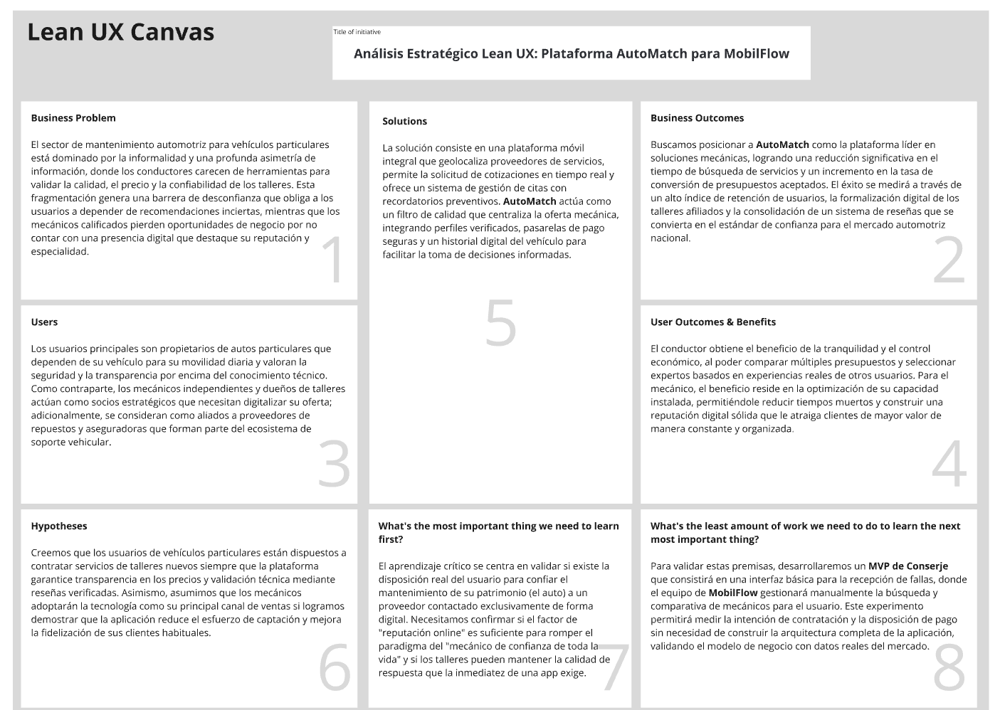

## 1.3. Segmentos objetivo

**Segmento objetivo 1: Mecánicos**
- Profesionales o técnicos que brindan servicios de diagnóstico, mantenimiento y reparación automotriz, y buscan captar clientes, generar confianza y mejorar la visibilidad de sus servicios.


**Segmento objetivo 2: Conductores**
- Propietarios de vehículos que requieren servicios mecánicos confiables para mantener la operatividad de su auto y reducir la incertidumbre al buscar atención técnica.

<div style="page-break-after: always;"></div>

# Capítulo II: Requirements Development and Software Solution Design

En este capítulo se desarrolla el proceso de levantamiento de requerimientos y diseño de la solución de software para AutoMatch. Se presentan técnicas de análisis, identificación de necesidades, modelado del dominio, bounded contexts y decisiones arquitectónicas orientadas a construir una solución escalable y alineada con los principios de ingeniería de software.
## 2.1. Competidores
### ¿Por qué llevar a cabo este análisis?

El análisis de competidores se realiza con el propósito de identificar y evaluar a los principales actores del mercado de servicios automotrices. Esto permite comprender sus fortalezas, debilidades, estrategias y propuestas de valor, así como las oportunidades existentes dentro del entorno competitivo.

A través de este análisis, AutoMatch puede definir una estrategia diferenciada, orientada a satisfacer de manera más eficiente las necesidades de los usuarios. Asimismo, permite reconocer vacíos en el mercado, como la falta de plataformas especializadas, la limitada transparencia en precios y la escasa validación de la calidad del servicio.

En el contexto peruano, donde el sector automotriz presenta altos niveles de informalidad y desconfianza, este análisis resulta clave para diseñar una solución que genere valor, confianza y accesibilidad para los usuarios, posicionando a AutoMatch como una alternativa innovadora frente a los competidores existentes.
### 2.1.1. Análisis competitivo

#### Competitive Analysis Landscape

**¿Por qué llevar a cabo este análisis?**  
Identificar y comparar a los principales competidores del mercado automotriz para entender sus fortalezas, debilidades y estrategias, con el fin de definir la propuesta de valor y ventaja competitiva de AutoMatch en el contexto peruano.

---

### Comparativa general

| Categoría | AutoMatch | Google Maps / Reseñas | Autingo (LatAm) | Maquinarias.pe | Cadenas formales (Bosch / Derco) |
|----------|-----------|------------------------|-----------------|----------------|----------------------------------|
| **Overview** | App que conecta conductores con mecánicos | Plataforma de búsqueda con reseñas | Plataforma digital de servicios mecánicos | Plataforma peruana de servicios postventa | Talleres formales con respaldo de marca |
| **Ventaja competitiva** | Geolocalización + verificación + comparación de precios | Gran volumen de información | Servicio estructurado digital | Respaldo empresarial | Garantía y respaldo técnico |
| **Mercado objetivo** | Conductores urbanos en Perú | Usuarios globales | Mercado latinoamericano | Usuarios en Perú | Segmento medio-alto |
| **Estrategias de marketing** | Redes sociales, referidos | SEO | Marketing digital | Publicidad digital | Publicidad corporativa |
| **Servicios** | Búsqueda, cotización, chat, historial | Reseñas y ubicación | Diagnóstico, reservas | Mantenimiento y postventa | Servicios especializados |
| **Precios** | Gratis | Gratis | Pago por servicio | Precios definidos | Alto costo |
| **Canales** | App y web | Web y app | Web y app | Web | Presencial + digital |

---

### Análisis FODA comparativo

| Plataforma | Fortalezas | Debilidades | Oportunidades | Amenazas |
|------------|-----------|-------------|---------------|----------|
| **AutoMatch** | Especialización, geolocalización, verificación, comparación de precios | Marca nueva | Liderar mercado peruano, integrar pagos digitales | Nuevos competidores, desconfianza inicial |
| **Google Maps** | Gran base de usuarios, visibilidad | No especializado, información no validada | Crecimiento continuo | Plataformas especializadas |
| **Autingo** | Plataforma estructurada | No adaptado a Perú | Expansión LATAM | Competidores locales |
| **Maquinarias.pe** | Respaldo empresarial | No es marketplace | Crecimiento digital en Perú | Apps más completas |
| **Cadenas formales** | Alta confianza y calidad | Costos elevados | Expansión | Alternativas más económicas |


### 2.1.2. Estrategias y tácticas frente a competidores

Para competir eficazmente en el mercado peruano de servicios automotrices, AutoMatch implementa un conjunto de estrategias orientadas a diferenciarse de plataformas generalistas, servicios formales tradicionales y soluciones digitales existentes.

---

#### Diferenciación por especialización

A diferencia de Google Maps, que solo ofrece información general, AutoMatch se enfoca exclusivamente en servicios mecánicos, permitiendo una experiencia más precisa y útil para el usuario.

Esta especialización permite ofrecer funcionalidades específicas como filtrado por tipo de servicio, diagnóstico y comparación de opciones.

---

#### Estrategia de confianza y verificación

Frente a la desconfianza presente en el mercado, AutoMatch implementa:

- Verificación de identidad y experiencia de mecánicos  
- Sistema de calificaciones y reseñas reales  

En comparación con competidores como Google Maps o plataformas informales, donde la información puede no estar validada, AutoMatch garantiza mayor confiabilidad en la elección del servicio.

---

#### Transparencia y comparación de precios

A diferencia de Maquinarias.pe o cadenas formales, donde los precios suelen ser fijos o poco visibles, AutoMatch ofrece:

- Cotizaciones previas al servicio  
- Comparación entre múltiples mecánicos  

Esto reduce la incertidumbre del usuario y mejora la toma de decisiones.

---

#### Geolocalización en tiempo real

AutoMatch incorpora funcionalidades de ubicación avanzada, permitiendo localizar mecánicos cercanos en tiempo real.

Esta estrategia permite competir directamente con la facilidad de uso de Google Maps.

---

#### Adaptación al contexto peruano

A diferencia de plataformas internacionales como Autingo, AutoMatch está diseñada específicamente para el mercado peruano:

- Considera distritos, tráfico y comportamiento urbano  
- Se adapta a las necesidades locales del usuario  

Esto genera una mayor cercanía con el usuario y mejora la adopción.

---

#### Estrategia de crecimiento y adquisición

Para posicionarse en el mercado, AutoMatch aplicará:

- Marketing digital en redes sociales  
- Programas de referidos  
- Alianzas con talleres y comunidades automotrices  

Esto permite competir con el posicionamiento orgánico de Google Maps y la estructura corporativa de cadenas formales.

---

#### Integración de pasarela de pago

AutoMatch incorporará una pasarela de pago segura dentro de la plataforma, permitiendo a los usuarios realizar pagos digitales de manera rápida y confiable.

Esto permitirá:

- Reducir el uso de efectivo  
- Aumentar la seguridad en las transacciones  
- Generar confianza entre usuarios y mecánicos  
- Facilitar la trazabilidad de los pagos  

Además, esta funcionalidad mejora la experiencia del usuario al centralizar todo el proceso (búsqueda, contratación y pago) en una sola plataforma.


## 2.2. Entrevistas

### 2.2.1. Diseño de entrevistas

#### 2.2.1.1 Preguntas Generales

1. Nombre  
2. Edad  
3. Género  
4. Distrito de residencia  
5. Estado civil  
6. Ocupación  
7. Canales digitales que usa para informarse, contratar o promover servicios  
8. Dispositivos que utiliza con mayor frecuencia

#### 2.2.1.2 Segmento Objetivo: Mecanicos

1. ¿Cómo es el proceso desde que un cliente te contacta hasta que terminas el servicio?  
2. ¿Cuántos clientes atiendes en una semana promedio?  
3. ¿Sientes que este flujo de clientes deriva en una inconsistencia de ganancias?  
4. ¿Qué porcentaje de tus clientes son nuevos vs recurrentes?  
5. ¿Qué es lo más difícil de conseguir clientes nuevos?  
6. ¿Qué te frustra del mercado actual?  
7. Si existiera una app que te envía clientes cercanos, ¿la usarías?  
8. ¿Qué tendría que tener para que realmente la uses?  
9. ¿Qué te haría desconfiar de esa app?

#### 2.2.1.3 Segmento Objetivo: Conductores**

1. ¿Que tipo de vehículo que poses, mecanico o automatico?  
2. ¿Qué tan necesario es tu auto en tu día a día?  
3. ¿Qué pasa cuando tu auto falla?  
4. ¿Cómo buscas un mecánico hoy?  
5. ¿Cuánto tiempo te tomó encontrarlo?  
6. ¿Cuál es tu mayor problema al buscar un mecánico?  
7. ¿Alguna vez te han engañado o cobrado de más?  
8. ¿Comparas opciones antes de elegir?  
9. ¿Usarías una app para encontrar mecánicos cercanos? ¿Qué tendría que tener para que confíes en ella?

### 2.2.2. Registro de entrevistas

[Url a Registros de Entrevistas](https://upcedupe-my.sharepoint.com/:v:/g/personal/u202310609_upc_edu_pe/IQCiDe1DPL8sSrLgZHVSbiiNASFOLEMg63PK2nBlIJpFs6E?e=NNQS9v&nav=eyJyZWZlcnJhbEluZm8iOnsicmVmZXJyYWxBcHAiOiJTdHJlYW1XZWJBcHAiLCJyZWZlcnJhbFZpZXciOiJTaGFyZURpYWxvZy1MaW5rIiwicmVmZXJyYWxBcHBQbGF0Zm9ybSI6IldlYiIsInJlZmVycmFsTW9kZSI6InZpZXcifX0%3D)

#### 2.2.2.1 Segmento Objetivo: Conductores

**Entrevista N°1**


**Datos del entrevistado**  
- Nombre: Anedyib   
- Apellidos: Villar  
- Edad: 23  
- Genero: Mujer  
- Lugar de Residencia: Lima, Perú  
- Estado civil: Soltera  
- Ocupación: Analista de Marketing  
- Tipo de vehículo: Automatico

**Resumen de la entrevista:**

Las respuestas de Ane reflejan que su principal frustración como propietaria de un auto está en la confianza y el temor a ser engañada al buscar servicios mecánicos. Aunque prefiere acudir al concesionario oficial de Nissan porque desconfía de los mecánicos de la calle, incluso dentro de ese canal ha tenido malas experiencias, como cobros por servicios incompletos o trabajos que no se realizaron correctamente. Para ella, el problema no es solo reparar el auto, sino tener la seguridad de que el servicio será honesto, cumplirá con lo solicitado y tendrá una relación justa entre calidad y precio.

Otro punto importante es que su auto es una necesidad para su rutina diaria, tanto para ir a trabajar como para movilizarse por temas laborales, por lo que una falla representa una interrupción importante. Cuando necesita buscar soluciones, recurre principalmente a canales que le generan confianza, como directorios oficiales y referencias, aunque reconoce que encontrar opciones puede tomar tiempo. También menciona que suele evaluar alternativas dependiendo del tipo de problema, priorizando siempre confianza y reputación.

Respecto a soluciones digitales, Ane muestra apertura hacia una aplicación para encontrar mecánicos cercanos, siempre que esté respaldada por una comunidad y referencias reales de usuarios. Para ella, la propuesta de valor más fuerte sería:

* Referencias y reseñas verificadas de otros conductores.  
* Transparencia en precios y cumplimiento del servicio ofrecido.  
* Un espacio confiable, enfocado en la comunidad automotriz, que ayude a reducir el riesgo de malas experiencias.

Con esto, percibe que podría tomar mejores decisiones, reducir la incertidumbre y encontrar mecánicos confiables más fácilmente.

**Información de la entrevista**

Duración: 4:30
Minuto de inicio en el video consolidado: 0:00


**Entrevista N°2**


**Datos del entrevistado**  

- Nombre: Jose  
- Apellidos: Torrejon  
- Edad: 27  
- Genero: Hombre  
- Lugar de Residencia: Lima, Perú  
- Estado civil: Soltero  
- Ocupación: Profesor de Marketing  
- Tipo de vehículo: Automatico  
**Información de la entrevista**  

- Fecha de la entrevista: 14/04  
- Duración: 4:08  
- Minuto de inicio en el video consolidado: 0:00  

**Resumen de la entrevista:**

Las respuestas de José reflejan que su principal frustración como propietario de un auto está en la confianza y transparencia al buscar mecánicos. Explica que el problema no es solo “arreglar el auto”, sino todo lo que se vuelve complicado alrededor: dificultad para encontrar especialistas confiables, precios poco claros, y limitaciones logísticas cuando el vehículo no puede desplazarse. En su experiencia, ha tenido que pasar por cuatro mecánicos distintos hasta encontrar uno que le brinde cierta seguridad, aunque aún siente la necesidad de contar con segundas opiniones.

Otro dolor fuerte es el costo económico y la incomodidad que generan las fallas del auto. José depende de su vehículo para ir a trabajar, ya que el transporte público no está cerca. Cuando el auto falla, primero investiga en internet y luego consulta con su mecánico de confianza, pero reconoce que los precios varían mucho y que incluso su mecánico actual le cobra más por servicios a domicilio. Esa falta de estandarización le genera dudas sobre si está pagando lo justo.

En cuanto a la búsqueda de mecánicos, José señala que lo más complicado es la falta de referencias confiables. Prefiere que el mecánico vaya a su casa para supervisar el trabajo, pero reconoce que en reparaciones más complejas debe dejar el auto en el taller, lo que le genera inseguridad. No suele comparar opciones porque mover el auto es difícil cuando está dañado, lo que lo obliga a depender de un único contacto.

Respecto a soluciones digitales, José estaría dispuesto a usar una aplicación para encontrar mecánicos cercanos, siempre que ofrezca reseñas y recomendaciones de otros usuarios. Para él, la propuesta de valor más fuerte sería:

* Referencias verificadas que generen confianza.  
* Transparencia en precios y servicios.  
* Disponibilidad de mecánicos que puedan atender a domicilio.

Con esto, percibe que reduciría la incertidumbre, evitaría sobrecostos y tendría mayor seguridad en el mantenimiento de su vehículo.

**Entrevista N°3**


**Datos del entrevistado**  

- Nombre: Luciana
- Apellidos: Ochoa
- Edad: 23
- Genero: Mujer
- Lugar de Residencia: San Borja
- Ocupación: Estudiante
- Tipo de vehículo: Camioneta automática

**Información de la entrevista**  

- Fecha de la entrevista: 14/04  
- Duración: 4:08  
- Minuto de inicio en el video consolidado: 0:00  

**Resumen de la entrevista:**

Las respuestas de Luciana muestran que su vehículo es importante en su día a día, principalmente para trasladarse a la universidad y para recoger materiales. Actualmente está enfrentando un problema con su camioneta, específicamente con la luz intermitente que no enciende, lo cual la ha llevado a buscar distintas soluciones mecánicas.
Para resolver el problema, ha acudido a varios mecánicos, aunque no ha logrado una solución definitiva, ya que el problema ha vuelto a presentarse después de ser reparado. Su forma de búsqueda de mecánicos se basó inicialmente en recomendaciones de familiares, debido a que no tenía conocimiento previo ni experiencia en el tema. Esta falta de información le dificultó el proceso de selección.
El proceso de encontrar una solución le tomó aproximadamente dos semanas, y reconoce que en un inicio no comparaba opciones, aunque después de una mala experiencia comenzó a intentar evaluar alternativas antes de elegir un mecánico.
Respecto a una posible aplicación para encontrar mecánicos cercanos, Luciana indica que sí la utilizaría, principalmente por su experiencia negativa previa. Para confiar en una solución de este tipo, menciona que sería importante contar con reseñas de otros usuarios, información sobre la calidad del trabajo realizado y orientación sobre los precios y la experiencia de los mecánicos.


#### 2.2.2.1 Segmento Objetivo: Mecanicos

**Entrevista N°1**


**Datos del entrevistado**  

- Nombre: Christian  
- Apellidos: Vilcahuamán  
- Edad: 35  
- Genero: Hombre  
- Lugar de Residencia: Santa Anita  
- Estado civil: Soltero  
- Ocupación: administrador de taller automotriz.  

**Información de la entrevista**  

- Fecha de la entrevista: 14/04  
- Duración:   
- Minuto de inicio en el video consolidado: 0:00  

**Resumen de la entrevista:**  
Las respuestas de Cristian reflejan que su principal preocupación como administrador de taller no está en la falta de clientes, sino en la capacidad operativa para atenderlos correctamente. Explica que su flujo de trabajo está bastante estructurado, con procesos definidos desde la recepción hasta el control de calidad, y que la mayor dificultad para captar nuevos clientes radica en gestionar la disponibilidad de técnicos, el espacio del taller y evitar incumplimientos por retrasos en trabajos en curso. Además, menciona que la mayoría de sus clientes son recurrentes, por lo que la captación de nuevos clientes no ha sido una prioridad, aunque reconoce que sí representa una oportunidad de crecimiento.

Otro punto importante es que Cristian muestra apertura hacia soluciones digitales, siempre que estas no solo generen clientes, sino que ayuden a optimizar la operación del taller. Estaría dispuesto a usar una aplicación que le envíe clientes cercanos si esta permite gestionar disponibilidad, coordinar horarios y evitar sobrecargar la capacidad del negocio. Sin embargo, también señala que desconfiaría de una solución que falle en mostrar información real sobre espacios o tiempos disponibles, ya que eso afectaría directamente el servicio y la reputación del taller. Para él, el valor principal de una herramienta digital está en combinar captación con confiabilidad y gestión operativa.


**Entrevista N°2**


**Datos del entrevistado**  
- Nombre: Luisa  
- Apellidos: Rios  
- Genero: Mujer  
- Lugar de Residencia: Bruno Terrero, Salamanca  
- Tipo de vehículo: Automatico  
  
**Información de la entrevista**  
- Fecha de la entrevista: 14/04  
- Duración: 4:08  
- Minuto de inicio en el video consolidado: 0:00  
  
**Resumen de la entrevista:**

Las respuestas de Luisa reflejan que su principal preocupación como técnica de máquinas domésticas no está en la falta de clientes, sino en la capacidad operativa para atenderlos correctamente. Explica que su flujo de trabajo está bastante estructurado, con procesos definidos desde la recepción hasta la entrega en perfectas condiciones de funcionamiento, y que la mayor dificultad para captar nuevos clientes radica en demostrar su confiabilidad y la calidad de su mano de obra. Además, menciona que la mayoría de sus clientes son recurrentes o referencias de clientes existentes, por lo que la captación de nuevos clientes no ha sido una prioridad, aunque reconoce que sí representa una oportunidad de crecimiento.

Luisa muestra apertura hacia soluciones digitales, siempre que estas no solo generen clientes, sino que ayuden a optimizar su operación. Estaría dispuesta a usar una aplicación que le envíe clientes cercanos si esta permite demostrar su expertise a través de reseñas y comunicación clara. Sin embargo, también señala que desconfiaría de una solución que falle en mostrar información completa sobre los trabajos realizados, las condiciones en que recibe las máquinas y en qué estado debe entregarlas, ya que eso afectaría directamente el servicio y su reputación. Para ella, el valor principal de una herramienta digital está en combinar captación con eficiencia, comunicación clara y gestión de detalles operativos.

**Entrevista N°3**


**Datos del entrevistado**
- Nombre: Carlo
- Apellidos: García
- Edad: 23 años
- Genero: Hombre
- Lugar de Residencia: San Borja
  
**Información de la entrevista**

- Fecha de la entrevista: 19/04
- Duración: 8:33
- Minuto de inicio en el video consolidado: 0:00

**Resumen de la entrevista:**

Las respuestas de Carlo reflejan que su principal frustración como mecánico automotriz está en la dispersión y volatilidad del mercado. Explica que el problema no es solo "reparar autos", sino todo lo que se vuelve complicado alrededor: la necesidad de estar presente en múltiples canales de comunicación (WhatsApp, Facebook, TikTok, Instagram), la falta de un lugar centralizado para comunicarse con clientes, y la dificultad para gestionar de manera eficiente tanto a proveedores como a clientes simultáneamente. Esta dispersión genera que tenga que cambiar constantemente entre aplicaciones y flujos diferentes, lo que es bastante trabajoso.
Volatilidad de ingresos y flujo de clientes
Otro dolor fuerte para Carlo es la inconsistencia en sus ganancias derivada del flujo irregular de clientes. Atiende entre 12 a 20 clientes por semana, pero este volumen es muy variable. Reconoce que depende mucho de las comisiones y que, aunque tiene clientes recurrentes (aproximadamente 30% nuevos y 70% recurrentes), hay días sin ningún cliente. Esta volatilidad le genera inseguridad financiera y dificulta la planificación.
Dificultad para conseguir clientes de manera eficiente
Señala que lo más complicado es lograr que los clientes lo encuentren de forma eficiente. Actualmente obtiene clientes a través de redes sociales y páginas de la mecánica, pero el proceso es disperso y poco organizado. No existe un canal centralizado donde los clientes puedan encontrarlo directamente según sus necesidades específicas.
Soluciones digitales potenciales
Respecto a una posible solución digital, Carlo estaría totalmente dispuesto a usar una aplicación que le enviara clientes a partir de sus necesidades. Para él, esta aplicación tendría que tener:
Un canal de comunicación bien establecido y centralizado.
Capacidad para interactuar, realizar ofertas y propuestas de forma directa.
Evaluación de trabajos sin tener que cambiar entre múltiples plataformas.
Con esto, Carlo percibe que reduciría la dispersión, mejoraría la eficiencia operativa y tendría un flujo más predecible de clientes.

**Entrevista N°4**


**Datos del entrevistado**  
- Nombre: Luis   
- Apellidos: Péres    
- Edad: 23 años  
- Genero: Hombre  
- Lugar de Residencia: Chorrillos, Lima, Perú  

**Información de la entrevista**  

- Fecha de la entrevista: 20/04  
- Duración: 3:49  
- Minuto de inicio en el video consolidado: 0:00  

**Resumen de la entrevista:**

Las respuestas de Luis reflejan que uno de los principales desafíos desde el lado del taller es la inestabilidad en el flujo de clientes, lo que impacta directamente en la consistencia de los ingresos. Aunque el taller atiende entre 15 a 25 clientes por semana, esta demanda varía considerablemente, generando semanas con alta carga de trabajo y otras con baja actividad.

Otro punto importante es la dificultad para captar nuevos clientes, ya que la confianza juega un rol clave en la decisión del usuario. Luis menciona que existe una fuerte competencia en el mercado, donde algunos talleres reducen precios para atraer clientes, lo que también genera una percepción enfocada en lo económico más que en la calidad del servicio.

En cuanto a los canales digitales, el taller utiliza principalmente WhatsApp para la comunicación directa con los clientes y Facebook como medio para visualizar servicios y referencias. Esto evidencia una adopción digital básica, pero aún limitada en términos de herramientas especializadas.

Respecto a soluciones digitales, Luis muestra una actitud positiva hacia una aplicación que pueda conectar talleres con clientes cercanos, ya que percibe que podría ayudar a incrementar la demanda. Sin embargo, establece condiciones claras para su adopción:

* Facilidad de uso en la plataforma.  
* Visualización clara de la ubicación de los clientes.  
* Generación de clientes reales y potenciales.  
* Sistema de referencias o reputación confiable.

Por otro lado, los factores que generarían desconfianza incluyen que la aplicación no funcione correctamente, que los clientes no sean reales o que implique costos elevados sin resultados tangibles.

En general, Luis percibe que una solución digital bien implementada podría mejorar la captación de clientes, estabilizar los ingresos del taller y fortalecer la confianza en el servicio, siempre que cumpla con estándares de funcionalidad, transparencia y efectividad.

### 2.2.3. Análisis de entrevistas

**2.2.3.1 Segmento Objetivo Conductores**

Los resultados evidencian que el segmento de conductores entrevistados presenta la necesidad de encontrar mecánicos confiables, transparentes y cercanos. La falla de un vehículo no representa solo un problema técnico, sino también una interrupción importante en su rutina laboral y personal. Por ello, cualquier solución dirigida a este segmento debe enfocarse no solo en la reparación del auto, sino también en reducir la incertidumbre durante la búsqueda del servicio.

Otro hallazgo relevante es que ambos entrevistados ya usan canales digitales para informarse, principalmente computadora y celular. Esto demuestra una apertura hacia herramientas tecnológicas que faciliten la búsqueda de mecánicos, especialmente si incluyen reseñas verificadas y referencias reales. En ese sentido, una aplicación orientada a este segmento tendría mayor aceptación si resuelve el problema de confianza y permite comparar opciones sin    generar riesgos adicionales

En conclusión, el análisis permitio identifico que el conductor es dependiente de su vehículo para trabajar y altamente sensible a problemas de confianza en servicios mecánicos. Sus principales necesidades se centran en encontrar mecánicos confiables, evitar cobros injustos y acceder a información verificable antes de tomar una decisión. Estas características serán clave para definir los arquetipos y orientar la propuesta de valor de la solución.

**2.2.3.1 Segmento Objetivo Mecanicos**

Los resultados evidencian que el segmento de mecánicos entrevistado presenta una necesidad clara de captar clientes sin perder control operativo. Tanto Cristian como Luisa priorizan la capacidad de atender correctamente antes que incrementar volumen indiscriminadamente, mientras Carlo enfatiza el problema de dispersión y falta de centralización en la relación con clientes.

Otro hallazgo relevante es que el valor esperado de una solución digital no se limita solo a generar clientes. Los tres entrevistados asocian valor con funcionalidades como visibilidad frente a nuevos usuarios, gestión de disponibilidad, reputación basada en reseñas y un mejor emparejamiento entre la necesidad del conductor y la especialidad del mecánico. Esto sugiere que una propuesta enfocada únicamente en listar mecánicos sería insuficiente si no incorpora mecanismos que generen confianza, mejoren el descubrimiento del servicio y faciliten conexiones más relevantes entre ambas partes.

En conclusión, el mecánico típico de este segmento es un profesional que valora no solo captar nuevos clientes, sino hacerlo mediante canales que fortalezcan su visibilidad, reputación y acceso a oportunidades acordes con su especialidad. Sus principales necesidades se centran en recibir clientes de forma confiable, generar confianza a través de referencias y reseñas, mejorar su exposición frente a potenciales usuarios y acceder a una solución que facilite conexiones relevantes con conductores que realmente necesiten sus servicios. Estas características serán clave para construir los arquetipos del segmento y definir una propuesta de valor alineada a sus principales necesidades. 

## 2.3. Needfinding
En esta sección se identifican y analizan las necesidades de los usuarios a partir de la información recolectada en entrevistas y herramientas de investigación UX. El objetivo es comprender los problemas, motivaciones y comportamientos de los usuarios para definir soluciones alineadas a sus expectativas.

### 2.3.1. User Personas

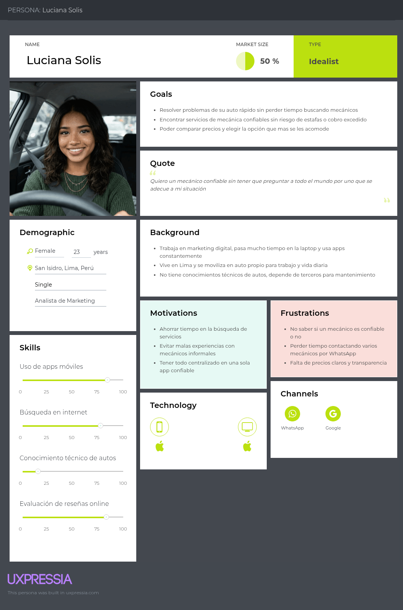

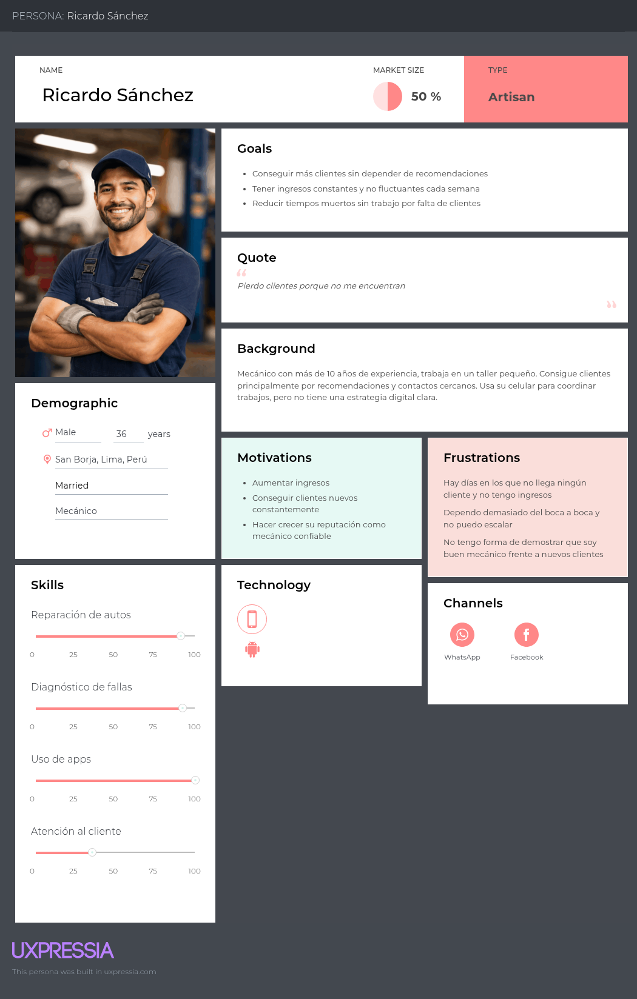

2.3.2. User Task Matrix

| Task | Luciana (Conductora) |  | Ricardo (Mecánico) |  |
|------|----------------------|--|--------------------|--|
|      | Frecuencia | Importancia | Frecuencia | Importancia |
| Buscar mecánico | Always | High | Rarely | Medium |
| Comparar opciones y precios | Often | High | Rarely | Medium |
| Evaluar confianza (reseñas/recomendaciones) | Always | High | Sometimes | High |
| Contactar mecánico / cliente | Often | High | Always | High |
| Coordinar servicio (tiempo y lugar) | Often | High | Always | High |
| Solicitar servicio | Sometimes | High | Rarely | Medium |
| Ejecutar servicio mecánico | Rarely | Medium | Always | High |
| Gestionar pagos | Often | High | Often | High |
| Conseguir nuevos clientes | Rarely | Low | Always | High |
| Mantener reputación | Rarely | Medium | Often | High |
2.3.3. User Journey Mapping


#### User Journey Map – Conductora (Luciana)


---

#### User Journey Map – Mecánico (Ricardo)


### 2.3.4. Empathy Mapping


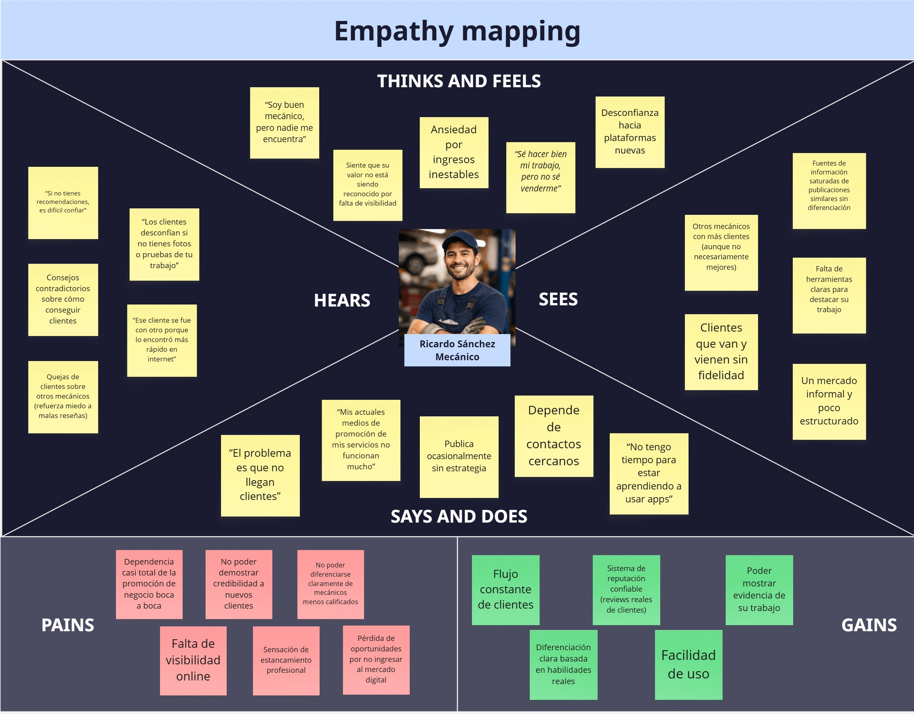

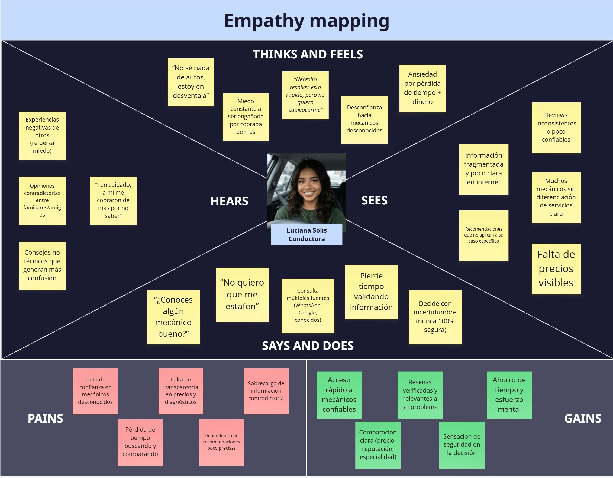

### 2.3.5. Ubiquitous Language

| Término | Definición |
| :---- | :---- |
| **Usuario** | Persona que posee un vehículo y busca servicios mecánicos dentro de la plataforma. |
| **Mecánico** | Proveedor de servicios de mantenimiento o reparación automotriz registrado en la plataforma. |
| **Solicitud de servicio** | Pedido generado por un usuario para recibir atención mecánica. |
| **Match** | Proceso mediante el cual la plataforma conecta a un usuario con uno o más mecánicos disponibles según criterios como ubicación y disponibilidad. |
| **Servicio mecánico** | Trabajo solicitado por el usuario, como mantenimiento, reparación o diagnóstico del vehículo. |
| **Disponibilidad** | Estado del mecánico que indica si puede atender solicitudes en un momento determinado. |
| **Calificación** | Puntuación numérica otorgada por el usuario al mecánico tras finalizar un servicio. |
| **Reseña** | Comentario cualitativo del usuario sobre la experiencia del servicio recibido. |
| **Historial de servicios** | Registro de todos los servicios realizados por un usuario o mecánico dentro de la plataforma. |
| **Precio estimado** | Costo aproximado del servicio mostrado antes de su ejecución. |

#### 2.4. Requirements specification

| Epics |  |
| :---- | ----- |
| Epic 01: Manejo de Usuarios |  |
| Epic 02: Manejo de Servicios |  |
| Epic 03: Matching |  |
| Epic 04: Calificación y reseñas  |  |

### 2.4.1. User Stories

#### 2.4.1.1 User Stories 

| Story ID  | User | Priority | Epic |
| ----- | :---: | :---: | :---: |
| US-01 | Conductor	 | Media | **Epic 04: Calificación y reseñas** |
| **Title** | Calificaciones y reseñas |  |  |
| **Description** |  |  |  |
| Como conductor, quiero leer reseñas y ver calificaciones de mecánicos para tomar una decisión informada. |  |  |  |
| **Acceptance Criteria** |  |  |  |
| **Escenario 1:** Consulta de reseñas **Dado** que el conductor abre el perfil de un mecánico **Cuando** revisa las reseñas **Entonces** se muestran comentarios y promedio de calificaciones.	 |  |  |  |


| Story ID  | User | Priority | Epic |
| ----- | :---: | :---: | :---: |
| US-02 | Conductor	 | Alta | **Epic 02: Manejo de Servicios** |
| **Title** | Cotización transparente |  |  |
| **Description** |  |  |  |
| Como conductor, quiero recibir una cotización previa antes de aceptar el servicio para evitar cobros excesivos. |  |  |  |
| **Acceptance Criteria** |  |  |  |
| **Escenario 1:** Cotización previa **Given** que el conductor solicita un servicio **When** se procesan la información los síntomas del vehículo **Then** la app muestra el precio estimado antes de confirmar.	 |  |  |  |


| Story ID  | User | Priority | Epic |
| ----- | :---: | :---: | :---: |
| US-03 | Conductor	 | Media | **Epic 02: Manejo de Servicios** |
| **Title** | Historial de servicios |  |  |
| **Description** |  |  |  |
| Como conductor, quiero ver mi historial de servicios para recordar qué trabajos se hicieron y con quién. |  |  |  |
| **Acceptance Criteria** |  |  |  |
| **Escenario 1:** Consulta de historial **Given** que el conductor accede a su historial **When** revisa servicios previos **Then** se muestran fecha, mecánico y costo de cada servicio.	 |  |  |  |


| Story ID | User | Priority | Epic |
| ----- | :---: | :---: | :---: |
| US-04 | Conductores | Alta | **Epic 01: Manejo de Usuarios** |
| **Title** | Registro de usuario |  |  |
| **Description** |  |  |  |
| Como usuario quiero registrarme en la plataforma para acceder como conductor o mecánico. |  |  |  |
| **Acceptance Criteria** |  |  |  |
| **Escenario 1: Registrar usuario con email nuevo Dado que** no tengo una cuenta **Cuando** completo mis datos de registro **Entonces** se crea mi usuario con estado activo.  **Escenario 2: Registrar usuario con email usado Dado que** intento registrarme con un correo ya existente **Cuando** envío el formulario **Entonces** el sistema rechaza el registro y me informa el conflicto.  |  |  |  |


| Story ID | User | Priority | Epic |
| ----- | :---: | :---: | :---: |
| US-05 | Conductores | Alta | **Epic 01: Manejo de Usuarios** |
| **Title** | Completar perfil de conductor |  |  |
| **Description** |  |  |  |
| **Como** conductor **Quiero** completar mi perfil personal y de vehículo **Para** recibir mejores recomendaciones y solicitudes más precisas.  |  |  |  |
| **Acceptance Criteria** |  |  |  |
| **Escenario 1: Agregar datos de vehiculo**<br><br> Dado que mi cuenta está creada<br><br> Cuando agrego los datos de mi vehículo<br><br> Entonces mi perfil de conductor queda disponible para búsquedas y matching. **Escenario 2: Actualizar datos de vehiculo**<br><br> Dado que ya tengo un vehículo registrado<br><br> Cuando actualizo su información<br><br> Entonces el perfil guarda la versión más reciente.  |  |  |  |


| Story ID | User | Priority | Epic |
| ----- | :---: | :---: | :---: |
| US-06 | Mecanico | Alta | **Epic 01: Manejo de Usuarios** |
| **Title** | Completar perfil de mecánico |  |  |
| **Description** |  |  |  |
| **Como** mecánico **Quiero** completar mi perfil profesional **Para** mostrar mis capacidades y ser encontrado por conductores.  |  |  |  |
| **Acceptance Criteria** |  |  |  |
| **Escenario 1: Completar datos de mecánico<br><br> Dado que** ya estoy registrado<br><br> **Cuando** completo mis datos profesionales<br><br> **Entonces** mi perfil público queda habilitado. **Escenario 2: Actualizar datos de mecánico<br><br> Dado que** actualizo mis datos de contacto o presentación<br><br> **Cuando** guardo los cambios<br><br> **Entonces** el perfil público refleja la nueva información. |  |  |  |

| Story ID | User | Priority | Epic |
| ----- | :---: | :---: | :---: |
| US-07 | Mecanico | Alta | **Epic 01: Manejo de Usuarios** |
| **Title** | Definir especialidades del mecánico  |  |  |
| **Description** |  |  |  |
| **Como** mecánico **Quiero** definir mis especialidades **Para** aparecer en búsquedas relacionadas con mis conocimientos.  |  |  |  |
| **Acceptance Criteria** |  |  |  |
| **Escenario 1: Ingresar Especialidades**<br><br> Dado que estoy editando mi perfil<br><br> Cuando selecciono especialidades como frenos, motor o electricidad<br><br> Entonces el sistema las asocia a mi perfil. **Escenario 2: Eliminar Especialidades**<br><br> Dado que una especialidad ya no aplica a mi servicio<br><br> Cuando la elimino del perfil<br><br> Entonces deja de usarse en el matching. |  |  |  |

| Story ID | User | Priority | Epic |
| ----- | :---: | :---: | :---: |
| US-12 | Mecanico | Media | **Epic 01: Manejo de Usuarios** |
| **Title** | Definir especialidades del mecánico  |  |  |
| **Description** |  |  |  |
| **Como** mecánico **Quiero** definir mis especialidades **Para** aparecer en búsquedas relacionadas con mis conocimientos.  |  |  |  |
| **Acceptance Criteria** |  |  |  |
| **Escenario 1: Ingresar Especialidades**<br><br> Dado que estoy editando mi perfil<br><br> Cuando selecciono especialidades como frenos, motor o electricidad<br><br> Entonces el sistema las asocia a mi perfil. **Escenario 2: Eliminar Especialidades**<br><br> Dado que una especialidad ya no aplica a mi servicio<br><br> Cuando la elimino del perfil<br><br> Entonces deja de usarse en el matching. **Escenario 3: Seleccionar Especialidad de Tipo de vehículo**<br><br> Dado que atiendo un tipo de vehiculo especifico (Carros, SUV, motos, etc)<br><br> Cuando selecciono esos tipos de vehículo<br><br> Entonces solo seré sugerido para esos segmentos. **Escenario 4: Eliminar Especialidad de Tipo de vehículo**<br><br> Dado que ya no atiendo un tipo de vehículo<br><br> Cuando lo retiro de mi perfil<br><br> Entonces el sistema lo excluye de futuras recomendaciones. |  |  |  |


| Story ID | User | Priority | Epic |
| ----- | :---: | :---: | :---: |
| US-08 | Mecanico | Alta | **Epic 02: Manejo de Servicios** |
| **Title** | Publicar servicio  |  |  |
| **Description** |  |  |  |
| Como mecánico Quiero publicar mis servicios Para ofrecerlo en el catálogo y recibir solicitudes. |  |  |  |
| **Acceptance Criteria** |  |  |  |
| **Escenario 1: Publicar Servicio Completo<br><br> Dado que** completé la información del servicio<br><br> **Cuando** lo publico<br><br> **Entonces** el servicio aparece en el catálogo. **Escenario 2: Publicar Servicio Incompleto<br><br><br><br> Dado que** faltan datos obligatorios del servicio<br><br> **Cuando** intento publicarlo<br><br> **Entonces** el sistema bloquea la publicación y muestra los campos faltantes.  |  |  |  |

| Story ID | User | Priority | Epic |
| ----- | :---: | :---: | :---: |
| US-09 | Mecanico | Media | **Epic 02: Manejo de Servicios** |
| **Title** | Editar, activar o desactivar una publicación |  |  |
| **Description** |  |  |  |
| **Como** mecánico **Quiero** editar o pausar mis servicios publicados **Para** mantener actualizado mi catálogo.  |  |  |  |
| **Acceptance Criteria** |  |  |  |
| **Escenario 1: Actualizar Servicio<br><br> Dado que** un servicio sigue vigente<br><br> **Cuando** actualizo su descripción o condiciones<br><br> **Entonces** la publicación se actualiza sin perder su identidad. **Escenario 2: Eliminar Servicio<br><br> Dado que** no estoy disponible temporalmente<br><br> **Cuando** desactivo un servicio<br><br> **Entonces** deja de aparecer en las búsquedas. |  |  |  |


| Story ID | User | Priority | Epic |
| ----- | :---: | :---: | :---: |
| US-10 | Conductor | Alta | **Epic 02: Manejo de Servicios** |
| **Title** | Buscar mecánicos con filtros |  |  |
| **Description** |  |  |  |
| **Como conductor Quiero buscar mecánicos usando filtros Para encontrar opciones compatibles con mi problema y mi vehículo.**  |  |  |  |
| **Acceptance Criteria** |  |  |  |
| **Escenario 1: Busqueda de mecanicos con filtros<br><br> Dado que** tengo síntomas y tipo de vehículo definidos<br><br> **Cuando** aplico filtros de búsqueda<br><br> **Entonces** el sistema me muestra mecánicos compatibles. **Escenario 2: Búsqueda con filtro sin exito<br><br> Dado** que no existen resultados exactos<br><br> **Cuando** ejecuto la búsqueda<br><br> **Entonces** el sistema devuelve opciones cercanas o relacionadas. |  |  |  |


| Story ID | User | Priority | Epic |
| ----- | :---: | :---: | :---: |
| US-11 | Conductor | Alta | **Epic 02: Manejo de Servicios** |
| **Title** | Ver lista de mecánicos disponibles |  |  |
| **Description** |  |  |  |
| **Como conductor Quiero ver una lista de mecánicos disponibles Para comparar opciones antes de crear una solicitud.**   |  |  |  |
| **Acceptance Criteria** |  |  |  |
| **Escenario 1: Visualización de mecánicos disponibles**<br><br> Dado que hay mecánicos con disponibilidad vigente<br><br> Cuando consulto la lista<br><br> Entonces veo únicamente los que pueden atender. **Escenario 2: Sin disponibilidad en la búsqueda**<br><br> Dado que no hay disponibilidad en mi zona o horario<br><br> Cuando consulto la lista<br><br> Entonces el sistema me indica que no hay opciones disponibles. |  |  |  |

| Story ID | User | Priority | Epic |
| ----- | :---: | :---: | :---: |
| US-12 | Conductor | Media | **Epic 02: Manejo de Servicios** |
| **Title** | Consultar perfil público del mecánico |  |  |
| **Description** |  |  |  |
| **Como conductor Quiero ver el perfil público del mecánico Para evaluar si es adecuado para mi caso.**  |  |  |  |
| **Acceptance Criteria** |  |  |  |
| **Escenario 1: Acceso a perfil público disponible**<br><br> Dado que selecciono un mecánico en la búsqueda<br><br> Cuando abro su perfil público<br><br> Entonces veo sus especialidades, ubicación y reputación. **Escenario 2: Perfil no disponible públicamente**<br><br> Dado que el mecánico desactivó su publicación<br><br> Cuando intento ver su perfil<br><br> Entonces el sistema muestra que no está disponible públicamente. |  |  |  |


| Story ID | User | Priority | Epic |
| ----- | :---: | :---: | :---: |
| US-13 | Mecanico | Media | **Epic 02: Manejo de Servicios** |
| **Title** | Gestionar disponibilidad y horarios |  |  |
| **Description** |  |  |  |
| **Como mecánico Quiero administrar mis horarios de atención Para recibir solicitudes solo cuando realmente pueda atender.**  |  |  |  |
| **Acceptance Criteria** |  |  |  |
| **Escenario 1: Definición de horarios disponibles**<br><br> Dado que tengo una jornada definida<br><br> Cuando agrego mis franjas horarias<br><br> Entonces el sistema las usa para mostrar mi disponibilidad. **Escenario 2: Bloqueo de horario no disponible**<br><br> Dado que tengo un bloqueo de agenda<br><br> Cuando marco un horario como no disponible<br><br> Entonces ese horario deja de poder seleccionarse. |  |  |  |

| Story ID | User | Priority | Epic |
| ----- | :---: | :---: | :---: |
| US-14 | Conductor | Alta | **Epic 02: Manejo de Servicios** |
| **Title** | Registrar síntomas y contexto |  |  |
| **Description** |  |  |  |
| **Como conductor Quiero registrar síntomas, problema e información contextual del vehículo Para recibir una recomendación más precisa.**  |  |  |  |
| **Acceptance Criteria** |  |  |  |
| **Escenario 1: Registro de síntomas básicos**<br><br> Dado que mi vehículo presenta un ruido extraño<br><br> Cuando describo el síntoma y el contexto<br><br> Entonces el sistema guarda la información para el diagnóstico. **Escenario 2: Registro de contexto adicional**<br><br> Dado que el problema ocurre solo en ciertas condiciones<br><br> Cuando agrego ese contexto<br><br> Entonces el diagnóstico preliminar considera esa información. |  |  |  |

| Story ID | User | Priority | Epic |
| ----- | :---: | :---: | :---: |
| US-15 | Sistema | Alta | **Epic 02: Manejo de Servicios** |
| **Title** | Generar diagnóstico preliminar |  |  |
| **Description** |  |  |  |
| **Como sistema Quiero generar un diagnóstico preliminar a partir de los síntomas Para orientar el matching y la cotización referencial.**  |  |  |  |
| **Acceptance Criteria** |  |  |  |
| **Escenario 1: Diagnóstico generado con información suficiente**<br><br> Dado que los síntomas registrados son suficientes<br><br> Cuando se procesa la información<br><br> Entonces se genera un diagnóstico preliminar. **Escenario 2: Diagnóstico no generado por falta de información**<br><br> Dado que los síntomas son ambiguos o incompletos<br><br> Cuando el sistema evalúa el caso<br><br> Entonces no genera un diagnóstico confiable y mantiene el caso como pendiente de enriquecimiento. |  |  |  |


| Story ID | User | Priority | Epic |
| ----- | :---: | :---: | :---: |
| US-16 | Sistema | Alta | **Epic 03: Matching** |
| **Title** | Sugerir Match |  |  |
| **Description** |  |  |  |
| **Como sistema Quiero encontrar un match entre conductor y mecánico Para maximizar la compatibilidad entre problema, vehículo y servicio.**  |  |  |  |
| **Acceptance Criteria** |  |  |  |
| **Escenario 1: Generación de match exacto**<br><br> Dado que existe un mecánico compatible con diagnóstico, vehículo y ubicación<br><br> Cuando se ejecuta el matching<br><br> Entonces se genera un match exacto. **Escenario 2: Ausencia de match exacto**<br><br> Dado que no hay un mecánico exacto disponible Cuando el sistema busca alternativas Entonces me sugiere un mecánico similar. |  |  |  |


| Story ID | User | Priority | Epic |
| ----- | :---: | :---: | :---: |
| US-17 | Sistema | Alta | **Epic 02: Manejo de Servicios** |
| **Title** | Generar cotización referencial |  |  |
| **Description** |  |  |  |
| **Como sistema Quiero generar una cotización referencial Para reducir el riesgo de sobreprecio antes de crear la solicitud.**  |  |  |  |
| **Acceptance Criteria** |  |  |  |
| **Escenario 1: Generación de cotización estimada**<br><br> Dado que existe suficiente información del problema<br><br> Cuando el sistema calcula la referencia<br><br> Entonces se genera un rango de cotización estimado. |  |  |  |


| Story ID | User | Priority | Epic |
| ----- | :---: | :---: | :---: |
| US-18 | Conductor | Alta | **Epic 02: Manejo de Servicios** |
| **Title** | Crear solicitud de servicio |  |  |
| **Description** |  |  |  |
| **Como conductor Quiero crear una solicitud de servicio Para formalizar mi necesidad y activar el proceso operativo.**  |  |  |  |
| **Acceptance Criteria** |  |  |  |
| **Escenario 1: Creación exitosa de solicitud**<br><br> Dado que ya elegí un mecánico o una recomendación<br><br> Cuando confirmo la solicitud<br><br> Entonces se crea una solicitud de servicio. **Escenario 2: Bloqueo por información incompleta**<br><br> Dado que no he completado los datos mínimos<br><br> Cuando intento crear la solicitud<br><br> Entonces el sistema no la registra y me pide completar la información faltante. |  |  |  |


| Story ID | User | Priority | Epic |
| ----- | :---: | :---: | :---: |
| US-19 | Conductor/Mecanico | Media | **Epic 02: Manejo de Servicios** |
| **Title** | Cancelar solicitud de servicio |  |  |
| **Description** |  |  |  |
| **Como conductor o mecánico Quiero cancelar una solicitud de servicio Para detener el proceso cuando lo desee** |  |  |  |
| **Acceptance Criteria** |  |  |  |
| **Escenario 1: Cancelación de Servicio**  Dado que el servicio todavía no se ha ejecutado<br><br> Cuando una de las partes cancela la solicitud<br><br> Entonces el servicio pasa a estado cancelado. |  |  |  |


| Story ID | User | Priority | Epic |
| ----- | :---: | :---: | :---: |
| US-20 | Conductor/Mecanico | Alta | **Epic 02: Manejo de Servicios** |
| **Title** | Marcar servicio |  |  |
| **Description** |  |  |  |
| **Como mecánico y conductor Quiero marcar el servicio como completado Para finalizar mi servicio** |  |  |  |
| **Acceptance Criteria** |  |  |  |
| **Escenario 1: Marcado exitoso de servicio completado**<br><br> Dado que el conductor culmina la atención<br><br> Cuando el conductor marca la finalización del servicio  Entonces el estado cambia a “pendiente de confirmación del conductor”. **Escenario 2: Bloqueo por servicio no finalizado**<br><br>Dado que el mecánico ya marcó el servicio como completado Cuando confirma el mecanico marca la finalización del servicio Entonces se registra mi confirmación.  |  |  |  |

| Story ID | User | Priority | Epic |
| ----- | :---: | :---: | :---: |
| US-21 | Conductor/Mecanico | Media | **Epic 02: Manejo de Servicios** |
| **Title** | Consultar estado de servicio y servicios activos |  |  |
| **Description** |  |  |  |
| **Como conductor o mecánico Quiero consultar el estado de un servicio y mis servicios activos Para entender en qué etapa se encuentra cada atención.**  |  |  |  |
| **Acceptance Criteria** |  |  |  |
| **Escenario 1: Consulta de servicio en curso**<br><br> Dado que tengo una solicitud en curso<br><br> Cuando reviso el panel de servicios<br><br> Entonces veo su estado actual. **Escenario 2: Exclusión de servicios finalizados en activos**<br><br> Dado que un servicio ya fue finalizado<br><br> Cuando consulto mis servicios activos<br><br> Entonces ese servicio ya no aparece en la lista activa. |  |  |  |


| Story ID | User | Priority | Epic |
| ----- | :---: | :---: | :---: |
| US-22 | Conductor | Media | **Epic 02: Manejo de Servicios** |
| **Title** | Calificar servicio finalizado |  |  |
| **Description** |  |  |  |
| **Como conductor Quiero calificar un servicio finalizado Para expresar mi nivel de satisfacción con la atención recibida.**  |  |  |  |
| **Acceptance Criteria** |  |  |  |
| **Escenario 1: Envío de calificación válido**<br><br> Dado que el servicio fue finalizado<br><br> Cuando envío una calificación<br><br> Entonces la plataforma la registra. |  |  |  |


| Story ID | User | Priority | Epic |
| ----- | :---: | :---: | :---: |
| US-23 | Conductor | Media | **Epic 04: Calificación y reseñas** |
| **Title** | Publicar reseña |  |  |
| **Description** |  |  |  |
| **Como conductor Quiero publicar una reseña sobre el servicio finalizado Para aportar contexto cualitativo y afectar la reputación del mecánico.**  |  |  |  |
| **Acceptance Criteria** |  |  |  |
| **Escenario 1: Publicación de reseña válida**<br><br> Dado que ya completé la calificación de un servicio finalizado<br><br> Cuando envío mi reseña<br><br> Entonces la reseña se publica y actualiza la reputación del mecánico. **Escenario 2: Bloqueo por reseña duplicada**<br><br> Dado que ya existe una reseña para ese mismo servicio<br><br> Cuando intento publicar otra<br><br> Entonces el sistema la rechaza para evitar duplicidad. |  |  |  |


| Story ID | User | Priority | Epic |
| ----- | :---: | :---: | :---: |
| US-24 | Conductor | Baja | **No aplica** |
| **Title** | Landing Page |  |  |
| **Description** |  |  |  |
| **Como conductor o mecánico Quiero ver las funcionalidades de la aplicación Para saber si me conviene usarla** |  |  |  |
| **Acceptance Criteria** |  |  |  |
| **Escenario 1: Ver funcionalidades**<br><br> Dado que estoy en la landing page  Cuando navego por la landing page Entonces puedo visualizar las funcionalidades de la misma |  |  |  |


### 2.4.1.2 Technical Stories


| Story ID  | User | Priority | Epic |
| ----- | :---: | :---: | :---: |
| TS-01 | Developers	 | Alta | No aplica |
| **Title** | Conectar con API Externa de geolocalización |  |  |
| **Description** |  |  |  |
| Como desarrollador, quiero implementar servicios de geolocalización para que los conductores puedan ver la ubicación mecánicos. |  |  |  |
| **Acceptance Criteria** |  |  |  |
| **Escenario 1:** Consulta de ubicación **Given**  que se reciben coordenadas **When** el sistema procesa la solicitud **Then** devuelve resultados ordenados por cercanía |  |  |  |


| Story ID | User | Priority | Epic |
| ----- | :---: | :---: | :---: |
| TS-02 | Developers | Alta | No Aplica |
| **Title** | Registro de usuario |  |  |
| **Description** |  |  |  |
| Como desarrollador, quiero registrar usuarios (conductores y mecánicos) a través de diferentes formularios para permitir el acceso a la plataforma.  |  |  |  |
| **Acceptance Criteria** |  |  |  |
| **Escenario 1: Consulta de ubicación Dado que** el usuario es un mecánico **Y** envía sus datos **Cuando** el sistema valida la información **Entonces** se crea el usuario con rol “Mecánico” en la base de datos  **Escenario 1: Consulta de ubicación Dado que** el usuario es un conductor **Y** envía sus datos **Cuando** el sistema valida la información **Entonces** se crea el usuario con rol “Conductor” en la base de datos  |  |  |  |


| Story ID | User | Priority | Epic |
| ----- | :---: | :---: | :---: |
| TS-03 | Developers | Alta | No Aplica |
| **Title** | Login de usuario |  |  |
| **Description** |  |  |  |
| Como desarrollador, quiero autenticar a los usuarios para permitir acceso seguro.  |  |  |  |
| **Acceptance Criteria** |  |  |  |
| **Escenario 1: Inicio de sesión con credenciales correctas Dado que** el usuario ingresa credenciales correctas **Cuando** el usuario presiona el botón para iniciar sesión **Entonces** el sistema devuelve un token JWT con el que podrá hacer querys **Escenario 2: Inicio de sesión con credenciales incorrectas Dado que** el usuario ingresa credenciales incorrectas **Cuando** el usuario presiona el botón para iniciar sesión **Entonces** el sistema devuelve un error y no brinda el token **Escenario 3:Diferenciación de roles en Base de Datos. Dado** que existen distintos tipos de usuarios (mecanicos y conductores) **Cuando** el usuario intente acceder a queries **Entonces** el sistema verificará si su rol tiene acceso a estas |  |  |  |


| Story ID | User | Priority | Epic |
| ----- | :---: | :---: | :---: |
| TS-04 | Developers | Alta | No Aplica |
| **Title** | Diseñar API CRUD de usuarios |  |  |
| **Description** |  |  |  |
| Como desarrollador, quiero crear endpoints para manejar a los usuarios de mi aplicación |  |  |  |
| **Acceptance Criteria** |  |  |  |
| **Escenario 1: Actualización de Usuario Dado que** existe un usuario registrado **Cuando** se actualizan los datos del usuario **Entonces** se modifican los datos del usuario en la Base de Datos  **Escenario 2: Eliminación de Usuario Dado que** existe un usuario registrado **Cuando** se solicita la eliminación del usuario **Entonces** el usuario es marcado como inactivo en la Base de Datos |  |  |  |


| Story ID | User | Priority | Epic |
| ----- | :---: | :---: | :---: |
| TS-05 | Developers | Alta | No Aplica |
| **Title** | Diseñar CRUD API de servicios |  |  |
| **Description** |  |  |  |
| Como desarrollador, quiero diseñar una API de servicios para poder registrar o modificar los servicios dados por los mecanicos  |  |  |  |
| **Acceptance Criteria** |  |  |  |
| **Escenario 1: Registro de Servicio  Dado que** se han ingresado los parámetros del servicio **Cuand**o se registra el servicio **Entonces** se guarda el servicio en la Base de Datos **Escenario 2: Actualización de Servicio Dado que** existe un servicio registrado **Cuando** se actualizan los datos del servicio **Entonces** se modifican los datos del servicio en la Base de Datos  **Escenario 3: Eliminación de Servicio Dado que** existe un servicio registrado **Cuando** se solicita la eliminación del servicio **Entonces** el servicio es marcado como desestimado en la Base de Datos  |  |  |  |


| Story ID | User | Priority | Epic |
| ----- | :---: | :---: | :---: |
| TS-06 | Developers | Alta | No Aplica |
| **Title** | Integración con IA de recomendación inteligente de mecánicos  |  |  |
| **Description** |  |  |  |
| Como desarrollador, quiero utilizar un modelo de IA para recomendar el mejor mecánico al usuario en base a parámetros como ubicación, tipo de problema, rating y disponibilidad, para mejorar la experiencia y precisión en la elección.  |  |  |  |
| **Acceptance Criteria** |  |  |  |
| **Escenario 1: Recomendación exitosa Dado que** el usuario ingresa los parámetros del servicio (ubicación, tipo de problema, etc.) **Cuando el** sistema procesa la información con el modelo de IA **Entonces** se retorna una lista de mecánicos recomendados ordenados por relevancia  **Escenario 2: Sin coincidencias exactas Dado que** no existen mecánicos que cumplan todos los parámetros o cumplan parcialmente **Cuando** el sistema ejecuta la búsqueda **Entonces** se retornan mecánicos cercanos o similares como recomendación alternativa |  |  |  |

| Story ID | User | Priority | Epic |
| ----- | :---: | :---: | :---: |
| TS-07 | Developers | Alta | No Aplica |
| **Title** | Diseñar API CRUD de Diagnostico y Matching |  |  |
| **Description** |  |  |  |
| Como desarrollador, quiero crear endpoints para manejar los Diagnostico y Matching de mi aplicación |  |  |  |
| **Acceptance Criteria** |  |  |  |
| **Escenario 1: Procesamiento de síntomas y generación de diagnóstico**<br> Dado que el usuario envía un conjunto de síntomas <br> Cuando el motor de diagnóstico procesa la entrada <br> Entonces se genera un diagnóstico con base en reglas, scoring o modelo definido <br><br>**Escenario 2: Matching de diagnóstico con especialidades** <br><br>Dado un diagnóstico generado <br> Cuando el servicio de matching se ejecuta <br> Entonces se calculan especialidades relacionadas mediante reglas de correspondencia o pesos<br><br> **Escenario 3: Exposición de recomendaciones vía API** Dado un diagnóstico con especialidades asociadas <br> Cuando el frontend solicita recomendaciones <br> Entonces la API retorna especialistas o categorías filtradas por relevancia<br><br>**Escenario 4: Reprocesamiento de diagnóstico por actualización de síntomas**<br><br> Dado que el usuario actualiza su lista de síntomas <br> Cuando se envía la nueva data al backend <br> Entonces se invalida el diagnóstico anterior y se recalcula el nuevo resultado |  |  |  |

| Story ID | User | Priority | Epic |
| ----- | :---: | :---: | :---: |
| TS-08 | Developers | Alta | No Aplica |
| **Title** | Diseñar API CRUD de Catalogo de Servicios |  |  |
| **Description** |  |  |  |
| Como desarrollador backend, necesito implementar un catálogo de servicios donde los mecánicos puedan registrar y actualizar sus servicios ofrecidos, y los conductores puedan buscar, filtrar y seleccionar mecánicos según los servicios disponibles dentro de la plataforma |  |  |  |
| **Acceptance Criteria** |  |  |  |
| **Escenario 1: Registro de servicios por parte del mecánico** <br> Dado que un usuario está registrado como mecánico <br> Cuando el mecánico crea o actualiza su catálogo de servicios <br> Entonces el sistema guarda los servicios ofrecidos asociados a su perfil (ej: diagnóstico, frenos, motor, electricidad) <br> <br> **Escenario 2: Actualización del catálogo de servicios** <br> Dado que el mecánico ya tiene servicios registrados <br> Cuando actualiza su catálogo (agregar, editar o eliminar servicios) <br> Entonces el sistema actualiza la información reflejada en su perfil público<br> <br> **Escenario 3: Búsqueda de mecánicos por servicios** <br> Dado que existen mecánicos con servicios registrados <br> Cuando un conductor realiza una búsqueda con filtros (tipo de servicio, ubicación, disponibilidad) <br> Entonces el sistema retorna una lista de mecánicos que coinciden con los criterios <br> <br> **Escenario 4: Selección de mecánico desde catálogo** <br> <br> Dado que un conductor visualiza los resultados del catálogo <br> Cuando selecciona un mecánico específico <br> Entonces el sistema muestra el perfil detallado con sus servicios, rating y disponibilidad|  |  |  |

| Story ID | User | Priority | Epic |
| ----- | :---: | :---: | :---: |
| TS-09 | Developers | Alta | No Aplica |
| **Title** | Diseñar API CRUD de Calificación y Reputación |  |  |
| **Description** |  |  |  |
| Como desarrollador backend, necesito implementar un sistema de calificación y reputación que permita a los conductores crear, actualizar y consultar ratings y reseñas asociados a mecánicos dentro de la plataforma |  |  |  |
| **Acceptance Criteria** |  |  |  |
|**Escenario 1: Creación de calificación para mecánico**  <br>Dado que un servicio ha sido finalizado correctamente <br> Cuando el usuario asigna una calificación al mecánico <br> Entonces el sistema registra el rating asociado al usuario, mecánico y servicio correspondiente <br> <br>**Escenario 2: Actualización de calificación existente**  <br>Dado que existe una calificación previa asociada a un servicio <br> Cuando el usuario actualiza su rating <br> Entonces el sistema recalcula y actualiza la calificación almacenada del mecánico  <br> <br>**Escenario 3: Creación de reseña para mecánico**  <br>Dado que el usuario ha completado un servicio <br> Cuando el usuario envía una reseña textual <br> Entonces el sistema almacena la reseña asociada al mecánico y al servicio <br> <br>**Escenario 4: Actualización de reseña existente**  <br>Dado que existe una reseña previamente registrada <br> Cuando el usuario edita su reseña <br> Entonces el sistema actualiza el contenido manteniendo la trazabilidad del servicio asociado|  |  |  |

### 2.4.1.3 Spike Stories

| Story ID | User | Priority | Epic |
| ----- | :---: | :---: | :---: |
| SS-01 | Developers | Media | No Aplica |
| **Title** | Investigar la Integración de OpenAI para Recomendación Inteligente de Mecánicos |  |  |
| **Description** |  |  |  |
| Como desarrollador,  quiero evaluar la integración de OpenAI como motor de recomendación para mejorar la precisión en la asignación de mecánicos y optimizar la experiencia del usuario. |  |  |  |
| **Acceptance Criteria** |  |  |  |
| **Escenario 1: Revisión de la API de OpenAI Dado que** el equipo necesita entender las capacidades de OpenAI<br><br>**Cuando** el desarrollador revisa la documentación de la API<br><br>**Entonces** identifica los endpoints y modelos adecuados para recomendaciones **Escenario 2: Evaluación de Integración Backend Dado que** el sistema usa backend para lógica de negocio<br><br>**Cuando** el desarrollador evalúa el consumo de la API de OpenAI<br><br>**Entonces** se definen los endpoints necesarios para enviar parámetros y recibir recomendaciones  **Escenario 3: Evalúa la Compatibilidad Móvil Dado** la arquitectura Kotlin Multiplatform Mobile (KMM) para Android e iOS, **Cuando** el desarrollador evalúa la compatibilidad con los Apps SDKs de OpenAI **Entonces** el desarrollador documenta los requisitos de integración móvil **Escenario 4: Evaluación de Seguridad Dado que** se manejarán datos de usuarios<br><br>**Cuando** el desarrollador analiza la integración<br><br>**Entonces** se identifican riesgos y medidas de protección (API keys, validación, etc.) **Escenario 5: Evaluación de Costos Dado** que OpenAI tiene costos por uso<br><br>**Cuando** el desarrollador analiza el consumo esperado<br><br>**Entonces** se estiman costos según el volumen de requests proyectado **Escenario 6: Evaluación de Rendimiento Dado que** las recomendaciones deben ser rápidas (menos de 5 segundos)<br><br>**Cuando** el desarrollador mide el tiempo de respuesta<br><br>**Entonces** se identifican posibles latencias **Escenario 7: Identificación de Dependencias Dado que** se requiere integración externa<br><br>**Cuando** el desarrollador revisa la implementación<br><br>**Entonces** se listan librerías, configuraciones y servicios necesarios **Escenario 8: Prototipa la Integración de Stripe Dado que** se necesita validar la viabilidad de OpenAI<br><br>**Cuando** el desarrollador construye un proof-of-concept mínimo <br><br>**Entonces** se obtiene una recomendación de mecánicos funcional **Escenario 9: Estimación de Esfuerzo Dado que** el equipo necesita una estimación de esfuerzo para la implementación de OpenAi **Cuando** el desarrollador desglosa la integración en tareas de móvil (KMM), y backend basadas en los hallazgos del Spike **Entonces** el desarrollador proporciona una estimación aproximada de puntos de historia para la funcionalidad completa en el informe.  **Escenario 10: Documentación Final Dado que** el Spike está completo, **Cuando** el desarrollador compila todos los hallazgos en un informe compartido, **Entonces** el informe incluye pros/contras, enfoque recomendado y es revisado en una reunión de equipo o sesión de refinamiento |  |  |  |


| Story ID | User | Priority | Epic |
| ----- | :---: | :---: | :---: |
| SS-02 | Developers | Media | No Aplica |
| **Title** | Investigar la Integración de FAISS para Recomendación Inteligente de Mecánicos |  |  |
| **Description** |  |  |  |
| Como desarrollador,  quiero evaluar la integración de FAISS como motor de recomendación para mejorar la precisión en la asignación de mecánicos y optimizar la experiencia del usuario. |  |  |  |
| **Acceptance Criteria** |  |  |  |
| **Escenario 1: Revisión de FAISS<br><br>Dado** que el equipo necesita entender las capacidades de FAISS<br><br>**Cuando** el desarrollador revisa la documentación de FAISS<br><br>**Entonces** identifica cómo funciona la búsqueda por similitud mediante vectores **Escenario 2: Evaluación de Integración Backend<br><br>Dado que** el sistema usa backend para lógica de negocio<br><br>**Cuando** el desarrollador evalúa la integración de FAISS<br><br>**Entonces** se definen los endpoints necesarios para indexar y consultar mecánicos  **Escenario 3: Modelado de Datos Vectoriales<br><br>Dado que** FAISS trabaja con vectores<br><br>**Cuando** el desarrollador define la estructura de datos<br><br>**Entonces** se representan los mecánicos como vectores (ej: ubicación, rating, especialidad) **Escenario 4: Evaluación de Seguridad<br><br>Dado que** se manejarán datos de usuarios<br><br>**Cuando** el desarrollador analiza la integración<br><br>**Entonces** se identifican riesgos y medidas de protección **Escenario 5: Evaluación de Costos<br><br>Dado que** FAISS es open source<br><br>**Cuando** el desarrollador analiza su implementación<br><br>**Entonces** se identifican costos asociados a infraestructura (servidor, memoria) **Escenario 6: Evaluación de Rendimiento<br><br>Dado que** las recomendaciones deben ser rápidas (menos de 3 segundos)<br><br>**Cuando** el desarrollador prueba consultas de similitud<br><br>**Entonces** se valida que FAISS responde eficientemente incluso con grandes volúmenes de datos **Escenario 7: Identificación de Dependencias<br><br>Dado que** se requiere integración técnica<br><br>**Cuando** el desarrollador revisa la implementación<br><br>**Entonces** se listan librerías necesarias  **Escenario 8: Prototipa la Integración de FAISS<br><br>Dado que** se necesita validar la viabilidad<br><br>**Cuando** el desarrollador construye un proof-of-concept mínimo<br><br>**Entonces** se obtiene una lista de mecánicos recomendados por similitud **Escenario 9: Estimación de Esfuerzo<br><br> Dado que** el equipo necesita una estimación de esfuerzo<br><br> **Cuando** el desarrollador desglosa tareas (vectorización, indexación, queries backend)<br><br> **Entonces** se proporciona una estimación aproximada de implementación  **Escenario 10: Documentación Final<br><br>Dado que** el Spike está completo<br><br>**Cuando** el desarrollador compila los hallazgos<br><br>**Entonces** el informe incluye ventajas, limitaciones y posibles usos dentro del sistema |  |  |  |


| Story ID | User | Priority | Epic |
| ----- | :---: | :---: | :---: |
| SS-03 | Developers | Media | No Aplica |
| **Title** | Investigar la Integración de Google Maps API para localizar mecánicos en el mapa |  |  |
| **Description** |  |  |  |
| Como desarrollador, quiero evaluar la integración de Google Maps API como motor de mapas para mejorar la experiencia del usuario al encontrar la localización de mecánicos. |  |  |  |
| **Acceptance Criteria** |  |  |  |
| **Escenario 1: Revisión de documentación de Google Maps API <br><br>Dado** que el equipo necesita entender las capacidades de Google Maps <br><br>**Cuando** el desarrollador revisa la documentación oficial de la API <br><br>**Entonces** identifica los endpoints relevantes para geolocalización y visualización de mecánicos en el mapa.  **Escenario 2: Evaluación de Integración Backend<br><br>Dado que** la plataforma usa un backend para lógica de negocio <br><br>**Cuando** el desarrollador analiza cómo consumir la API desde el backend <br><br>**Entonces** se definen los endpoints necesarios para enviar coordenadas y recibir resultados.   **Escenario 3: Prototipo mínimo de integración <br><br>Dado que** se requiere validar la viabilidad técnica <br><br>**Cuando** el desarrollador construye un proof-of-concept con un mapa y marcadores de mecánicos <br><br>**Entonces** se visualizan correctamente las ubicaciones en el mapa.   **Escenario 4: Evaluación de costos y licenciamiento <br><br>Dado que** se manejarán datos de usuarios<br><br>**Cuando** el desarrollador analiza la integración<br><br>**Entonces** se identifican riesgos y medidas de protección **Escenario 5: Evaluación de Costos<br><br>Dado que** Google Maps API tiene costos por uso <br><br>**Cuando** el desarrollador estima el volumen de requests <br><br>**Entonces** se documentan los costos proyectados y las restricciones de licenciamiento   **Escenario 6: Evaluación de Rendimiento<br><br>Dado que** la integración debe ser rápida y usable <br><br>**Cuando** se mide el tiempo de respuesta y carga del mapa <br><br>**Entonces** se valida que la experiencia sea fluida (menos de 2 segundos).   |  |  |  |

### 2.4.2. Impact Mapping

<div style="max-width:100px">
  
</div>

### 2.4.3. Product Backlog

| # Orden | User Story Id | Título | Story Points (1 / 2 / 3 / 5 / 8) |
|--------|--------------|--------|----------------------------------|
| 1 | US-01 | Calificaciones y reseñas | 3 |
| 2 | US-02 | Cotización transparente | 5 |
| 3 | US-03 | Historial de servicios | 3 |
| 4 | US-04 | Registro de usuario | 5 |
| 5 | US-05 | Completar perfil de conductor | 3 |
| 6 | US-06 | Completar perfil de mecánico | 3 |
| 7 | US-07 | Definir especialidades del mecánico | 3 |
| 8 | US-12 | Definir especialidades del mecánico | 5 |
| 9 | US-08 | Publicar servicio | 5 |
| 10 | US-09 | Editar, activar o desactivar una publicación | 3 |
| 11 | US-10 | Buscar mecánicos con filtros | 5 |
| 12 | US-11 | Ver lista de mecánicos disponibles | 3 |
| 13 | US-12 | Consultar perfil público del mecánico | 2 |
| 14 | US-13 | Gestionar disponibilidad y horarios | 5 |
| 15 | US-14 | Registrar síntomas y contexto | 3 |
| 16 | US-15 | Generar diagnóstico preliminar | 5 |
| 17 | US-16 | Sugerir Match | 8 |
| 18 | US-17 | Generar cotización referencial | 5 |
| 19 | US-18 | Crear solicitud de servicio | 5 |
| 20 | US-19 | Cancelar solicitud de servicio | 2 |
| 21 | US-20 | Marcar servicio | 3 |
| 22 | US-21 | Consultar estado de servicio y servicios activos | 3 |
| 23 | US-22 | Calificar servicio finalizado | 2 |
| 24 | US-23 | Publicar reseña | 3 |
| 25 | US-24 | Landing Page | 3 |
| 26 | TS-01 | Sistema de notificaciones | 5 |
| 27 | TS-02 | Conectar con API Externa de geolocalización | 8 |
| 28 | TS-03 | Registro de usuario | 5 |
| 29 | TS-04 | Login de usuario | 5 |
| 30 | TS-05 | Diseñar API CRUD de usuarios | 5 |
| 31 | TS-06 | Diseñar queries de usuarios | 3 |
| 32 | TS-07 | Diseñar CRUD API de servicios | 5 |
| 33 | TS-08 | Diseñar queries de servicios | 3 |
| 34 | TS-09 | Diseñar queries de servicios | 3 |
| 35 | TS-10 | Integración con IA de recomendación inteligente de mecánicos | 8 |
| 36 | SS-01 | Investigación de geolocalización | 5 |
| 37 | SS-02 | Integración de OpenAI para recomendación | 8 |
| 38 | SS-02 | Integración de FAISS para recomendación | 8 |
| 39 | SS-03 | Integración de Google Maps API | 8 |

## 2.5. Strategic-Level Domain-Driven Design

### 2.5.1. EventStorming

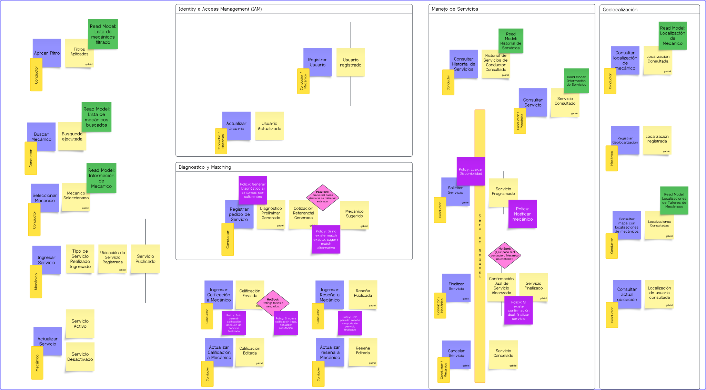

2.5.1.1. Candidate Context Discovery

Durante el EventStorming se aplicó la técnica look-for-pivotal-events para identificar los eventos que marcan cambios de estado en el negocio. Estos eventos actuaron como splitters de la narrativa principal, permitiendo separar responsabilidades y definir los contextos candidatos. A partir de este análisis se establecieron los siguientes bounded contexts:

| Bounded Context          | Descripción                                                                 | Eventos clave                                                                 |
|--------------------------|------------------------------------------------------------------------------|-------------------------------------------------------------------------------|
| ServiceCatalogContext    | Gestiona la publicación, actualización y filtrado de servicios mecánicos.   | Servicio Publicado, Servicio Actualizado, Servicio Desactivado                |
| UserIdentityContext (IAM)| Maneja el registro, autenticación y perfiles de usuarios y mecánicos.        | Usuario Registrado, Usuario Actualizado, Perfil Completado                    |
| DiagnosisContext         | Administra pedidos de servicio, síntomas y generación de diagnósticos/cotizaciones. | Pedido de Servicio Registrado, Diagnóstico Generado, Match Encontrado         |
| ReputationContext        | Gestiona calificaciones y reseñas verificadas de los servicios completados. | Calificación Enviada, Reseña Publicada, Calificación Editada, Reseña Editada  |
| ServiceManagementContext | Controla el ciclo de vida del servicio, desde la solicitud hasta la finalización y registro en el historial. | Servicio Solicitado, Confirmación Dual Alcanzada, Servicio Finalizado, Servicio Cancelado |


#### 2.5.1.2. Domain Message Flows Modeling

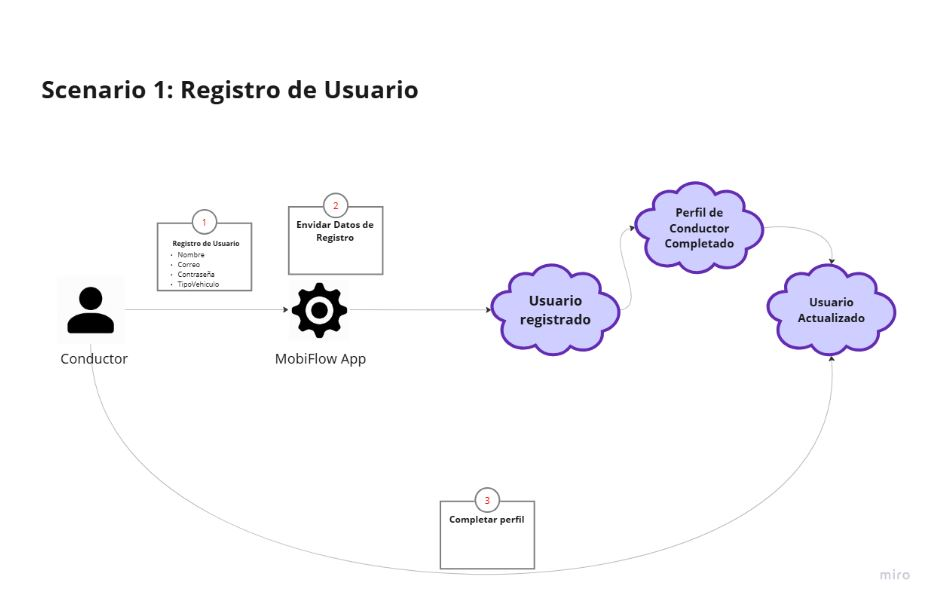
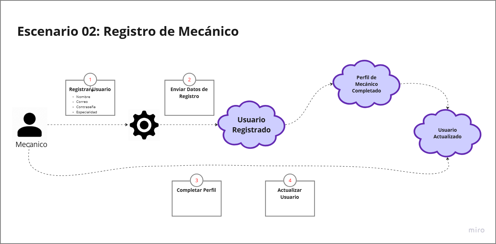
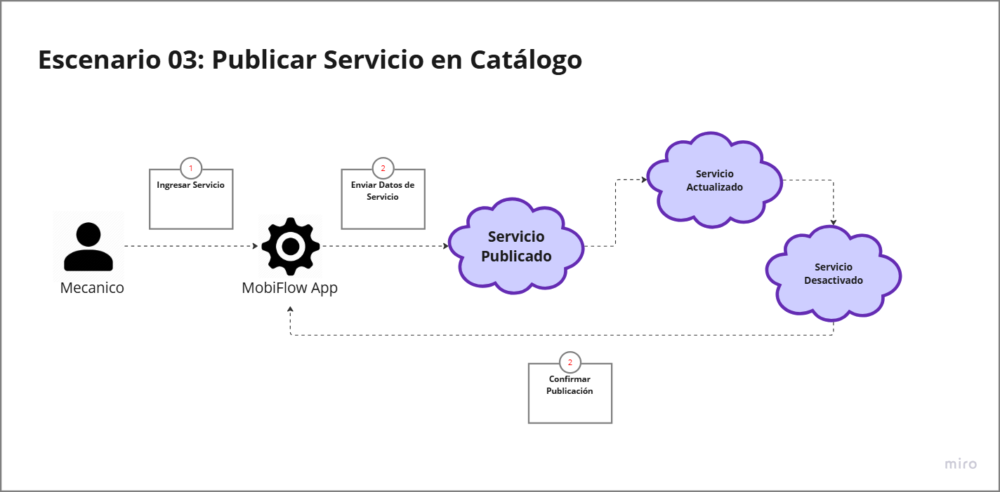
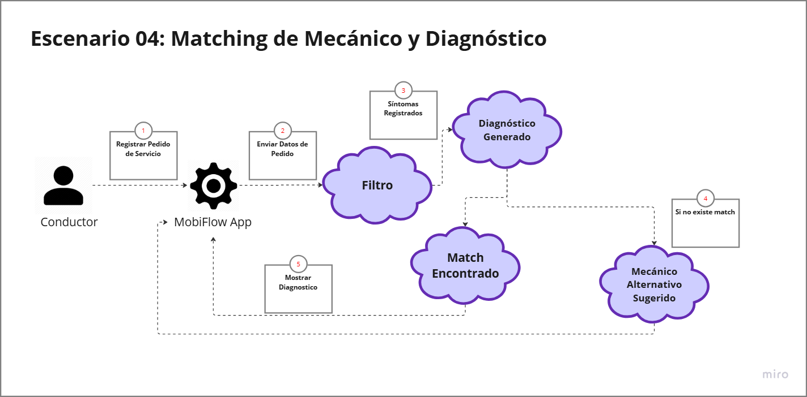
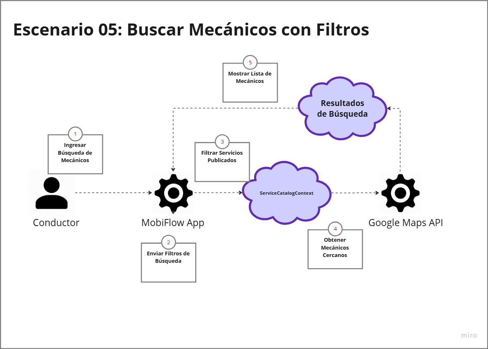
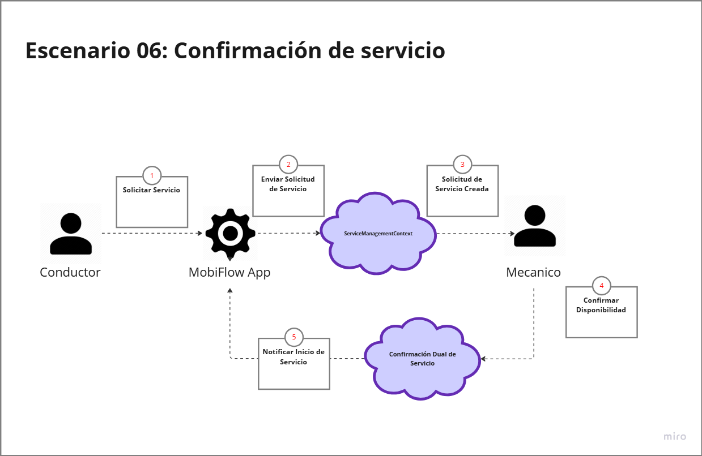

#### 2.5.1.3. Bounded Context Canvases

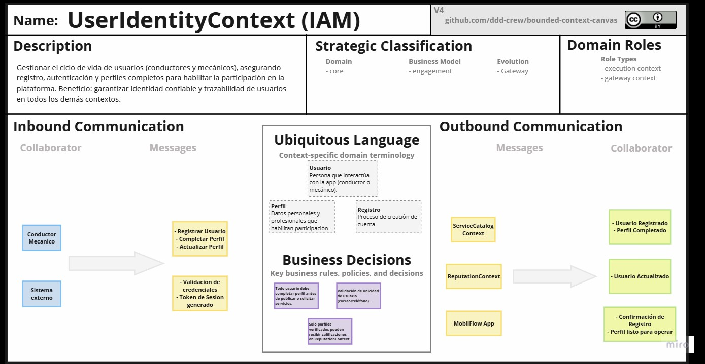
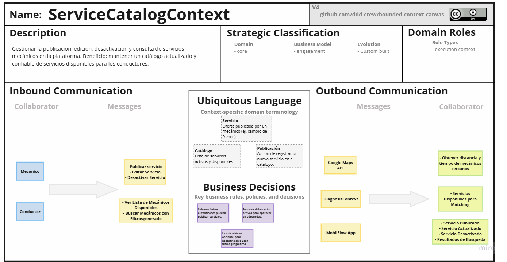


#### 2.5.2. Context Mapping

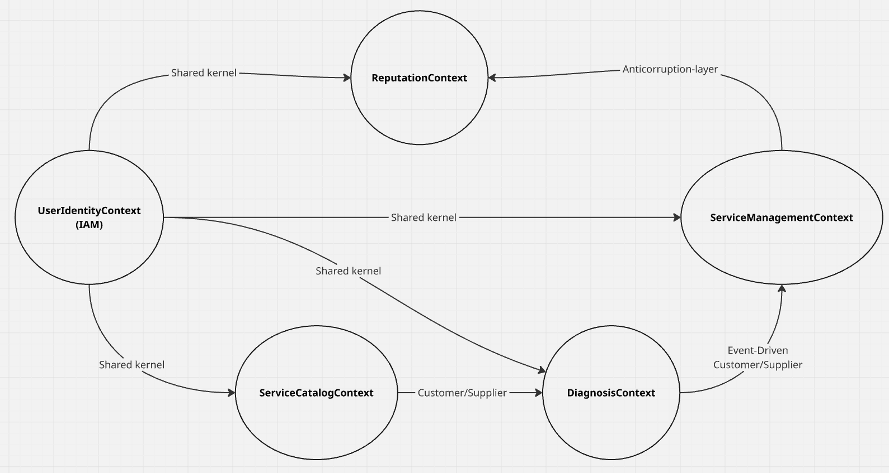

### 2.5.3. Software Architecture

#### 2.5.3.1. Software Architecture Context Level Diagrams


#### 2.5.3.2. Software Architecture Container Level Diagrams


#### 2.5.3.3. Software Architecture Deployment Diagrams


#### 2.6. Tactical-Level Domain-Driven Design

### 2.6.1. Bounded Context: ServiceCatalogContext 

En esta sección se describe el contexto encargado de la gestión del catálogo de servicios mecánicos, incluyendo su publicación, actualización y desactivación. Se detallan las clases identificadas como parte del modelo de dominio, documentando su propósito, atributos, métodos y relaciones, con el fin de estructurar un diccionario claro del dominio.

Miró en donde se desarrolló:

https://miro.com/app/board/uXjVHd8mZPo=/?share_link_id=996378247083

#### 2.6.1.1. Domain Layer

Aquí se modela el núcleo del catálogo de servicios. Se incluyen entidades como Servicio, junto con Value Objects relacionados (por ejemplo, categoría o ubicación). Se definen agregados que aseguran la consistencia del estado del servicio, así como interfaces de repositorios para su persistencia.

#### 2.6.1.2. Interface Layer

Se presentan los controladores encargados de exponer funcionalidades como publicación, edición y filtrado de servicios. Estos componentes permiten la interacción con clientes externos, como aplicaciones web o móviles.

#### 2.6.1.3. Application Layer

Se gestionan los flujos de negocio mediante Command Handlers (por ejemplo, PublicarServicio o ActualizarServicio) y Event Handlers asociados a eventos como ServicioPublicado o ServicioActualizado.

#### 2.6.1.4 Infrastructure Layer
Se implementan repositorios concretos para persistencia en base de datos, además de integraciones con servicios externos si aplica (por ejemplo, indexación para búsqueda).

En este punto se muestran los layers juntos:

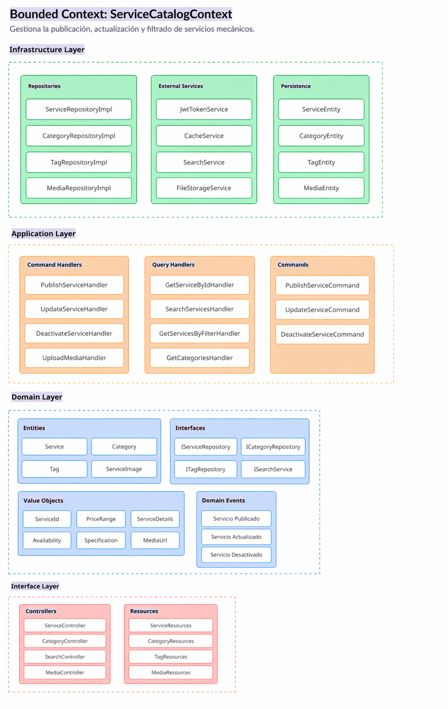


#### 2.6.1.5. Bounded Context Software Architecture Component Level Diagrams

Se presentan diagramas C4 que muestran cómo el contenedor del catálogo se descompone en componentes como API, servicios de aplicación y repositorios.

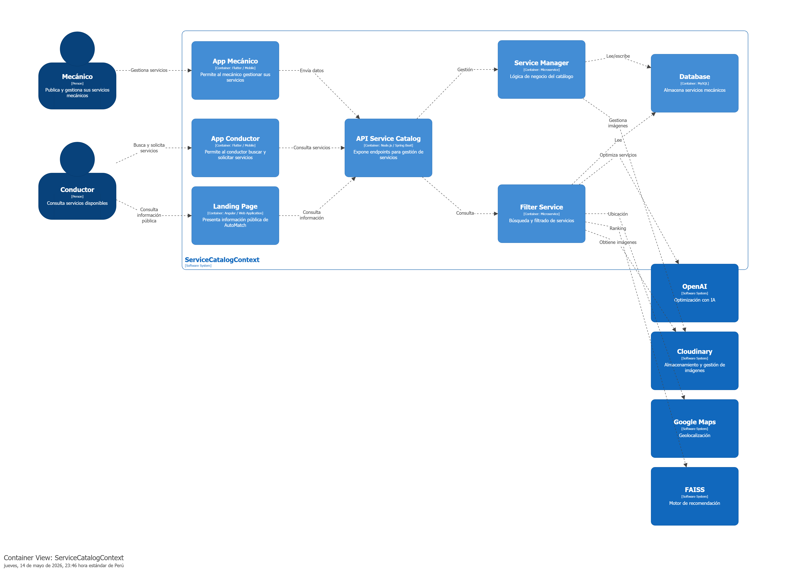

#### 2.6.1.6. Bounded Context Software Architecture Code Level Diagrams

Se incluyen diagramas detallados que reflejan la implementación interna, incluyendo clases de dominio y estructura de persistencia.

##### 2.6.1.6.1. Bounded Context Domain Layer Class Diagrams
  
   Se modelan las clases principales del dominio, sus atributos, métodos y relaciones, incluyendo multiplicidades y tipos de asociación.

   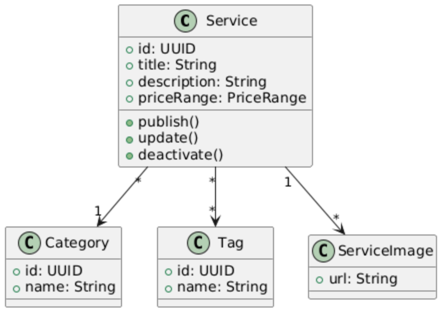
   
##### 2.6.1.6.2. Bounded Context Database Design Diagram
   Se define la estructura de tablas como Servicios, incluyendo claves primarias, foráneas y   restricciones necesarias para garantizar integridad.

   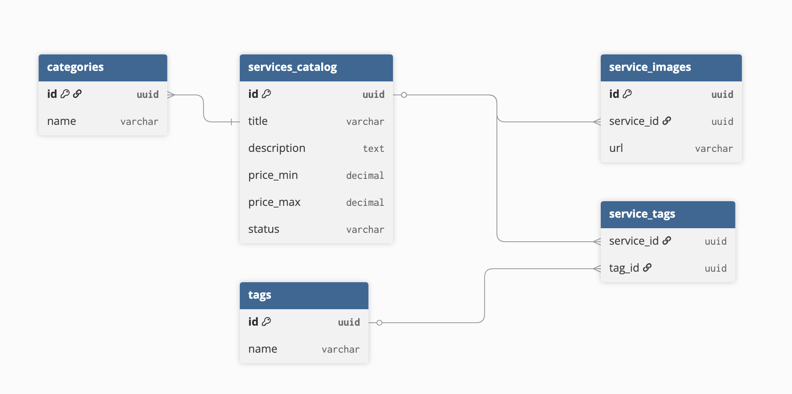


<br> 
<br> 

### 2.6.2. Bounded Context: UserIdentityContext (IAM)

Este contexto gestiona la identidad de los usuarios, abarcando registro, autenticación y administración de perfiles. Se documentan las clases clave del dominio junto con sus responsabilidades y relaciones.

#### 2.6.2.1. Domain Layer

Incluye entidades como Usuario y Perfil, además de Value Objects como credenciales. Se modelan reglas de negocio relacionadas con autenticación y gestión de identidad.

#### 2.6.2.2. Interface Layer

Se presentan controladores para registro, login y actualización de perfiles, actuando como punto de entrada para clientes.

#### 2.6.2.3. Application Layer

Se definen casos de uso como RegistrarUsuario o AutenticarUsuario mediante handlers que coordinan la lógica de negocio.

#### 2.6.2.4 Infrastructure Layer

Incluye implementación de repositorios, servicios de autenticación (como JWT) y conexión a bases de datos.

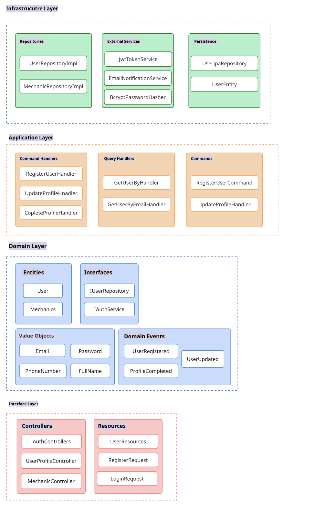

#### 2.6.2.5. Bounded Context Software Architecture Component Level Diagrams 

Se muestra la separación entre componentes como API de autenticación, servicio de usuarios y almacenamiento.

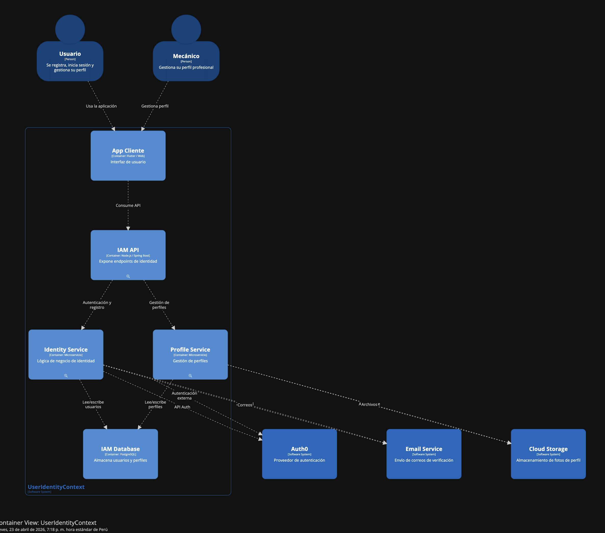

#### 2.6.2.6. Bounded Context Software Architecture Code Level Diagrams

Se detallan clases e implementación del dominio y persistencia.

##### 2.6.2.6.1. Bounded Context Domain Layer Class Diagrams

Se representan clases como Usuario, sus atributos y relaciones con otros objetos.

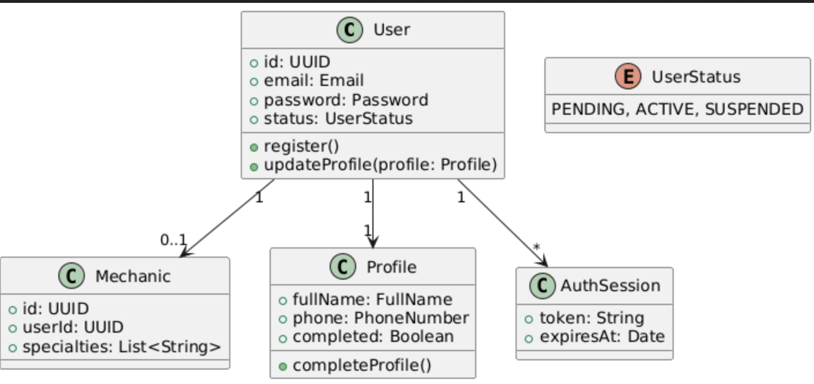

##### 2.6.2.6.2. Bounded Context Database Design Diagram

Incluye tablas como Usuarios y Perfiles con sus respectivas relaciones.

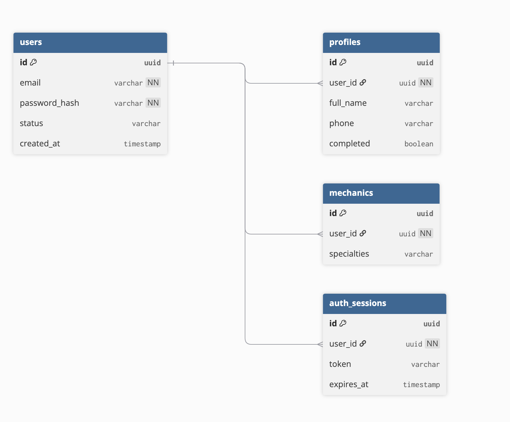

<br> 
<br> 

### 2.6.3. Bounded Context: DiagnosisContext

Este contexto se encarga de gestionar solicitudes de servicio, análisis de síntomas y generación de diagnósticos o cotizaciones.

#### 2.6.3.1. Domain Layer

Se modelan entidades como PedidoServicio y Diagnóstico, incluyendo lógica para interpretar síntomas y generar resultados.

#### 2.6.3.2. Interface Layer

Incluye controladores que permiten registrar solicitudes y consultar diagnósticos.

#### 2.6.3.3. Application Layer

Se implementan flujos como RegistrarPedido o GenerarDiagnostico, así como eventos como DiagnosticoGenerado.

#### 2.6.3.4 Infrastructure Layer

Se integran servicios externos, como motores de análisis o APIs de inteligencia artificial si corresponde.

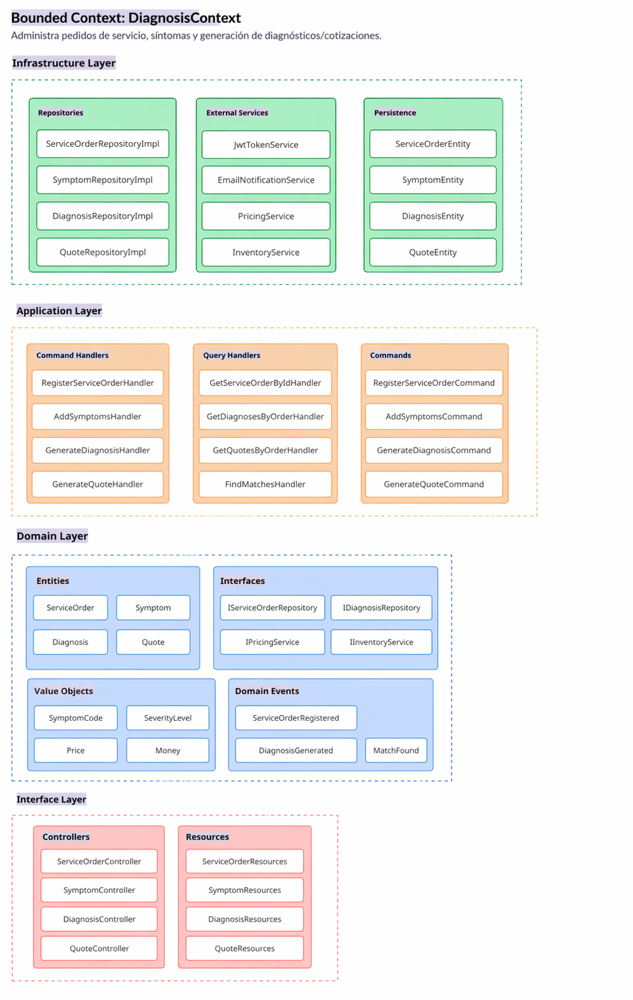

#### 2.6.3.5. Bounded Context Software Architecture Component Level Diagrams

Se visualiza la interacción entre componentes como API, motor de diagnóstico y repositorios.

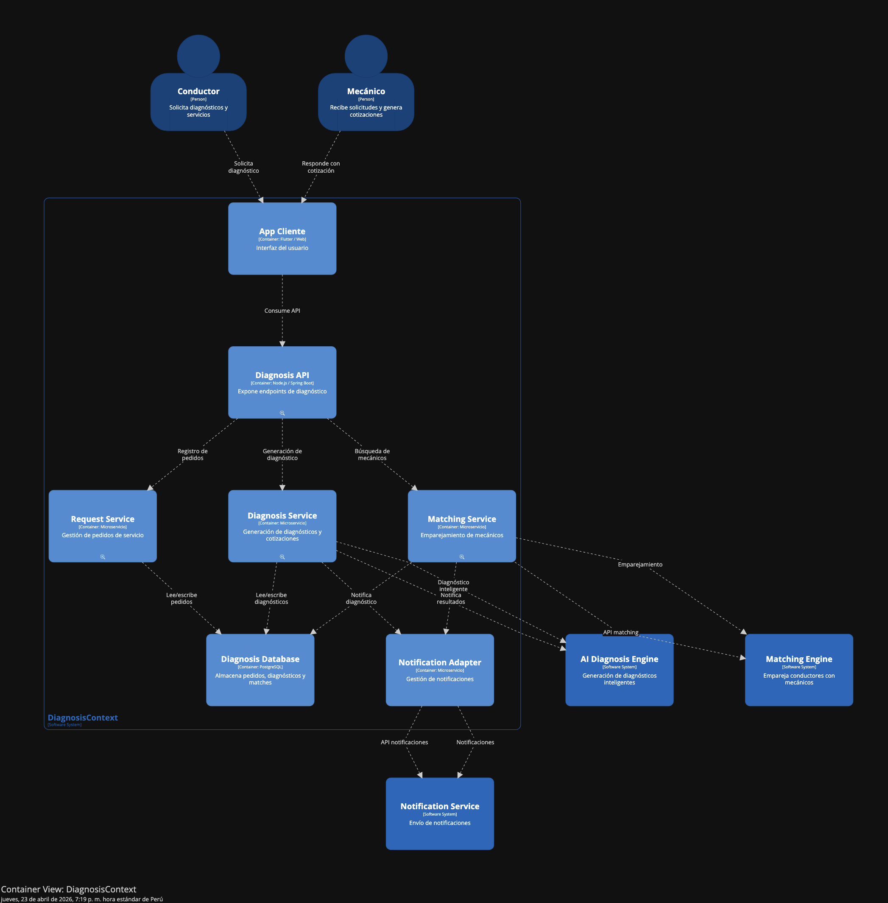

#### 2.6.3.6. Bounded Context Software Architecture Code Level Diagrams

Se detalla la implementación interna del procesamiento de diagnósticos.

##### 2.6.3.6.1. Bounded Context Domain Layer Class Diagrams

Incluyen clases y relaciones para modelar síntomas, pedidos y resultados.

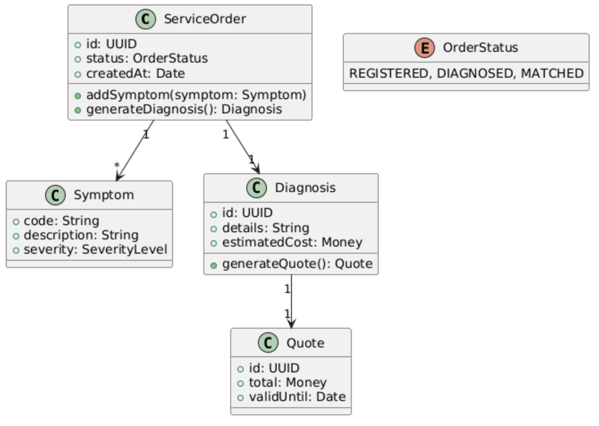

##### 2.6.3.6.2. Bounded Context Database Design Diagram

Define tablas como Pedidos y Diagnosticos con sus relaciones.

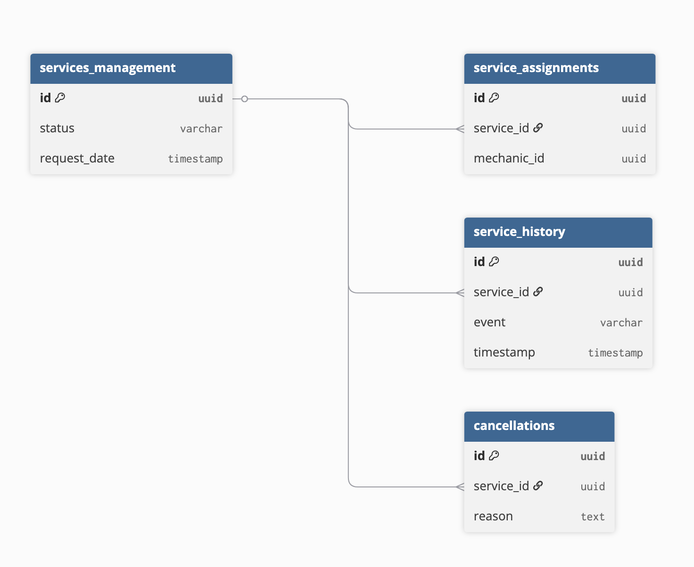

<br> 
<br> 

### 2.6.4. Bounded Context: ReputationContext

Este contexto gestiona la reputación mediante calificaciones y reseñas verificadas de servicios completados.

#### 2.6.4.1. Domain Layer

Incluye entidades como Calificación y Reseña, con reglas que aseguran que solo servicios completados puedan ser evaluados.

#### 2.6.4.2. Interface Layer

Se presentan endpoints para enviar, editar y visualizar reseñas.

#### 2.6.4.3. Application Layer

Se gestionan procesos como EnviarCalificacion y PublicarReseña mediante handlers.

#### 2.6.4.4 Infrastructure Layer

Incluye persistencia de reseñas y posibles integraciones con sistemas de moderación.

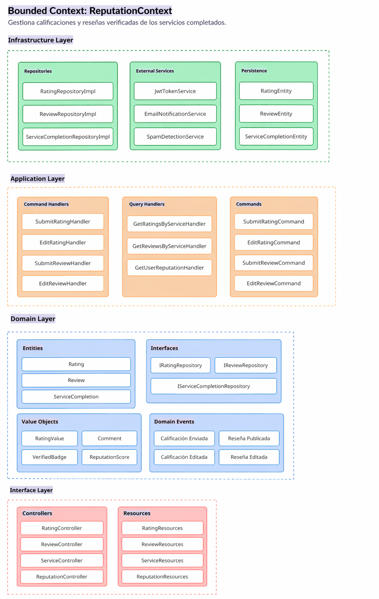

#### 2.6.4.5. Bounded Context Software Architecture Component Level Diagrams

Muestra componentes como API de reputación y repositorios.

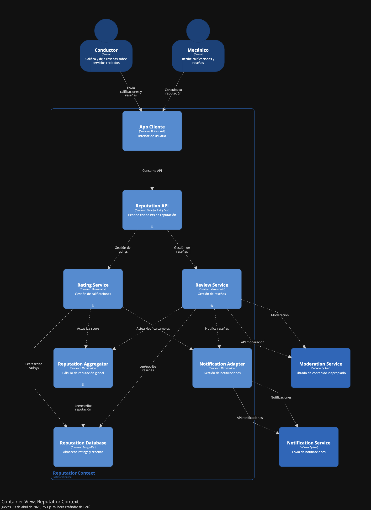

#### 2.6.4.6. Bounded Context Software Architecture Code Level Diagrams

Expone la implementación detallada de la lógica de reputación.

##### 2.6.4.6.1. Bounded Context Domain Layer Class Diagrams

Modela las clases de evaluación y sus relaciones con servicios.

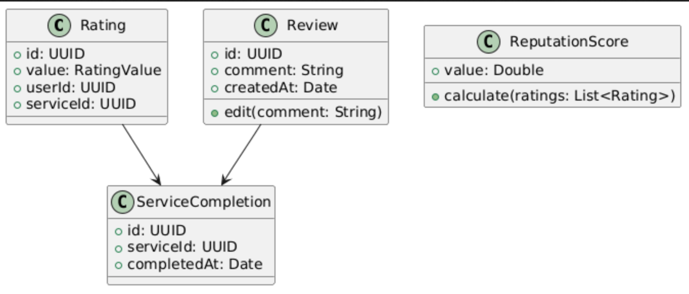

##### 2.6.4.6.2. Bounded Context Database Design Diagram

Define tablas como Calificaciones y Reseñas.

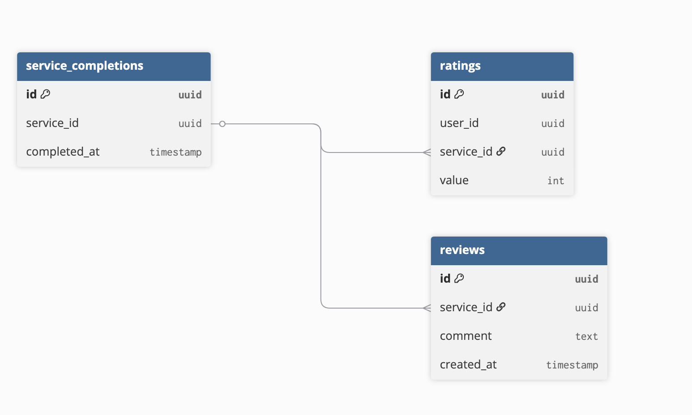

<br> 
<br> 

### 2.6.5. Bounded Context: ServiceManagementContext

Este contexto controla el ciclo de vida completo del servicio, desde la solicitud hasta su finalización o cancelación.

#### 2.6.5.1. Domain Layer

Incluye entidades como ServicioEnProceso, con estados y reglas de transición (solicitado, confirmado, finalizado, cancelado).

#### 2.6.5.2. Interface Layer

Se presentan controladores para gestionar el estado del servicio y registrar acciones de los usuarios.

#### 2.6.5.3. Application Layer

Incluye persistencia del historial de servicios y posible integración con sistemas de notificación.

#### 2.6.5.4 Infrastructure Layer

Incluye persistencia del historial de servicios y posible integración con sistemas de notificación.

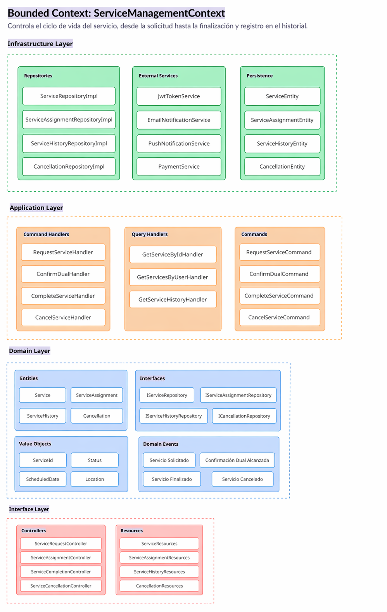

#### 2.6.5.5. Bounded Context Software Architecture Component Level Diagrams

Se representa la interacción entre componentes como gestor de servicios, API y base de datos.

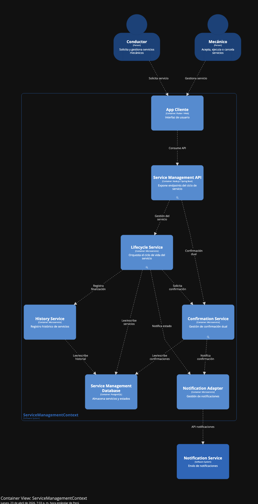

#### 2.6.5.6. Bounded Context Software Architecture Code Level Diagrams

Se detalla la implementación de la lógica de estados y transiciones.

##### 2.6.5.6.1. Bounded Context Domain Layer Class Diagrams

Incluye clases que modelan el ciclo de vida del servicio.

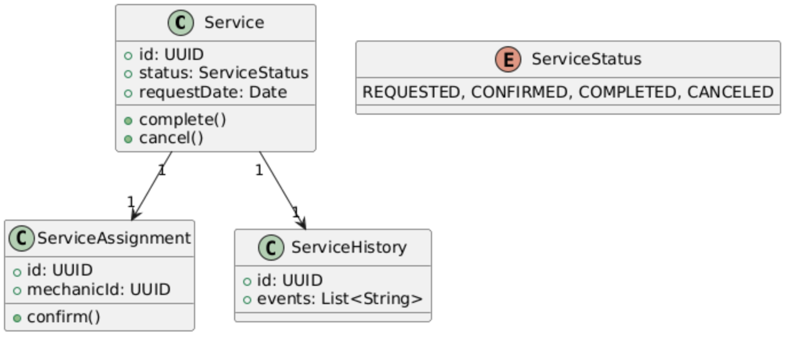

##### 2.6.5.6.2. Bounded Context Database Design Diagram

Define tablas como Servicios y HistorialServicios con relaciones y constraints.

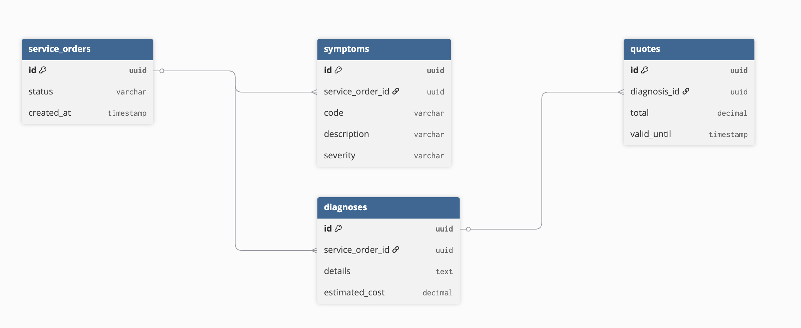

<div style="page-break-after: always;"></div>

# Capítulo III: Solution UI/UX Design

En este capítulo se presenta el diseño de experiencia e interfaz de usuario de AutoMatch. Se incluyen wireframes, mockups, user flows y prototipos desarrollados para garantizar una interacción intuitiva, accesible y eficiente para los usuarios de la aplicación móvil.

## 3.1. Product Design

### 3.1.1. Style Guidelines

En esta sección, el equipo define un sistema de diseño centralizado y organizado que reúne los principales elementos visuales utilizados en AutoMatch, tales como paleta de colores, tipografía, iconografía, componentes gráficos y lineamientos de interfaz. El propósito de estas guías es mantener una experiencia visual consistente y coherente tanto en la Landing Page como en la aplicación móvil desarrollada en Android con Jetpack Compose.

#### 3.1.1.1. General Style Guidelines

##### Branding

Identidad visual moderna y tecnológica que transmite confianza, seguridad y eficiencia en la búsqueda y comparación de servicios mecánicos automotrices.

##### Iconografía

Iconografía clara e intuitiva, basada en íconos simples y reconocibles para acciones principales como inicio, búsqueda de mecánicos, servicios, historial y perfil de usuario, manteniendo una experiencia visual limpia, moderna y fácil de navegar.

<p align="">
  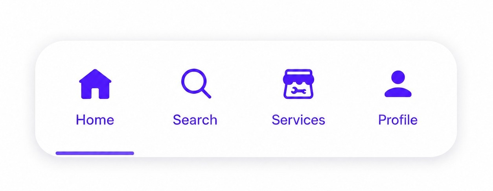
</p>

#### Typography

Tipografías sans-serif modernas y de alta legibilidad optimizadas para dispositivos móviles y plataformas web.

**Sistema de jerarquía tipográfica:**

- **Títulos principales:** Bold y tamaño destacado para encabezados y pantallas principales.  
- **Subtítulos:** Semi-bold para secciones, tarjetas y categorías.  
- **Texto general:** Regular para contenido informativo y descripciones.  
- **Labels y botones:** Medium para formularios, campos interactivos y acciones principales.  


#### Colors

Paleta de colores moderna y tecnológica basada en tonos morados y azules que reflejan innovación, confianza y seguridad dentro del sector automotriz y asegurador. La combinación cromática fue diseñada para ofrecer una experiencia visual atractiva, profesional y consistente en toda la plataforma AutoMatch.

**Sistema de colores:**

- **Color primario:** Morado vibrante `#312070` utilizado en botones, íconos, navegación y elementos destacados de la interfaz.  
- **Color secundario:** Azul y morado claro `#8465F5` y `#C663E6` aplicados en componentes interactivos, enlaces y elementos de apoyo visual.  
- **Fondos:** Tonos claros y neutros `#FDF7FF` para mantener interfaces limpias, organizadas y fáciles de visualizar.  
- **Texto:** Escala de grises oscuros y negros `#1D1B20` para garantizar legibilidad, jerarquía visual y contraste adecuado.  
- **Colores complementarios:**  
  - `#0A0629` → Fondo oscuro principal.  
  - `#4D3ED6` → Variación de color primario.  
  - `#6750A4` → Morado Material Design utilizado en componentes secundarios.  

<p align="center">
  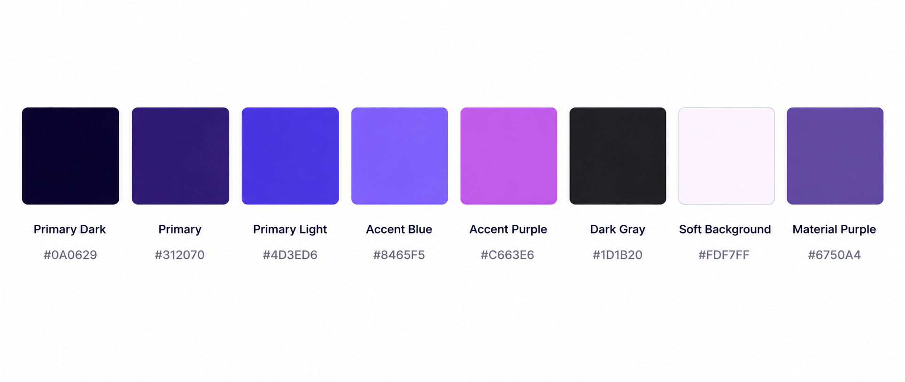
</p>

#### Spacing

Sistema de espaciado moderno y consistente diseñado para mejorar la organización visual, la legibilidad y la experiencia de navegación dentro de la plataforma AutoMatch.

- **Padding interno de tarjetas, formularios y componentes:** 16px – 24px para mantener interfaces limpias y equilibradas.  
- **Separación entre elementos interactivos, textos e íconos:** 12px – 16px para facilitar la lectura y evitar saturación visual.  
- **Márgenes laterales y contenedores principales:** 16px – 20px para asegurar alineación y consistencia entre pantallas.  
- **Espaciados amplios y uniformes** que transmiten orden, claridad visual y una experiencia moderna tanto en dispositivos móviles.  

#### Communication Tone

Tono de comunicación diseñado para transmitir confianza, seguridad y cercanía dentro de la plataforma AutoMatch.

- Claro y directo en instrucciones, procesos de cotización y comparación de seguros.  
- Profesional y amigable en mensajes, notificaciones y atención al usuario.  
- Conciso en labels, botones y descripciones para facilitar la navegación.  
- Uso de lenguaje accesible y fácil de comprender para todo tipo de usuarios.  

---

#### Dimension Guidelines

Componentes de UI diseñados con dimensiones estándar para garantizar comodidad visual, accesibilidad y una mejor experiencia de usuario dentro de la plataforma AutoMatch.

- **Botones principales:** Altura de 48px – 56px para facilitar la interacción táctil en dispositivos móviles.  
- **Íconos:** Tamaños entre 24px – 32px para mantener claridad visual y consistencia en la interfaz.  
- **Inputs y campos de texto:** Altura de 48px – 56px para mejorar la legibilidad y usabilidad.  
- **Tarjetas de información y cotizaciones:** Ancho adaptable a pantalla completa con padding lateral uniforme.  
- **Bottom Navigation Bar:** Altura de 56px – 64px para una navegación cómoda, moderna y accesible.  


#### Communication Tone

Tono de comunicación diseñado para transmitir confianza, seguridad y cercanía dentro de la plataforma AutoMatch.

- Claro y directo en instrucciones, procesos de cotización y comparación de seguros.  
- Profesional y amigable en mensajes, notificaciones y atención al usuario.  
- Conciso en labels, botones y descripciones para facilitar la navegación.  
- Uso de lenguaje accesible y fácil de comprender para todo tipo de usuarios.  

---

#### Dimension Guidelines

Componentes de UI diseñados con dimensiones estándar para garantizar comodidad visual, accesibilidad y una mejor experiencia de usuario dentro de la plataforma AutoMatch.

- **Botones principales:** Altura de 48px – 56px para facilitar la interacción táctil en dispositivos móviles.  
- **Íconos:** Tamaños entre 24px – 32px para mantener claridad visual y consistencia en la interfaz.  
- **Inputs y campos de texto:** Altura de 48px – 56px para mejorar la legibilidad y usabilidad.  
- **Tarjetas de información y cotizaciones:** Ancho adaptable a pantalla completa con padding lateral uniforme.  
- **Bottom Navigation Bar:** Altura de 56px – 64px para una navegación cómoda, moderna y accesible.  

  <p align="center">
  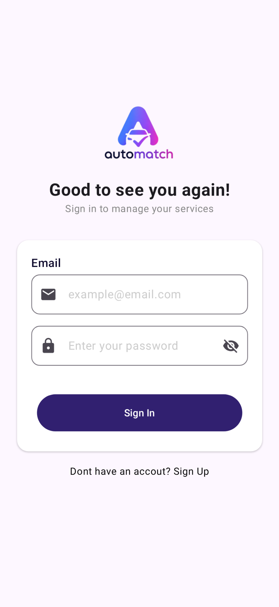
</p>


### 3.1.2. Information Architecture

#### 3.1.2.1. Organization Systems

#### Jerárquico (Visual Hierarchy)

Se utiliza para destacar información clave como cotizaciones disponibles, seguros recomendados, historial y detalles de pólizas vehiculares. Las pantallas principales muestran primero la información más relevante para facilitar la toma de decisiones del usuario.

#### Secuencial (Step-by-Step)

Implementado en:

- Proceso de registro e inicio de sesión de usuarios.  
- Flujo de cotización y comparación de seguros.  
- Registro y edición de información vehicular.  
- Selección y confirmación de seguros.  
- Gestión y actualización del perfil de usuario.  

#### Por Tópicos

La información se organiza en secciones claras:

- **Home:** Información principal y recomendaciones.  
- **Search:** Búsqueda y comparación de seguros.  
- **Services:** Gestión de servicios y cotizaciones.  
- **Profile:** Configuración y datos del usuario.  

#### Según Audiencia

- **Usuarios propietarios de vehículos:** Acceso a cotizaciones, comparación y gestión de seguros vehiculares.  
- **Usuarios nuevos:** Acceso guiado al registro, información y exploración de servicios disponibles.  


### 3.1.2.2. Labelling Systems

Etiquetas diseñadas para ser claras, intuitivas y fáciles de comprender, permitiendo que los usuarios naveguen de manera rápida y eficiente dentro de la plataforma AutoMatch.

#### Ejemplos de Etiquetas

- “Welcome Back” / “Create your account” (pantallas de autenticación).  
- “Compare Insurance” / “View Quote” (acciones principales).  
- “Insurance Card” / “Service Card” (componentes visuales).  
- “Full Name” / “Email” / “Password” / “Vehicle Plate” (campos de formulario).  
- “Home” / “Search” / “Services” / “Profile” (navegación principal).  

#### Asociaciones

- “Search” vinculado con comparación y búsqueda de seguros.  
- “Services” asociado con cotizaciones, historial y gestión de pólizas.  
- “Profile” relacionado con configuración de usuario y datos personales.  
- “Vehicles” asociado con información vehicular y seguros registrados.  


#### 3.1.2.3. SEO Tags and Meta Tags

#### Landing Page

- **Title:** “AutoMatch - Encuentra y compara seguros vehiculares fácilmente”  
- **Meta Description:** “AutoMatch te permite comparar seguros vehiculares, visualizar cotizaciones y encontrar la mejor opción de manera rápida, segura y confiable.”  
- **Keywords:** seguros vehiculares, comparación de seguros, cotización de seguros, AutoMatch, pólizas vehiculares, seguros online, servicios automotrices  
- **Author:** Equipo AutoMatch  

#### Aplicación Móvil

- **Title (Home):** “Home | AutoMatch”  
- **Meta Description:** “Gestiona tus servicios, compara seguros y accede a información vehicular desde AutoMatch.”  


#### 3.1.2.4. Searching Systems

Sistema de búsqueda implementado para facilitar la comparación y exploración de seguros vehiculares dentro de AutoMatch.

#### Búsqueda por Filtros

- Tipo de seguro vehicular.  
- Cobertura y beneficios incluidos.  
- Precio y rango de cotización.  
- Compañías aseguradoras disponibles.  
- Servicios y categorías relacionadas.  

#### Resultados de Búsqueda

Mostrados en tarjetas con información clave:

- Nombre del seguro o servicio.  
- Precio estimado y cobertura.  
- Beneficios principales.  
- Calificación y recomendaciones.  
- Disponibilidad y estado del servicio.  

#### Navegación y Visualización

- Visualización organizada mediante tarjetas interactivas y secciones categorizadas.  
- Navegación rápida entre resultados, servicios y detalles de cotización.  
- Diseño optimizado para dispositivos móviles, priorizando claridad visual y facilidad de uso.  


#### 3.1.2.5. Navigation Systems

El sistema de navegación de AutoMatch fue diseñado para brindar una experiencia intuitiva, rápida y organizada, permitiendo que los usuarios accedan fácilmente a las principales funcionalidades de la plataforma.

#### Navegación Principal

Implementada mediante una Bottom Navigation Bar visible en las pantallas principales de la aplicación.

#### Secciones principales

- **Home:** Visualización de información principal y recomendaciones.  
- **Search:** Búsqueda y comparación de seguros vehiculares.  
- **Services:** Gestión de servicios, cotizaciones e historial.  
- **Profile:** Configuración y administración de datos del usuario.  

#### Características de Navegación

- Navegación rápida entre pantallas principales mediante íconos intuitivos.  
- Indicadores visuales para mostrar la sección activa.  
- Flujo de navegación simple y consistente en toda la aplicación.  
- Organización jerárquica que prioriza las funciones más utilizadas por el usuario.  
- Diseño optimizado para interacción táctil en dispositivos móviles.  

3.1.3. Landing Page UI Design

3.1.3.1. Landing Page Wireframe


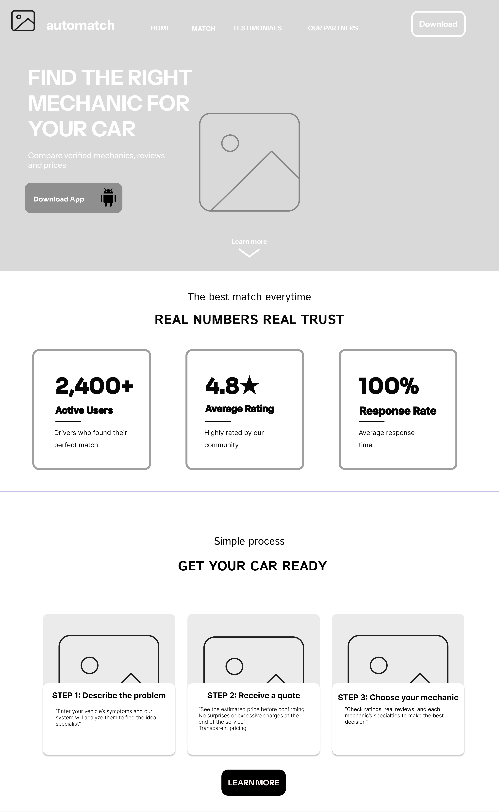
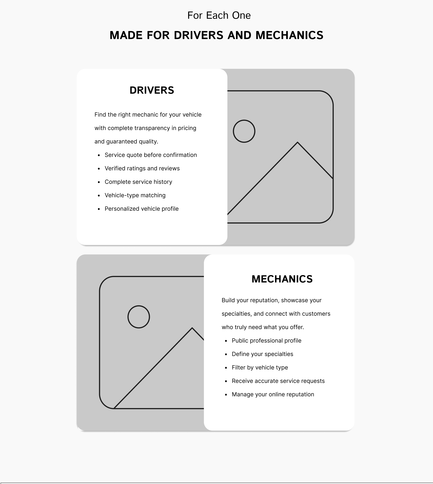
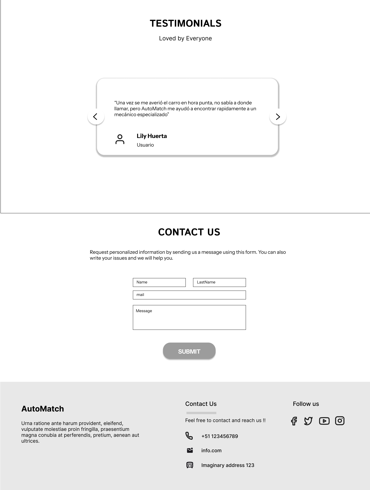

3.1.3.2. Landing Page Mock-up

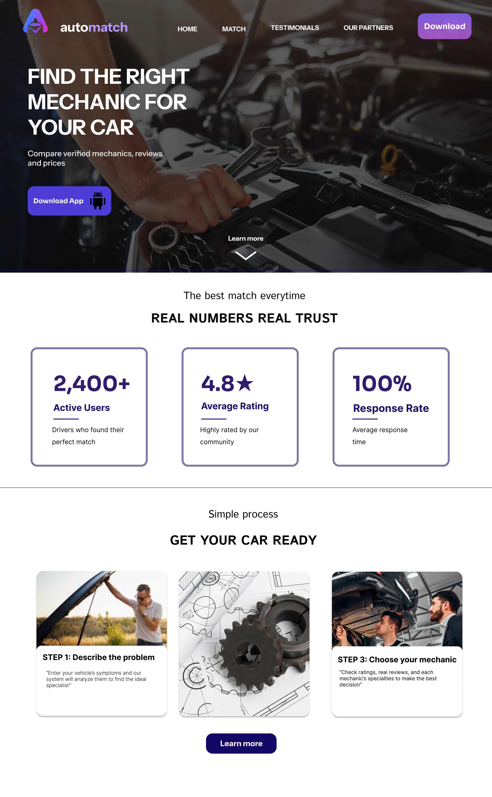
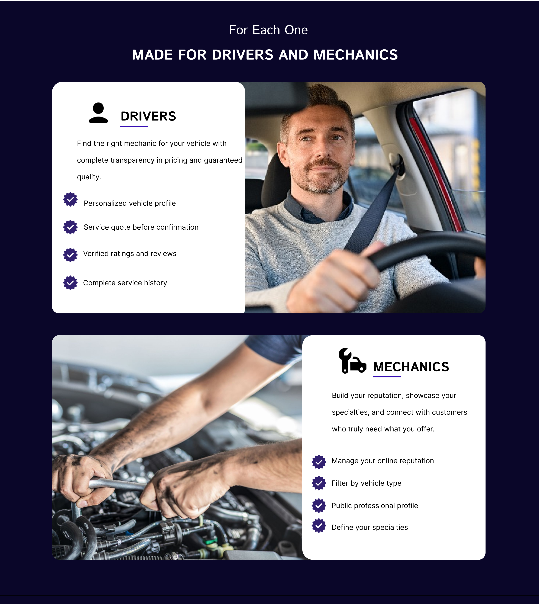
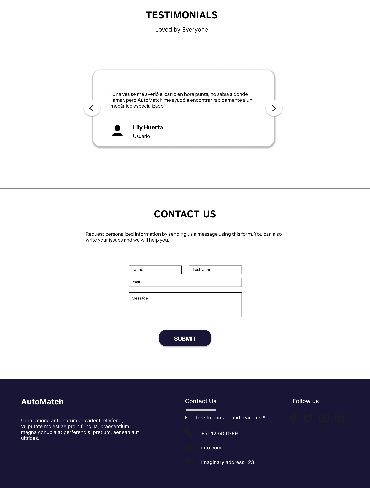

3.1.4. Mobile Applications UX/UI Design

3.1.4.1. Mobile Applications Wireframes

3.1.4.2. Mobile Applications Wireflow Diagrams

3.1.4.3. Mobile Applications Mock-ups

Login:

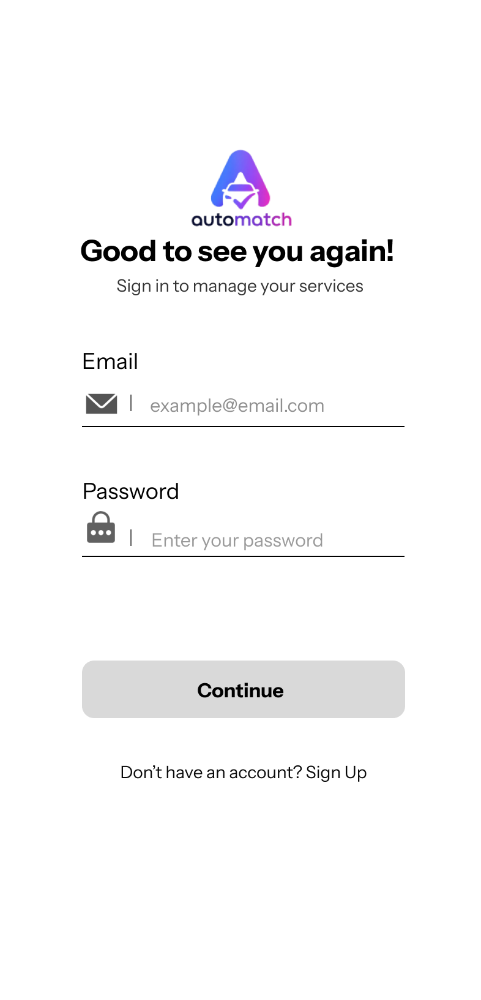

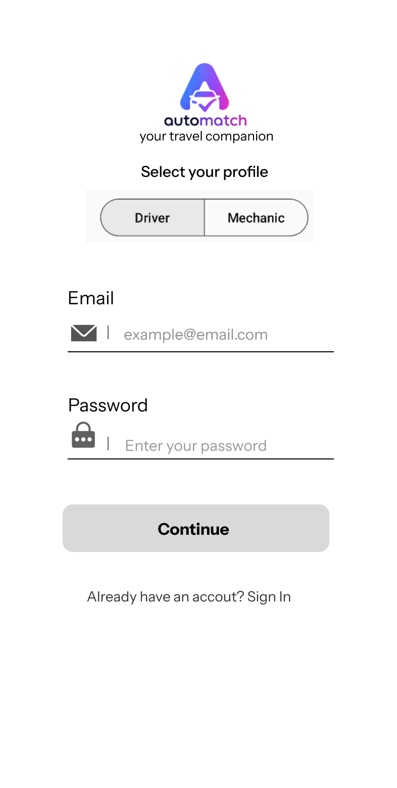

User:

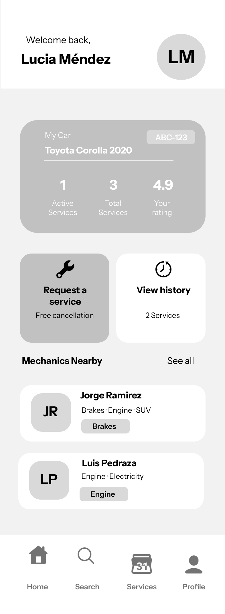

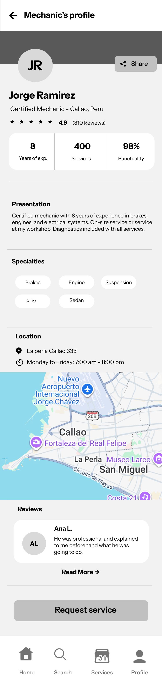

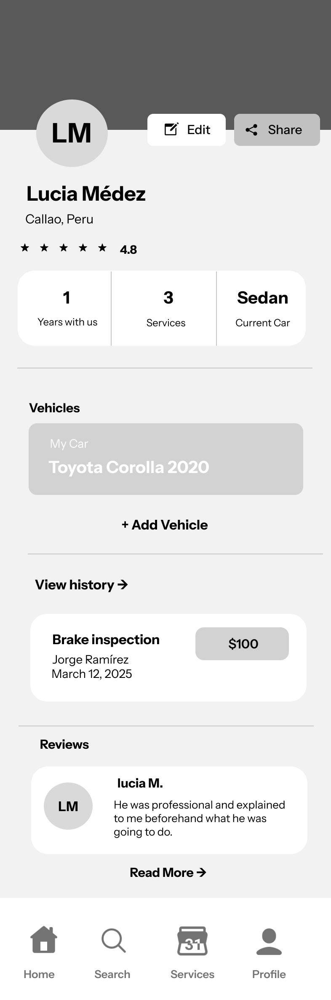

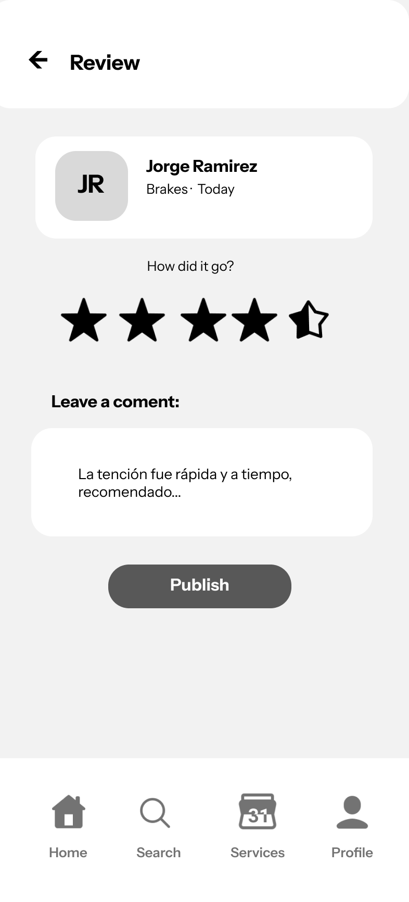


Mechanic:


#### 3.1.4.4. Mobile Applications User Flow Diagrams

**Login:**
Este flujo ilustra el proceso de autenticación y creación de cuentas dentro de la aplicación móvil AutoMatch. Los usuarios pueden iniciar sesión en la plataforma o registrarse seleccionando su rol como conductor o mecánico antes de acceder al sistema.


**User Flow:**

Pedir un servicio

Este diagrama representa el proceso que siguen los conductores para solicitar un servicio mecánico. El flujo incluye el acceso a la pantalla principal, la visualización de perfiles de mecánicos, la descripción del problema del vehículo, la selección de una categoría y el envío de la solicitud de servicio mediante la plataforma AutoMatch.


Editar un perfil

Este flujo describe cómo los conductores pueden gestionar y editar la información de su perfil dentro de la aplicación. Los usuarios pueden actualizar la información de sus vehículos, modificar datos personales y administrar la configuración de su cuenta.


Servicio

Este diagrama ilustra el proceso de gestión de servicios desde la perspectiva del conductor. Los usuarios pueden visualizar el historial de servicios, hacer seguimiento de servicios completados y publicar reseñas y calificaciones una vez finalizado el servicio.


Busqueda

Este flujo representa el proceso de búsqueda y descubrimiento de mecánicos dentro de la aplicación AutoMatch. Los conductores pueden explorar mecánicos disponibles, acceder a perfiles, revisar calificaciones y especialidades, y evaluar opciones de servicio antes de solicitar asistencia.


**Mechanic Flow:**

Editar Perfil

Este flujo ilustra cómo los mecánicos pueden administrar y editar sus perfiles profesionales. Los mecánicos pueden actualizar información de presentación, especialidades, detalles de servicio y visibilidad dentro de la plataforma AutoMatch.


Servicios del mecanico

Este diagrama representa el flujo de trabajo utilizado por los mecánicos para administrar solicitudes de servicio, cotizaciones, servicios en progreso y trabajos completados dentro de la aplicación AutoMatch.


Visitar perfil del usuario

Este flujo describe cómo los mecánicos pueden acceder y revisar la información de los conductores durante un proceso de servicio activo. Los mecánicos pueden verificar información del vehículo, historial de servicios y detalles del cliente antes de completar el servicio.


#### 3.1.4.5. Mobile Applications Prototyping

https://www.figma.com/proto/ZX2IFwBkBBCBVVkt5pc7L0/MockUps---Wireframes?node-id=1-2&t=wyaKRP8yncQcKFk4-1

<div style="page-break-after: always;"></div>

# Capítulo IV: Product Implementation & Validation


## 4.1. Software Configuration Management

### 4.1.1. Software Development Environment Configuration

Para asegurar una colaboración eficiente y mantener la calidad en el desarrollo de **AutoMatch**, se definió un entorno de desarrollo común para todos los integrantes del equipo. A continuación, se presentan las herramientas y tecnologías utilizadas durante las distintas etapas del ciclo de vida del producto digital, indicando su propósito dentro del proyecto.


#### Product UX/UI Design

Para el diseño de experiencia de usuario y prototipado de la aplicación móvil AutoMatch se utilizaron las siguientes herramientas:

##### Figma
Herramienta utilizada para la creación de wireframes, mockups y prototipos interactivos de la aplicación móvil y landing page.  

https://www.figma.com/

##### UXPressia
Utilizada para la elaboración de User Personas, Empathy Maps y User Journey Maps.  

https://uxpressia.com/

##### Miro
Herramienta colaborativa utilizada para la creación de Lean UX Canvas, Event Storming y modelado de procesos del sistema.  

https://miro.com/


#### Software Development

Para el desarrollo de la aplicación móvil, backend y landing page se utilizaron las siguientes tecnologías y herramientas:

##### Android Studio (Instalación local)
IDE principal utilizado para el desarrollo de la aplicación móvil AutoMatch utilizando Kotlin y Jetpack Compose.  

https://developer.android.com/studio

##### Kotlin
Lenguaje principal utilizado para el desarrollo de la aplicación móvil y parte de la lógica del backend.  

https://kotlinlang.org/

##### Jetpack Compose
Framework moderno de Android utilizado para construir interfaces declarativas y responsivas.  

https://developer.android.com/jetpack/compose

##### IntelliJ IDEA (Instalación local)
Utilizado para soporte de desarrollo backend, pruebas y administración del proyecto.  

https://www.jetbrains.com/idea/

##### Git (Instalación local)
Herramienta utilizada para gestionar cambios de código mediante commits y ramas locales.  

https://git-scm.com/

##### GitHub
Plataforma utilizada para el almacenamiento remoto del código fuente y colaboración entre integrantes del equipo.  

https://github.com/

##### Postman
Herramienta utilizada para realizar pruebas y validaciones de endpoints REST del backend.  

https://www.postman.com/

##### MySQL
Sistema gestor de base de datos relacional utilizado para almacenar la información del sistema.  

https://www.mysql.com/


#### Project Management and Collaboration

Para la gestión del proyecto y coordinación del equipo se utilizaron las siguientes herramientas:

##### Trello
Utilizado para la planificación y seguimiento de tareas mediante tableros Kanban.  

https://trello.com/

##### WhatsApp
Herramienta de comunicación instantánea utilizada para coordinación rápida entre integrantes.  

https://web.whatsapp.com/

##### Google Meet
Utilizado para reuniones virtuales, presentaciones y seguimiento del proyecto.  

https://meet.google.com/


#### Software Documentation

Para la documentación y modelado del sistema se utilizaron las siguientes herramientas:

##### Lucidchart
Utilizado para la creación de diagramas UML, wireflows y user flows.  

https://www.lucidchart.com/

##### Visual Paradigm
Herramienta utilizada para modelado arquitectónico y diagramas C4 del sistema.  

https://online.visual-paradigm.com/


Estas herramientas permitieron mantener una adecuada organización del proyecto, facilitar la colaboración entre los integrantes y asegurar una implementación alineada con buenas prácticas de ingeniería de software.


### 4.1.2. Source Code Management

La gestión del código fuente es una parte fundamental en el desarrollo colaborativo de software, ya que permite un control eficiente sobre las modificaciones realizadas en el proyecto a lo largo de su ciclo de vida. En esta sección del informe, se describe el sistema de control de versiones implementado en el proyecto **AutoMatch**, utilizando GitHub como plataforma principal.

Además, se detallan las convenciones de trabajo adoptadas por el equipo, como el modelo GitFlow, el versionado semántico (Semantic Versioning) y las convenciones de commits mediante Conventional Commits. Estas prácticas aseguran un desarrollo ordenado y una integración continua efectiva entre los miembros del equipo.


#### URL de los Repositorios

| Repository | Description | URL |
|:------------|:--------------------------------------------------|:------------------------------------------------|
| **Organization** | Main GitHub organization of the project | [MobilFlow](https://github.com/MobilFlow) |
| **Report** | Repository containing the project documentation | [report.git](https://github.com/MobilFlow/report.git) |
| **Landing Page** | Frontend repository for the Landing Page | [Landing_Page.git](https://github.com/MobilFlow/Landing_Page.git) |
| **Backend** | Backend services and REST API repository | [back-end.git](https://github.com/MobilFlow/back-end.git) |
| **Mobile Application** | Mobile application repository developed in Android | [front-end.git](https://github.com/MobilFlow/front-end.git) |


##### Estructura de Ramas

Para mantener un flujo organizado en el desarrollo y facilitar la colaboración, se implementó el modelo GitFlow, creando las siguientes ramas:

##### Main Branch
Rama principal (`main`) que contiene las versiones estables y funcionales del proyecto. Todas las demás ramas derivan de esta.

##### Develop Branch
Rama secundaria (`develop`) donde se integran todas las nuevas funcionalidades antes de fusionarse con la rama principal.

##### Feature Branches
Estas ramas se crean a partir de `develop` y son utilizadas para desarrollar funcionalidades específicas del proyecto. Una vez finalizado el desarrollo, se realiza un merge hacia la rama `develop`.

##### Ejemplos

```bash
feature/login
feature/geolocation
feature/payment-system
feature/mechanic-matching
```

---

##### Release Branches
Utilizadas para preparar nuevas versiones estables antes de ser publicadas en producción.

##### Ejemplo

```bash
release/v1.0.0
```

---

##### Hotfix Branches
Ramas utilizadas para solucionar errores críticos detectados en producción.

##### Ejemplo

```bash
hotfix/authentication-error
```

---

##### Semantic Versioning

El proyecto AutoMatch utiliza Semantic Versioning para identificar las versiones del sistema siguiendo la estructura:

```bash
MAJOR.MINOR.PATCH
```

##### Ejemplo

```bash
v1.0.0
```

Donde:

- **MAJOR**: cambios incompatibles o grandes modificaciones.
- **MINOR**: nuevas funcionalidades compatibles.
- **PATCH**: corrección de errores menores.


##### Convenciones de Commits

Para la escritura de commits en el proyecto AutoMatch, se sigue la convención Conventional Commits, la cual cuenta con un formato estándar que facilita la lectura y entendimiento del historial de cambios dentro del proyecto.

##### Formato

```bash
<type>[optional scope]: <description>
```

##### Types

| Tipo | Descripción |
|------|-------------|
| feat | Añadir una nueva característica |
| fix | Corrección de errores |
| docs | Modificaciones en documentación |
| style | Cambios visuales o formato |
| refactor | Mejoras internas del código |
| test | Adición o modificación de pruebas |
| chore | Configuración y mantenimiento |

##### Scope

El scope brinda información adicional acerca del área del código afectada.

##### Ejemplo

```bash
feat(auth): add login functionality
```

---

##### Ejemplos básicos de commits

```bash
feat(location): add real-time geolocation system

fix(payment): resolve payment validation issue

docs(readme): update installation guide

refactor(api): improve backend architecture

test(auth): add login unit tests

chore(config): update environment variables
```

Estas convenciones permitieron mantener un historial de cambios organizado, mejorar la colaboración entre los integrantes del equipo y facilitar el mantenimiento continuo del proyecto AutoMatch.
4.1.3. Source Code Style Guide & Conventions
## 4.1.3. Source Code Style Guide & Conventions

##### Nomenclatura General

Para el desarrollo de la aplicación móvil **AutoMatch** en Android Studio utilizando Kotlin y Jetpack Compose bajo el patrón Clean Architecture, se aplicarán convenciones de nomenclatura basadas en Google Kotlin Style Guide y Jetpack Compose Guidelines.

Los nombres utilizados dentro del proyecto deben ser claros, descriptivos y escritos en inglés. Se utilizará `camelCase` para variables y funciones, `PascalCase` para clases y componentes de interfaz, y `snake_case` únicamente para recursos XML.

---

#### Ejemplos

##### Variables y funciones (camelCase)

```kotlin
val userName: String

fun getNearbyMechanics()
```

---

##### Clases y componentes (PascalCase)

```kotlin
class LoginViewModel

@Composable
fun HomeScreen()
```

---

##### Recursos XML (snake_case)

```xml
activity_main.xml
ic_mechanic_avatar.xml
```

##### Sangría

En Kotlin, la sangría utilizada será de 4 espacios por bloque. No se recomienda el uso de tabulaciones, siguiendo las convenciones oficiales de Android Developers.

##### Kotlin

Kotlin es el lenguaje principal utilizado en el proyecto AutoMatch. Las siguientes pautas aseguran consistencia y legibilidad en el código fuente.

##### Uso de val y var

Siempre que sea posible, se utilizará `val` en lugar de `var` para definir variables inmutables.

```kotlin
val mechanicName = "Carlos"

var servicePrice = 150.0
```

##### Formato de funciones

Las llaves de apertura deben ir en la misma línea que la declaración y la llave de cierre en su propia línea.

```kotlin
fun calculateDistance(origin: Location, destination: Location): Float {

    val result = FloatArray(1)

    Location.distanceBetween(
        origin.latitude,
        origin.longitude,
        destination.latitude,
        destination.longitude,
        result
    )

    return result[0]
}
```

##### Formato de clases

```kotlin
class MechanicRepository {

    fun getMechanicById(id: String): Mechanic {
        return mechanicDao.getMechanic(id)
    }
}
```

##### Espaciado

Se incluirá un espacio después de los dos puntos en las declaraciones de tipos y entre operadores.

```kotlin
val distance: Float = 25.5f

val total = x + y
```

##### Imports

No se utilizarán imports comodín (`*`). Se importarán únicamente las clases necesarias.

```kotlin
import androidx.compose.material3.Text
import androidx.lifecycle.ViewModel
```

##### Jetpack Compose

Jetpack Compose se utiliza para el desarrollo de interfaces modernas y responsivas dentro de AutoMatch.

##### Nomenclatura de Composables

Los nombres de funciones composables deben utilizar PascalCase y terminar con la palabra `Screen` o `Component`, dependiendo de su funcionalidad.

```kotlin
@Composable
fun LoginScreen()

@Composable
fun MechanicCardComponent()
```

##### Estructura y legibilidad

Cada Composable debe mantener una estructura clara y organizada para mejorar la legibilidad del código.

```kotlin
@Composable
fun HomeScreen() {

    Column(
        modifier = Modifier
            .fillMaxSize()
            .padding(16.dp)
    ) {

        Text(
            text = "Welcome to AutoMatch"
        )
    }
}
```

##### Uso de colores y temas

Los colores y estilos utilizados deben provenir de los archivos de tema definidos en la carpeta `ui/theme`, respetando las convenciones de Material Design 3.

```kotlin
Button(
    onClick = { },
    colors = ButtonDefaults.buttonColors(
        containerColor = PrimaryColor
    )
) {

    Text(
        "Register",
        color = Color.White
    )
}
```


### 4.1.4. Software Deployment Configuration


#### Landing Page

Para el despliegue de la Landing Page de **AutoMatch**, se utilizó GitHub Pages, la funcionalidad integrada de GitHub que permite publicar sitios web estáticos de manera sencilla y gratuita.


#### Proceso de implementación

##### Creación del repositorio

Desde la organización del proyecto en GitHub, se creó un repositorio destinado al despliegue de la Landing Page de AutoMatch.

##### Repositorio utilizado

```text
https://github.com/MobilFlow/Landing_Page
```

---

##### Configuración del repositorio

El repositorio fue configurado con visibilidad pública para permitir el despliegue mediante GitHub Pages.

Además, se organizó el proyecto utilizando ramas de trabajo bajo el modelo GitFlow.


##### Ejecución del despliegue

Una vez finalizada la configuración, se ejecutó el siguiente comando:

```bash
npm run deploy
```

Este proceso generó automáticamente la rama `gh-pages`, donde se almacenan los archivos estáticos generados por el build del proyecto.


##### Configuración de GitHub Pages

Luego del despliegue, se accedió a:

```text
Settings → Pages
```

Dentro del repositorio GitHub.


#### Detalles de configuración

##### Fuente de despliegue (Source)

Se seleccionó la opción:

```text
Deploy from a branch
```
Y se eligió Main

##### URL del sitio

GitHub Pages generó automáticamente la URL pública del proyecto:

```text
https://mobilflow.github.io/Landing_Page/
```

## 4.2. Landing Page & Mobile Application Implementation

### 4.2.1. Sprint 1

#### 4.2.1.1. Sprint Planning 1

| Sprint \# | Sprint 1 |
| :---- | :---- |
| **Sprint Planning Background** |  |
| Date | 2026-05-12 |
| Time | 07:30 PM |
| Location | Google Meets |
| Prepared By | Gabriel Sanchez |
| Attendees (to planning meeting) | Gabriel Sanchez, Romina Tuesta, Braulio, Liam, Giuseppe |
| Sprint 0 Review Summary | No Aplica |
| Sprint 0 Retrospective Summary | No Aplica |
| **Sprint Goal & User Stories** |  |
| Sprint 1 Goal | Nuestro enfoque está en implementar las funcionalidades de la plataforma mediante autenticación, administración de usuarios, publicación de servicios y navegación inicial del frontend. Creemos que esto brinda una experiencia confiable de registro e interacción inicial para conductores y mecánicos que utilizarán la plataforma. Esto se confirmará cuando los usuarios puedan registrarse e iniciar sesión correctamente mediante autenticación basada en JWT en el backend, navegar por las interfaces principales de la aplicación y utilizar endpoints funcionales para crear, consultar, actualizar, publicar y desactivar servicios desde la API. |
| Sprint n Velocity | 45 Story Points |
| Sum of Story Points | 45 Story Points |

#### 4.2.1.2. Sprint Backlog 1

Durante este Sprint se trabajó en la implementación de las funcionalidades base de autenticación, gestión de usuarios y servicios de la plataforma. El equipo desarrolló las pantallas principales de acceso, navegación inicial del frontend, endpoints CRUD de usuarios y servicios, así como la integración de autenticación mediante JWT desde el backend.

Link a Trello: [https://trello.com/invite/b/6a068841acbe1487bd955d97/ATTI93e02f577752f14ff38f789bc8fc666eCFE5AB80/automathc](https://trello.com/invite/b/6a068841acbe1487bd955d97/ATTI93e02f577752f14ff38f789bc8fc666eCFE5AB80/automathc)

| Sprint \# | Sprint 1 |
| :---- | :---- |

| User Story Id | User Story Title | Work-Item / Task Id | Work-Item / Task Title | Description | Estimation (Hours) | Assigned To | Status |
| :---- | :---- | :---- | :---- | :---- | ----- | :---- | :---- |
| US-04 | Registro de usuario | TK-01 | Diseñar pantalla Sign Up | Diseño e implementación de interfaz de registro de usuario | 5 | Gabriel Sanchez | Done |
| TS-04 | Registro de usuario | TK-02 | Implementar autenticación JWT | Desarrollo de autenticación y generación de token JWT | 6 | Gabriel Sanchez | Done |
| TS-03 | Login de usuario | TK-02 | Implementar autenticación JWT | Desarrollo de autenticación y generación de token JWT | 6 | Gabriel Sanchez | Done |
| TS-03 | Login de usuario | TK-04 | Implementar Login de usuario | Desarrollo y validación de autenticación desde Swagger | 5 | Gabriel Sanchez | Done |
| TS-04 | Diseñar API CRUD de usuarios | TK-05 | Implementar CRUD de usuarios | Creación de endpoints CRUD y queries de usuarios | 8 | Gabriel Sanchez | Done |
| US-24 | Landing Page | TK-06 | Diseñar Landing Page | Desarrollo visual e interfaz principal de la plataforma | 5 | Romina Tuesta | Done |
| US-05 | Completar perfil de conductor | TK-07 | Implementar perfil de conductor | Desarrollo de formulario y almacenamiento de datos | 4 | Gabriel Sanchez | Done |
| TS-05 | Diseñar CRUD API de servicios | TK-08 | Implementar CRUD de servicios | Desarrollo de endpoints para publicar, actualizar, listar, obtener y desactivar servicios | 10 | Braulio | Done |
| US-08 | Publicar servicio | TK-09 | Integrar publicación de servicios | Conexión lógica para publicación desde backend | 5 | Braulio | Done |
| US-23 | Publicar reseña | TK-11 | Diseñar pantalla de reseñas | Desarrollo de la interfaz de reseñas en frontend | 4 | Giuseppe | Done |
| US-11 | Ver lista de mecánicos disponibles | TK-12 | Implementar pantalla principal del mecánico | Desarrollo de la vista principal del mecánico en frontend | 5 | Braulio | Done |
| US-12 | Consultar perfil público del mecánico | TK-13 | Implementar información del mecánico | Desarrollo de la vista con información del mecánico en frontend | 4 | Braulio | Done |
| US-05 | Completar perfil de conductor | TK-14 | Implementar Driver Profile View | Desarrollo de la vista del perfil del conductor en frontend | 4 | Romina Tuesta | Done |
| US-03 | Historial de servicios | TK-15 | Implementar Mechanic History Screen | Desarrollo de la pantalla de historial del mecánico en frontend | 5 | Romina Tuesta | Done |
| US-18 | Crear solicitud de servicio | TK-16 | Implementar Mechanic Request Screen | Desarrollo de la pantalla de solicitudes del mecánico en frontend | 4 | Romina Tuesta | Done |
| US-18 | Crear solicitud de servicio | TK-17 | Implementar Request Service Driver Screen | Desarrollo de la pantalla para solicitar servicio desde el conductor en frontend | 4 | Romina Tuesta | Done |
| US-13 | Gestionar disponibilidad y horarios | TK-18 | Implementar Schedule Screen | Desarrollo de la pantalla de horarios y disponibilidad en frontend | 3 | Romina Tuesta | Done |
| US-10 | Buscar mecánicos con filtros | TK-19 | Implementar Search Driver Screen | Desarrollo de la pantalla de búsqueda con navegación actualizada en frontend | 4 | Romina Tuesta | Done |
| US-11 | Ver lista de mecánicos disponibles | TK-20 | Implementar perfil del mecánico | Desarrollo de las vistas relacionadas al perfil del mecánico en frontend | 5 | Liam | Done |
| US-05 | Completar perfil de conductor | TK-21 | Implementar vista del perfil del conductor | Desarrollo de la vista del perfil del conductor en frontend | 4 | Liam | Done |
| US-01 | Calificaciones y reseñas | TK-22 | Implementar reseñas | Desarrollo de las pantallas relacionadas a reseñas en frontend | 4 | Liam | Done |
| US-20 | Marcar servicio | TK-23 | Implementar inicio de pantalla del conductor | Desarrollo de la pantalla inicial del conductor en frontend | 3 | Liam | Done |
| TS-05 | Diseñar API CRUD de servicios | TK-25 | Implementar endpoints del ciclo de vida de servicios | Desarrollo de endpoints para creación, actualización, consulta y estados de servicios | 5 | Liam | Done |
| TS-08 | Diseñar API CRUD de Catálogo de Servicios | TK-26 | Implementar API del catálogo de servicios | Desarrollo del backend del catálogo de servicios con estructura de endpoints principales | 5 | Braulio | Done |
| TS-08 | Diseñar API CRUD de Catálogo de Servicios | TK-27 | Implementar search del catálogo | Desarrollo de endpoints para búsqueda, filtrado y consulta de servicios disponibles | 3 | Braulio | Done |
| TS-09 | Diseñar API CRUD de Calificación y Reputación | TK-29 | Implementar comandos de reputación y agregación de reseñas | Lógica de agregación de ratings y cálculo de score de reputación | 3 | Giuseppe | Done |

#### 4.2.1.3. Development Evidence for Sprint Review

| Repository | Branch | Commit Id | Commit Message | Author | Committed on |
|---|---|---|---|---|---|
| [MobilFlow/front-end](https://github.com/MobilFlow/front-end) | `main` | 575f92e | feat: changes main | Romimi1 | 2026-05-14 |
| [MobilFlow/front-end](https://github.com/MobilFlow/front-end) | `main` | 9b116b7 | feat: update for presentation | Romimi1 | 2026-05-14 |
| [MobilFlow/front-end](https://github.com/MobilFlow/front-end) | `main` | a4036ee | feat: modify main | Romimi1 | 2026-05-14 |
| [MobilFlow/front-end](https://github.com/MobilFlow/front-end) | `main` | 96eede6 | docs: Refactor navigation to use AutoMatchNavigation | Romimi1 | 2026-05-14 |
| [MobilFlow/front-end](https://github.com/MobilFlow/front-end) | `main` | 0a3f5c2 | feat: add driver views | Liamvillugas | 2026-05-13 |
| [MobilFlow/back-end](https://github.com/MobilFlow/back-end) | `main` | 0ab2a34 | feat: implementation bounded context service management | Liamvillugas | 2026-05-12 |
| [MobilFlow/back-end](https://github.com/MobilFlow/back-end) | `main` | 5ede791 | docs: config settings | Liamvillugas | 2026-05-12 |
| [MobilFlow/back-end](https://github.com/MobilFlow/back-end) | `main` | fb180ea | feat: implement service management bounded context | Liamvillugas | 2026-05-12 |
| [MobilFlow/back-end](https://github.com/MobilFlow/back-end) | `main` | 9794610 | feat: implement reputation bounded context | GiussepeTC0410 | 2026-05-11 |
| [MobilFlow/back-end](https://github.com/MobilFlow/back-end) | `main` | f39ddc9 | feat: add IAM Facade Implementation | yigabriel | 2026-05-10 |
| [MobilFlow/back-end](https://github.com/MobilFlow/back-end) | `main` | c77de9d | feat: add mechanic geolocalization bc | yigabriel | 2026-05-10 |
| [MobilFlow/back-end](https://github.com/MobilFlow/back-end) | `main` | e6c39e2 | feat: add mechanic specialities and cars for roles | yigabriel | 2026-05-10 |
| [MobilFlow/back-end](https://github.com/MobilFlow/back-end) | `main` | 6c0ddd0 | feat: add entities nad valueObject for profile management | yigabriel | 2026-05-10 |
| [MobilFlow/back-end](https://github.com/MobilFlow/back-end) | `main` | 13235aa | feat: add IAM bounded context with JWT | yigabriel | 2026-05-10 |
| [MobilFlow/front-end](https://github.com/MobilFlow/front-end) | `main` | b7af756 | feat: add preview for main | yigabriel | 2026-05-11 |
| [MobilFlow/front-end](https://github.com/MobilFlow/front-end) | `main` | 6afd175 | feat: add navigation | yigabriel | 2026-05-11 |
| [MobilFlow/back-end](https://github.com/MobilFlow/back-end) | `main` | fa61c50 | chore: add service catalog domain and services | BraulioTN | 2026-05-11 |
| [MobilFlow/back-end](https://github.com/MobilFlow/back-end) | `main` | f4d0d45 | chore: add initial service-catalog module scaffold | BraulioTN | 2026-05-11 |
| [MobilFlow/front-end](https://github.com/MobilFlow/front-end) | `main` | f36bd81 | feat: wire up navigation for mechanic screens | BraulioTN | 2026-05-13 |
| [MobilFlow/front-end](https://github.com/MobilFlow/front-end) | `main` | 23f5736 | chore: update generated build artifacts and add Kotlin error log | BraulioTN | 2026-05-13 |
| [MobilFlow/front-end](https://github.com/MobilFlow/front-end) | `main` | 4b27d32 | chore: add IDE configs and generated build files | BraulioTN | 2026-05-12 |

#### 4.2.1.4. Testing Suite Evidence for Sprint Review

Para este Sprint no se contemplaron pruebas unitarias

#### 4.2.1.5. Execution Evidence for Sprint Review


Link a Execution Evidende de Back y Landing Page: [Backend y Landing](https://youtu.be/vTRZWOIpazM)

Link a Execution Evidence de Mobile App: [Mobile App](https://upcedupe-my.sharepoint.com/:v:/g/personal/u202211706_upc_edu_pe/IQB5bPr7UFn8QLWpUrhgTk_9ARDha-jKPHWjHWX3hwAhPz0?nav=eyJyZWZlcnJhbEluZm8iOnsicmVmZXJyYWxBcHAiOiJPbmVEcml2ZUZvckJ1c2luZXNzIiwicmVmZXJyYWxBcHBQbGF0Zm9ybSI6IldlYiIsInJlZmVycmFsTW9kZSI6InZpZXciLCJyZWZlcnJhbFZpZXciOiJNeUZpbGVzTGlua0NvcHkifX0&e=rfuiog)

#### 4.2.1.6. Services Documentation Evidence for Sprint Review

| Endpoint                                                          | HTTP Method | Description                         | Request Body                                                                                                                                                            | Response                                                                                                                                                                                                                                                                                                                                                                                                                                                |
| ----------------------------------------------------------------- | ----------: | ----------------------------------- | ----------------------------------------------------------------------------------------------------------------------------------------------------------------------- | ------------------------------------------------------------------------------------------------------------------------------------------------------------------------------------------------------------------------------------------------------------------------------------------------------------------------------------------------------------------------------------------------------------------------------------------------------- |
| `/api/v1/mechanic-locations/{mechanicId}`                         |         GET | Get mechanic location               | None                                                                                                                                                                    | {  "id": 0,<br>  "mechanicId": 0,<br>  "latitude": 0,<br>  "longitude": 0,<br>  "addressText": "string"<br> },                                                                                                                                                                                                                                                                                                                                       |
| `/api/v1/mechanic-locations/{mechanicId}`                         |        POST | Register mechanic location          | {  "latitude": 0,<br>  "longitude": 0,<br>  "addressText": "string"<br> },                                                                                       | {  "id": 0,<br>  "mechanicId": 0,<br>  "latitude": 0,<br>  "longitude": 0,<br>  "addressText": "string"<br> },                                                                                                                                                                                                                                                                                                                                       |
| `/api/v1/mechanic-locations`                                      |         GET | Get all mechanic locations          | None                                                                                                                                                                    | [  {    "id": 0,<br>    "mechanicId": 0,<br>    "latitude": 0,<br>    "longitude": 0,<br>    "addressText": "string"<br> },]                                                                                                                                                                                                                                                                                                                   |
| `/api/v1/service-requests/{serviceId}/confirm`                    |         PUT | Confirm service completion          | {  "actorProfileId": 0,<br>  "role": "string"<br> },                                                                                                           | {  "id": 0,<br>  "driverProfileId": 0,<br>  "mechanicProfileId": 0,<br>  "carId": 0,<br>  "description": "string",<br>  "scheduledDate": "2026-05-15T04:22:00.781Z",<br>  "status": "SCHEDULED",<br>  "driverConfirmed": true,<br>  "mechanicConfirmed": true,<br>  "completedAt": "2026-05-15T04:22:00.781Z",<br>  "createdAt": "2026-05-15T04:22:00.781Z"<br> },                                                                                               |
| `/api/v1/service-requests/{serviceId}/cancel`                     |         PUT | Cancel a service                    | {  "actorProfileId": 0,<br>  "role": "string"<br> },                                                                                                           | {  "id": 0,<br>  "driverProfileId": 0,<br>  "mechanicProfileId": 0,<br>  "carId": 0,<br>  "description": "string",<br>  "scheduledDate": "2026-05-15T04:22:00.781Z",<br>  "status": "SCHEDULED",<br>  "driverConfirmed": true,<br>  "mechanicConfirmed": true,<br>  "completedAt": "2026-05-15T04:22:00.781Z",<br>  "createdAt": "2026-05-15T04:22:00.781Z"<br> },                                                                                               |
| `/api/v1/service-requests`                                        |        POST | Request a new service               | {  "driverProfileId": 1,<br>  "mechanicProfileId": 1,<br>  "carId": 1,<br>  "description": "AYUDA PORFAVOR",<br>  "scheduledDate": "2026-05-15T04:14:06.029Z"<br> }, | {  "id": 0,<br>  "driverProfileId": 0,<br>  "mechanicProfileId": 0,<br>  "carId": 0,<br>  "description": "string",<br>  "scheduledDate": "2026-05-15T04:22:00.785Z",<br>  "status": "SCHEDULED",<br>  "driverConfirmed": true,<br>  "mechanicConfirmed": true,<br>  "completedAt": "2026-05-15T04:22:00.785Z",<br>  "createdAt": "2026-05-15T04:22:00.785Z"<br> },                                                                                               |
| `/api/v1/service-requests/{serviceId}`                            |         GET | Get service by ID                   | None                                                                                                                                                                    | {  "id": 0,<br>  "driverProfileId": 0,<br>  "mechanicProfileId": 0,<br>  "carId": 0,<br>  "description": "string",<br>  "scheduledDate": "2026-05-15T04:22:00.787Z",<br>  "status": "SCHEDULED",<br>  "driverConfirmed": true,<br>  "mechanicConfirmed": true,<br>  "completedAt": "2026-05-15T04:22:00.787Z",<br>  "createdAt": "2026-05-15T04:22:00.787Z"<br> },                                                                                               |
| `/api/v1/service-requests/mechanic/{mechanicProfileId}`           |         GET | Get services by mechanic profile ID | None                                                                                                                                                                    | [  {    "id": 0,<br>    "driverProfileId": 0,<br>    "mechanicProfileId": 0,<br>    "carId": 0,<br>    "description": "string",<br>    "scheduledDate": "2026-05-15T04:22:00.790Z",<br>    "status": "SCHEDULED",<br>    "driverConfirmed": true,<br>    "mechanicConfirmed": true,<br>    "completedAt": "2026-05-15T04:22:00.790Z",<br>    "createdAt": "2026-05-15T04:22:00.790Z"<br> },]                                                               |
| `/api/v1/service-requests/history/{driverProfileId}`              |         GET | Get service history for a driver    | None                                                                                                                                                                    | [  {    "id": 0,<br>    "driverProfileId": 0,<br>    "mechanicProfileId": 0,<br>    "carId": 0,<br>    "description": "string",<br>    "scheduledDate": "2026-05-15T04:22:00.792Z",<br>    "status": "SCHEDULED",<br>    "driverConfirmed": true,<br>    "mechanicConfirmed": true,<br>    "completedAt": "2026-05-15T04:22:00.792Z",<br>    "createdAt": "2026-05-15T04:22:00.792Z"<br> },]                                                               |
| `/api/v1/service-requests/driver/{driverProfileId}`               |         GET | Get services by driver profile ID   | None                                                                                                                                                                    | [  {    "id": 0,<br>    "driverProfileId": 0,<br>    "mechanicProfileId": 0,<br>    "carId": 0,<br>    "description": "string",<br>    "scheduledDate": "2026-05-15T04:22:00.794Z",<br>    "status": "SCHEDULED",<br>    "driverConfirmed": true,<br>    "mechanicConfirmed": true,<br>    "completedAt": "2026-05-15T04:22:00.794Z",<br>    "createdAt": "2026-05-15T04:22:00.794Z"<br> },]                                                               |
| `/api/v1/mechanics/{mechanicProfileId}`                           |         PUT | Update mechanic profile             | {  "description": "string",<br>  "workshopName": "string",<br>  "workshopAddress": "string"<br> },                                                               | {  "id": 0,<br>  "userId": 0,<br>  "bio": "string",<br>  "workshopName": "string",<br>  "workshopAddress": "string",<br>  "specialties": [    {      "id": 0,<br>      "name": "string"}  ]}                                                                                                                                                                                                                                           |
| `/api/v1/mechanics`                                               |         GET | Get all mechanic profiles           | None                                                                                                                                                                    | [  {    "id": 0,<br>    "userId": 0,<br>    "bio": "string",<br>    "workshopName": "string",<br>    "workshopAddress": "string",<br>    "specialties": [      {        "id": 0,<br>        "name": "string"<br>      }    ]  }]                                                                                                                                                                                                           |
| `/api/v1/mechanics`                                               |        POST | Create mechanic profile             | {  "userId": 0,<br>  "description": "string",<br>  "workshopName": "string",<br>  "workshopAddress": "string"<br> },                                               | {  "id": 0,<br>  "userId": 0,<br>  "bio": "string",<br>  "workshopName": "string",<br>  "workshopAddress": "string",<br>  "specialties": [    {      "id": 0,<br>      "name": "string"}  ]}                                                                                                                                                                                                                                           |
| `/api/v1/mechanics/{mechanicProfileId}/specialties/{specialtyId}` |        POST | Add specialty to mechanic           | None                                                                                                                                                                    | {  "id": 0,<br>  "userId": 0,<br>  "bio": "string",<br>  "workshopName": "string",<br>  "workshopAddress": "string",<br>  "specialties": [    {      "id": 0,<br>      "name": "string"}  ]}                                                                                                                                                                                                                                           |
| `/api/v1/mechanics/{mechanicProfileId}/specialties/{specialtyId}` |      DELETE | Remove specialty from mechanic      | None                                                                                                                                                                    | {  "id": 0,<br>  "userId": 0,<br>  "bio": "string",<br>  "workshopName": "string",<br>  "workshopAddress": "string",<br>  "specialties": [    {      "id": 0,<br>      "name": "string"}  ]}                                                                                                                                                                                                                                           |
| `/api/v1/mechanics/user/{userId}`                                 |         GET | Get mechanic profile by user id     | None                                                                                                                                                                    | {  "id": 0,<br>  "userId": 0,<br>  "bio": "string",<br>  "workshopName": "string",<br>  "workshopAddress": "string",<br>  "specialties": [    {      "id": 0,<br>      "name": "string"}  ]}                                                                                                                                                                                                                                           |
| `/api/v1/mechanics/specialties`                                   |         GET | Get all specialties                 | None                                                                                                                                                                    | [  {    "id": 0,<br>    "name": "string"<br> },]                                                                                                                                                                                                                                                                                                                                                                                         |
| `/api/v1/roles`                                                   |         GET | Get all roles                       | None                                                                                                                                                                    | [  {    "id": 0,<br>    "name": "string"<br> },]                                                                                                                                                                                                                                                                                                                                                                                         |
| `/api/v1/drivers/cars/{carId}`                                    |         PUT | Update car                          | {  "brand": "string",<br>  "model": "string",<br>  "year": 0,<br>  "plate": "string",<br>  "fuelType": "string"<br> },                                               | {  "id": 0,<br>  "ownerId": 0,<br>  "brand": "string",<br>  "model": "string",<br>  "year": 0,<br>  "plate": "string",<br>  "fuelType": "string"<br> },                                                                                                                                                                                                                                                                                                  |
| `/api/v1/drivers/cars/{carId}`                                    |      DELETE | Delete car                          | None                                                                                                                                                                    | `{}`                                                                                                                                                                                                                                                                                                                                                                                                                                                    |
| `/api/v1/drivers`                                                 |        POST | Create driver profile               | {  "userId": 0,<br>  "licenseNumber": "string"<br> },                                                                                                          | {  "id": 0,<br>  "userId": 0,<br>  "cars": [    {}  ]}                                                                                                                                                                                                                                                                                                                                                                                 |
| `/api/v1/drivers/{driverProfileId}/cars`                          |         GET | Get cars by driver profile id       | None                                                                                                                                                                    | [  {    "id": 0,<br>    "ownerId": 0,<br>    "brand": "string",<br>    "model": "string",<br>    "year": 0,<br>    "plate": "string",<br>    "fuelType": "string"<br> },]                                                                                                                                                                                                                                                                          |
| `/api/v1/drivers/{driverProfileId}/cars`                          |        POST | Register car                        | {  "brand": "TOYOTA",<br>  "model": "RAPIDO",<br>  "year": 2009,<br>  "plate": "SKU1234",<br>  "fuelType": "GASOLINE"<br> },                                         | {  "id": 0,<br>  "ownerId": 0,<br>  "brand": "string",<br>  "model": "string",<br>  "year": 0,<br>  "plate": "string",<br>  "fuelType": "string"<br> },                                                                                                                                                                                                                                                                                                  |
| `/api/v1/drivers/user/{userId}`                                   |         GET | Get driver profile by user id       | None                                                                                                                                                                    | {  "id": 0,<br>  "userId": 0,<br>  "cars": [    {}  ]}                                                                                                                                                                                                                                                                                                                                                                                 |
| `/api/v1/reputation/reviews/{id}`                                 |         PUT | Update mechanic review              | {  "content": "string",<br>  "serviceFinished": true<br> },                                                                                                    | {  "id": 0,<br>  "content": "string",<br>  "mechanicId": 0,<br>  "driverId": 0,<br>  "serviceId": 0,<br>  "createdAt": "2026-05-15T04:22:00.816Z",<br>  "edited": true<br> },                                                                                                                                                                                                                                                                            |
| `/api/v1/reputation/ratings/{id}`                                 |         PUT | Update mechanic rating              | {  "score": 0,<br>  "serviceFinished": true<br> },                                                                                                             | {  "id": 0,<br>  "score": 0,<br>  "mechanicId": 0,<br>  "driverId": 0,<br>  "serviceId": 0,<br>  "createdAt": "2026-05-15T04:22:00.818Z",<br>  "edited": true<br> },                                                                                                                                                                                                                                                                                     |
| `/api/v1/reputation/reviews`                                      |        POST | Create mechanic review              | {  "content": "string",<br>  "mechanicId": 0,<br>  "driverId": 0,<br>  "serviceId": 0,<br>  "serviceFinished": true<br> },                                           | {  "id": 0,<br>  "content": "string",<br>  "mechanicId": 0,<br>  "driverId": 0,<br>  "serviceId": 0,<br>  "createdAt": "2026-05-15T04:22:00.819Z",<br>  "edited": true<br> },                                                                                                                                                                                                                                                                            |
| `/api/v1/reputation/ratings`                                      |        POST | Create mechanic rating              | {  "score": 0,<br>  "mechanicId": 0,<br>  "driverId": 0,<br>  "serviceId": 0,<br>  "serviceFinished": true<br> },                                                    | {  "id": 0,<br>  "score": 0,<br>  "mechanicId": 0,<br>  "driverId": 0,<br>  "serviceId": 0,<br>  "createdAt": "2026-05-15T04:22:00.820Z",<br>  "edited": true<br> },                                                                                                                                                                                                                                                                                     |
| `/api/v1/services/{serviceId}`                                    |         GET | Get service by id                   | None                                                                                                                                                                    | {  "id": 0,<br>  "mechanicProfileId": 0,<br>  "title": "string",<br>  "description": "string",<br>  "minimumPrice": 0,<br>  "maximumPrice": 0,<br>  "status": "string",<br>  "category": {    "id": 0,<br>    "name": "string"<br> },,<br>  "tags": [    {      "id": 0,<br>      "name": "string"}  ],<br>  "images": [    {      "id": 0,<br>      "imageUrl": "string"}  ]}                                                         |
| `/api/v1/services/{serviceId}`                                    |         PUT | Update service                      | {  "title": "string",<br>  "description": "string",<br>  "priceMin": 0,<br>  "priceMax": 0,<br>  "categoryId": 0<br> },                                              | {  "id": 0,<br>  "mechanicProfileId": 0,<br>  "title": "string",<br>  "description": "string",<br>  "minimumPrice": 0,<br>  "maximumPrice": 0,<br>  "status": "string",<br>  "category": {    "id": 0,<br>    "name": "string"<br> },,<br>  "tags": [    {      "id": 0,<br>      "name": "string"}  ],<br>  "images": [    {      "id": 0,<br>      "imageUrl": "string"}  ]}                                                         |
| `/api/v1/services`                                                |         GET | Get all services                    | None                                                                                                                                                                    | [  {    "id": 0,<br>    "mechanicProfileId": 0,<br>    "title": "string",<br>    "description": "string",<br>    "minimumPrice": 0,<br>    "maximumPrice": 0,<br>    "status": "string",<br>    "category": {      "id": 0,<br>      "name": "string"},<br>    "tags": [      {        "id": 0,<br>        "name": "string"<br>      }    ],<br>    "images": [      {        "id": 0,<br>        "imageUrl": "string"<br>      }    ]  }] |
| `/api/v1/services`                                                |        POST | Publish service                     | {  "mechanicProfileId": 0,<br>  "title": "string",<br>  "description": "string",<br>  "priceMin": 0,<br>  "priceMax": 0,<br>  "categoryId": 0<br> },                   | {  "id": 0,<br>  "mechanicProfileId": 0,<br>  "title": "string",<br>  "description": "string",<br>  "minimumPrice": 0,<br>  "maximumPrice": 0,<br>  "status": "string",<br>  "category": {    "id": 0,<br>    "name": "string"<br> },,<br>  "tags": [    {      "id": 0,<br>      "name": "string"}  ],<br>  "images": [    {      "id": 0,<br>      "imageUrl": "string"}  ]}                                                         |
| `/api/v1/services/{serviceId}/tags`                               |        POST | Add tag to service                  | {  "tagId": 2<br> },                                                                                                                                         | {  "id": 0,<br>  "mechanicProfileId": 0,<br>  "title": "string",<br>  "description": "string",<br>  "minimumPrice": 0,<br>  "maximumPrice": 0,<br>  "status": "string",<br>  "category": {    "id": 0,<br>    "name": "string"<br> },,<br>  "tags": [    {      "id": 0,<br>      "name": "string"}  ],<br>  "images": [    {      "id": 0,<br>      "imageUrl": "string"}  ]}                                                         |
| `/api/v1/services/{serviceId}/deactivate`                         |       PATCH | Deactivate service                  | None                                                                                                                                                                    | {  "id": 0,<br>  "mechanicProfileId": 0,<br>  "title": "string",<br>  "description": "string",<br>  "minimumPrice": 0,<br>  "maximumPrice": 0,<br>  "status": "string",<br>  "category": {    "id": 0,<br>    "name": "string"<br> },,<br>  "tags": [    {      "id": 0,<br>      "name": "string"}  ],<br>  "images": [    {      "id": 0,<br>      "imageUrl": "string"}  ]}                                                         |
| `/api/v1/users/{id}`                                              |         PUT | Update user                         | {  "name": "string",<br>  "email": "string",<br>  "profilePicture": "string"<br> },                                                                              | {  "id": 0,<br>  "email": "string",<br>  "fullName": "string",<br>  "profilePicture": "string",<br>  "role": "string"<br> },                                                                                                                                                                                                                                                                                                                         |
| `/api/v1/users/{id}/change-password`                              |       PATCH | Change user password                | {  "currentPassword": "string",<br>  "newPassword": "string"<br> },                                                                                            | `{}`                                                                                                                                                                                                                                                                                                                                                                                                                                                    |
| `/api/v1/users`                                                   |         GET | Get all users                       | None                                                                                                                                                                    | [  {    "id": 0,<br>    "email": "string",<br>    "fullName": "string",<br>    "profilePicture": "string",<br>    "role": "string"<br> },]                                                                                                                                                                                                                                                                                                     |
| `/api/v1/users/{userId}`                                          |         GET | Get user by id                      | None                                                                                                                                                                    | {  "id": 0,<br>  "email": "string",<br>  "fullName": "string",<br>  "profilePicture": "string",<br>  "role": "string"<br> },                                                                                                                                                                                                                                                                                                                         |
| `/api/v1/authentication/sign-up`                                  |        POST | Sign up                             | {  "email": "tri@gmail.com",<br>  "password": "1111",<br>  "fullName": "11111",<br>  "phoneNumber": "string",<br>  "role": "ROLE_DRIVER"<br> },                      | {  "id": 0,<br>  "email": "string",<br>  "fullName": "string",<br>  "profilePicture": "string",<br>  "role": "string"<br> },                                                                                                                                                                                                                                                                                                                         |
| `/api/v1/authentication/sign-in`                                  |        POST | Sign in                             | {  "email": "tri@gmail.com",<br>  "password": "1111"<br> },                                                                                                    | {  "id": 0,<br>  "email": "string",<br>  "token": "string"<br> },                                                                                                                                                                                                                                                                                                                                                                                |
| `/api/v1/tags`                                                    |         GET | Get all tags                        | None                                                                                                                                                                    | [  {    "id": 0,<br>    "name": "string"<br> },]                                                                                                                                                                                                                                                                                                                                                                                         |
| `/api/v1/tags`                                                    |        POST | Create tag                          | {  "id": 3,<br>  "name": "camionetas"<br> },                                                                                                                   | {  "id": 0,<br>  "name": "string"<br> },                                                                                                                                                                                                                                                                                                                                                                                                       |
| `/api/v1/service-images/{serviceId}`                              |        POST | Upload service image                | {  "imageUrl": "string"<br> },                                                                                                                               | {  "id": 0,<br>  "imageUrl": "string"<br> },                                                                                                                                                                                                                                                                                                                                                                                                   |
| `/api/v1/categories`                                              |         GET | Get all categories                  | None                                                                                                                                                                    | [  {    "id": 0,<br>    "name": "string"<br> },]                                                                                                                                                                                                                                                                                                                                                                                         |
| `/api/v1/categories`                                              |        POST | Create category                     | {  "id": 0,<br>  "name": "string"<br> },                                                                                                                       | {  "id": 0,<br>  "name": "string"<br> },                                                                                                                                                                                                                                                                                                                                                                                                       |
| `/api/v1/search?keyword=...`                                      |         GET | Search services                     | Query param: `keyword`                                                                                                                                                  | [  {    "id": 0,<br>    "mechanicProfileId": 0,<br>    "title": "string",<br>    "description": "string",<br>    "minimumPrice": 0,<br>    "maximumPrice": 0,<br>    "status": "string",<br>    "category": {      "id": 0,<br>      "name": "string"},<br>    "tags": [      {        "id": 0,<br>        "name": "string"<br>      }    ],<br>    "images": [      {        "id": 0,<br>        "imageUrl": "string"<br>      }    ]  }] |


#### 4.2.1.7. Software Deployment Evidence for Sprint Review

En esta entega se realizó el despliegue de la Landing Page por medio de Github Pages, a continuación se explica el proceso y lo que se consiguió:


Link a Landing Page: [Landing Page](https://mobilflow.github.io/Landing_Page/)

#### 4.2.1.8. Team Collaboration Insights during Sprint

**BACKEND**


**FRONTEND**


**LANDING PAGE**


## 4.3. Validation Interviews

### 4.3.1. Diseño de Entrevistas

**Drivers**

1. Cuando ves este landing page, ¿cómo describirías con tus propias palabras qué servicio ofrece y para qué sirve?  
2. ¿En qué situaciones de tu vida cotidiana crees que este tipo de servicio te sería realmente útil y por qué?  
3. ¿Qué partes del mensaje o propuesta de valor te generan más confianza o interés, y cuáles te generan dudas?  
4. Si tuvieras un problema con tu coche, ¿qué te haría elegir esta plataforma en lugar de buscar un mecánico por tu cuenta?  
5. ¿Qué te faltaría ver o entender en esta propuesta para sentirte seguro/a de usarla por primera vez?

**Mechanics**

6. Al ver este landing page, ¿cómo interpretas la oportunidad que se te está ofreciendo como mecánico?  
7. ¿Qué tan relevante o atractiva te resulta la idea de conseguir clientes a través de una plataforma como esta, y por qué?  
8. ¿Qué preocupaciones o posibles desventajas te vienen a la mente al pensar en registrarte y recibir clientes desde aquí?  
9. ¿Qué elementos del proceso (registro, visibilidad, reputación, tarifas, etc.) podrían frenar tu decisión de unirte?  
10. ¿Qué tendría que ofrecerte esta plataforma para que sientas que realmente vale la pena formar parte como profesional?

### 4.3.2. Registro de Entrevistas

### **Entrevista N°1 \- Carlo García (Mecanico)**


[https://youtu.be/B4hnR9BDWMM?si=AIC3NA5ajjrEQCD-](https://youtu.be/B4hnR9BDWMM?si=zwVkHRp-ZnaLYuio)

#### **Datos del entrevistado**

Nombre: Carlo  
Apellidos: García  
Género: Hombre  
Ocupación: Mecánico / relacionado al rubro automotriz 

**Información de la entrevista**  
Duración: 1:58  
Minuto de inicio en el video consolidado: 0:00

#### **Resumen de la entrevista:**

Las respuestas de Carlo reflejan una percepción positiva hacia la propuesta de la plataforma Automatch, especialmente en relación con la facilidad para captar nuevos clientes y mejorar la visibilidad del servicio mecánico. Considera que la plataforma puede ayudar a generar una experiencia más personalizada y a fortalecer la confianza entre mecánicos y clientes, lo cual ve como un valor importante dentro del sector.

También menciona que la idea de un sistema estructurado de reservas y gestión de servicios podría aumentar significativamente la cartera de clientes y optimizar los procesos de trabajo. Sin embargo, enfatiza la importancia de que la plataforma sea clara, amigable y fácil de usar, tanto para mecánicos como para clientes, incluyendo guías o manuales que faciliten la navegación.

Además, señala que su decisión de uso dependería de factores como la reputación dentro de la plataforma (ratings) y posibles mecanismos de asociación o visibilidad que impulsen su presencia. Para él, el principal valor de la herramienta estaría en combinar captación de clientes con confianza, organización y crecimiento profesional dentro de la plataforma.

### **Entrevista N°2 \- Luciana (Conductora)**


[https://youtu.be/B4hnR9BDWMM?si=AIC3NA5ajjrEQCD-](https://youtu.be/B4hnR9BDWMM?si=zwVkHRp-ZnaLYuio)

#### **Datos del entrevistado**

Nombre: Luciana  
Apellidos: Ochoa  
Género: Mujer  
Ocupación: Estudiante Universitaria

#### **Información de la entrevista**

####  Duración: 02:01 Minuto de inicio en el video consolidado: 1:58

#### **Resumen de la entrevista:**

Las respuestas de Luciana reflejan que el principal valor de la plataforma Automatch para los conductores es la facilidad para encontrar mecánicos cuando no se cuenta con contactos de confianza. Señala que en situaciones cotidianas donde el vehículo presenta fallas, este tipo de servicio sería especialmente útil para personas que no tienen una red establecida de talleres o mecánicos.

Menciona que la landing page le genera una primera impresión positiva, ya que permite entender claramente el propósito del servicio. También valora la inclusión de explicaciones del funcionamiento y testimonios de otros usuarios, lo que le genera mayor confianza. Sin embargo, expresa cierta duda respecto a los sistemas de rating, ya que no le queda completamente claro su confiabilidad.

Asimismo, indica que una funcionalidad importante sería la posibilidad de ubicar mecánicos cercanos, ya que la distancia puede ser un factor limitante en la elección del servicio. En general, considera que la plataforma le resultaría útil porque actúa como un intermediario entre conductores y mecánicos, facilitando el acceso a servicios confiables.

### **Entrevista N°3 \- Anedyib (conductora)**


[https://youtu.be/B4hnR9BDWMM?si=AIC3NA5ajjrEQCD-](https://youtu.be/B4hnR9BDWMM?si=zwVkHRp-ZnaLYuio)

#### **Datos del entrevistado**

Nombre: Anedyib   
Apellidos: Villar  
Género: Mujer  
Ocupación: Estudiante Universitaria

#### **Información de la entrevista**  Duración: 1:15  Minuto de inicio en el video consolidado: 04:00

#### **Resumen de la entrevista:**

Las respuestas de la entrevistada reflejan que la plataforma Automatch le resulta útil principalmente por la posibilidad de encontrar mecánicos sin depender únicamente del boca a boca o de concesionarias, las cuales considera costosas. Valora que exista una plataforma que centralice la búsqueda de servicios automotrices y facilite el acceso a opciones más confiables.

Sin embargo, expresa una preocupación importante relacionada con la confianza en la calidad de los mecánicos, ya que le preocupa que la información o evaluación de la plataforma no refleje correctamente la realidad del servicio. Esto representa una barrera para su decisión de uso inicial.

También menciona que para sentirse más segura necesitaría información más detallada de los mecánicos, como su experiencia previa, proyectos realizados o incluso una presentación más visual de su trabajo. En general, considera que la plataforma tiene potencial porque organiza y simplifica la búsqueda de mecánicos, pero requiere reforzar la transparencia y la validación de los profesionales para generar mayor confianza.

### **Entrevista N°4 \- Juan (Mecanico)**


[https://youtu.be/GLO42kKzqNI](https://youtu.be/GLO42kKzqNI)

**Datos del entrevistado:**

Nombre: Juan  
Apellidos: Davila  
Género: Hombre  
Ocupación: Trabajador de taller mecanico, area logistica

#### **Resumen de la entrevista:**

Las respuestas de Juan reflejan que el principal valor de la plataforma para los mecánicos es facilitar la conexión con clientes en un contexto donde el público ya está habituado a los servicios tecnológicos. Valora positivamente que la landing page sea clara y esté bien presentada, lo que le genera confianza inicial.

Juan considera que la aceptación de la plataforma dependerá en gran medida de dos factores clave: la disposición de los clientes a compartir su información personal y una buena gestión interna por parte del taller. Señala que la reputación basada en valoraciones de clientes puede ser un incentivo para mejorar la calidad del servicio, aunque deja claro que el éxito final recae en el esfuerzo del propio mecánico, no solo en la plataforma.

Expresa que la negociación de tarifas sigue siendo un punto sensible en el sector, y valora que la plataforma pueda ayudar a transparentar y agilizar ese proceso. También destaca como positivo el registro digital previo, ya que permite describir el problema del vehículo y facilita un diagnóstico más rápido por parte del mecánico.

Como mejora fundamental, Juan sugiere incorporar funciones de comunicación directa como un chat, ya que considera que fortalecer la relación cliente-mecánico más allá de la mera conexión inicial sería un diferencial clave para generar confianza y fidelización. En términos generales, considera que la plataforma está bien pensada y solo requiere ajustes para mejorar la interacción directa.

### 4.3.3. Evaluaciones según heurísticas

**UX Heuristics & Principles Evaluation**  
 **Usability \- Inclusive Design \- Information Architecture**

**CARRERA:** Ingeniería de Software  
 **CURSO:** 1acc0238 Aplicaciones para dispositivos móviles  
 **SECCIÓN:** No proporcionado  
 **PROFESORES:** Todos  
 **AUDITOR:** No proporcionado  
 **CLIENTE(S):** Carlos García; Lu / Luciana (según la transcripción); Jeip

**SITE o APP A EVALUAR:** AutoMatch

#### **TAREAS A EVALUAR**

El alcance de esta evaluación incluye la revisión de la usabilidad de las siguientes tareas:

1. Entender qué ofrece AutoMatch y para qué sirve.  
2. Buscar mecánicos cercanos.  
3. Revisar perfiles, ratings y testimonios de mecánicos.  
4. Contactar o solicitar información a un mecánico.  
5. Usar el formulario de contacto de la landing page.

No están incluidas en esta versión de la evaluación las siguientes tareas:

1. Registro completo dentro de la app.  
2. Gestión interna de mecánicos.  
3. Reservas avanzadas o pagos dentro del flujo completo.  
4. Compartir servicios entre usuarios.  
5. Funciones no visibles en la landing page revisada.

#### **ESCALA DE SEVERIDAD**

Los errores serán puntuados tomando en cuenta la siguiente escala de severidad:

**1** Problema superficial: Puede ser fácilmente superado por el usuario y ocurre con muy poca frecuencia.  
 **2** Problema menor: Puede ocurrir con más frecuencia o ser un poco más difícil de superar.  
 **3** Problema mayor: Ocurre frecuentemente o los usuarios no son capaces de resolverlo.  
 **4** Problema muy grave: Un error de gran impacto que impide continuar con el uso de la herramienta.

#### **TABLA RESUMEN**

| \# | Problema | Escala de severidad | Heurística/Principio violado(a) |
| ----- | ----- | ----- | ----- |
| 1 | No se muestran perfiles detallados de mecánicos que permitan evaluar experiencia, especialidad o trabajos previos | 3 | Usability: Match between system and the real world |
| 2 | Las calificaciones y testimonios generan interés, pero no explican cómo se validan o qué significan exactamente | 2 | Usability: Visibility of system status |
| 3 | La landing page no guía con suficiente claridad hacia el siguiente paso principal del usuario | 2 | Information Architecture: Is it usable? |

#### **DESCRIPCIÓN DE PROBLEMAS**

##### **PROBLEMA \#1: No se muestran perfiles detallados de mecánicos que permitan evaluar experiencia, especialidad o trabajos previos**

**Severidad:** 3  
 **Heurística violada:** Usability \- Match between system and the real world

**Problema:**  
 Los entrevistados expresan que para confiar en un mecánico necesitan ver más información concreta, como su rostro, experiencia, proyectos previos o especialidad. En la landing page sí se muestran referencias generales, pero no perfiles detallados que permitan comparar y decidir con seguridad antes de contactar a un profesional.

**Recomendación:**  
Agregar tarjetas o secciones de perfil con foto del mecánico, especialidad, años de experiencia, trabajos previos, calificación y verificación. Esto ayudaría a que el usuario compare opciones de forma más parecida a cómo elige un servicio en la vida real.


##### **PROBLEMA \#2: Las calificaciones y testimonios generan interés, pero no explican cómo se validan o qué significan exactamente**

**Severidad:** 2  
**Heurística violada:** Usability \- Visibility of system status

**Problema:**  
 La landing page muestra métricas como “4.8” y “100% response rate”, además de testimonios. Sin embargo, desde la perspectiva del usuario no queda claro cómo se obtienen esos valores, cuántas personas los respaldan ni si los mecánicos están realmente verificados. Eso puede generar dudas, tal como se observa en las entrevistas.

**Recomendación:**  
Explicar de forma breve qué significa cada métrica, cómo se calculan los ratings y cuál es el criterio de validación de los testimonios. También sería útil mostrar el número de reseñas o una etiqueta de verificación visible.

#### **PROBLEMA \#3: La landing page no guía con suficiente claridad hacia el siguiente paso principal del usuario**

**Severidad:** 2  
 **Heurística violada:** Information Architecture \- Is it usable?

**Problema:**  
 La página presenta varias secciones informativas, pero no deja completamente claro cuál es la acción principal que debe realizar el usuario después de entender el servicio. Hay botones como “Download App”, “Learn more” y “Submit”, pero no una ruta visual muy directa para pasar de la información a la acción concreta de buscar o contactar a un mecánico.

**Recomendación:**  
 Definir un CTA principal más claro, por ejemplo “Buscar mecánico ahora”, y organizar el flujo en pasos simples: buscar, comparar, contactar y reservar o solicitar información. Eso ayudaría a reducir la confusión inicial.

# Conclusiones

* Desarrollar esta propuesta de aplicación permitió abordar la problemática del mercado automotriz caracterizada por la falta de transparencia, confianza y centralización en los servicios mecánicos, la cual fue validada mediante entrevistas a usuarios y trabajadores mecánicos. Asimismo, la integración de metodologías como Lean UX, levantamiento de requerimientos y modelado de dominio facilitó estructurar una solución alineada con necesidades reales, estableciendo una base sólida para su desarrollo como producto digital.  
* Podemos concluir que la construcción de soluciones en ingeniería de software requiere un aprendizaje continuo y adaptativo el cual nos permite incorporar herramientas como event storming, diseño centrado en el usuario y gestión ágil que contribuyen a mejorar la calidad del producto y fortalecen la capacidad para afrontar entornos complejos y dinámicos propios del desarrollo tecnológico actual.
* En esta entrega se consolidó una solución integral para MobilFlow, abarcando el diseño UX/UI, la landing page, el frontend y backend funcionales, junto con validaciones con usuarios reales y evaluaciones heurísticas. Los resultados evidencian una propuesta bien estructurada y alineada con las necesidades del mercado, con oportunidades de mejora enfocadas principalmente en la interacción directa entre usuarios y mecánicos.

# Bibliografía

Asociación Automotriz del Perú. (2023). *Parque automotor peruano y tendencias del sector*. https://aap.org.pe/

Instituto Nacional de Estadística e Informática. (2023). *Estadísticas de servicios y actividades económicas en el Perú*. https://www.inei.gob.pe/


# Anexos

## Anexo A: Links

Event Storming: [https://lucid.app/lucidspark/273a3243-b31d-4c41-8b85-4a83e4895612/edit?view\_items=5IFPfxgRGcXX\&page=0\_0\&invitationId=inv\_9b6303f2-c7be-4e63-a883-b7ab6a8081e3](https://lucid.app/lucidspark/273a3243-b31d-4c41-8b85-4a83e4895612/edit?view_items=5IFPfxgRGcXX&page=0_0&invitationId=inv_9b6303f2-c7be-4e63-a883-b7ab6a8081e3)

Entrevista:  
[Entrevista App Moviles.mp4](https://upcedupe-my.sharepoint.com/:v:/g/personal/u202310609_upc_edu_pe/IQCiDe1DPL8sSrLgZHVSbiiNASFOLEMg63PK2nBlIJpFs6E?e=NNQS9v&nav=eyJyZWZlcnJhbEluZm8iOnsicmVmZXJyYWxBcHAiOiJTdHJlYW1XZWJBcHAiLCJyZWZlcnJhbFZpZXciOiJTaGFyZURpYWxvZy1MaW5rIiwicmVmZXJyYWxBcHBQbGF0Zm9ybSI6IldlYiIsInJlZmVycmFsTW9kZSI6InZpZXcifX0%3D) 

Github Reporte:
[Link a repositorio de reporte en github](https://github.com/MobilFlow)
